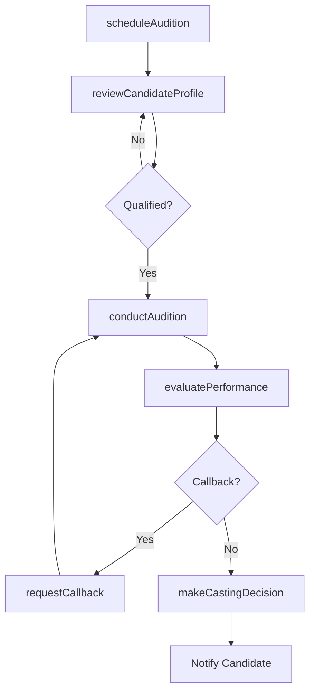
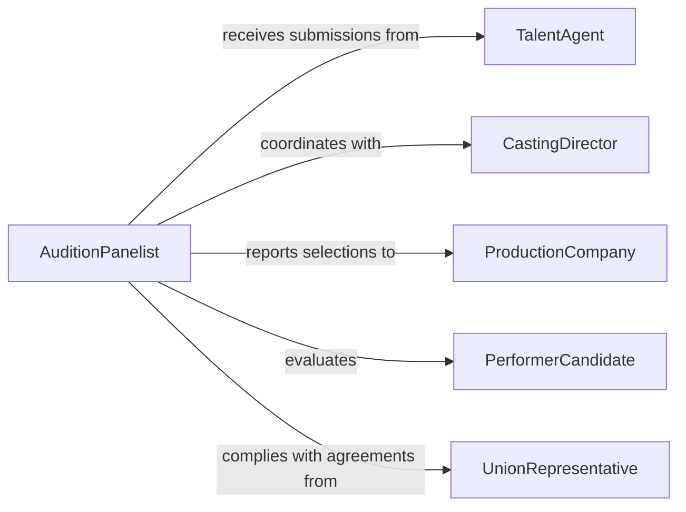

# Audition Interview Potential Performers Staff

> Business-as-Code definition for auditioning or interviewing potential performers or staff members. Models the evaluation process for selecting talent through auditions, interviews, and performance assessments.

## Overview

Auditioning or interviewing potential performers or staff members involves designing evaluation criteria, conducting auditions or interviews, and assessing candidates against role-specific requirements. This activity is common in entertainment, performing arts, media production, and creative industries where demonstrable skill and artistic fit are critical selection factors. It covers the full pipeline from scheduling auditions through final casting or hiring decisions.

## Actors

| Actor | Description |
|-------|-------------|
| TalentAgent | Represents performers and submits them for available roles |
| CastingDirector | Organizes auditions and manages the candidate evaluation process |
| ProductionCompany | Commissions the production requiring cast or crew |
| PerformerCandidate | An individual auditioning or interviewing for a role |
| UnionRepresentative | Ensures audition and hiring practices comply with guild agreements |

## Roles

| Role | Description |
|------|-------------|
| AuditionPanelist | Evaluates candidates during auditions or interviews |
| DirectorProducer | Makes final selection decisions for key roles |
| CastingCoordinator | Schedules auditions, manages candidate flow, and handles logistics |
| CreativeDirector | Assesses artistic fit and vision alignment of candidates |

## Entities

| Entity | Description |
|--------|-------------|
| AuditionSession | A scheduled event for evaluating performer candidates |
| InterviewSlot | A time-bound evaluation meeting with a staff candidate |
| CandidateProfile | A record of a performer's or applicant's qualifications and portfolio |
| EvaluationCriteria | The standards used to assess candidate performance |
| AuditionRecording | A video or audio capture of a candidate's audition performance |
| CastingDecision | The final selection outcome for a role or position |

## Actions

| Action | Description |
|--------|-------------|
| scheduleAudition | Set up an audition session with date, location, and requirements |
| reviewCandidateProfile | Examine a candidate's resume, portfolio, or demo reel |
| conductAudition | Run a live audition and observe the candidate's performance |
| conductInterview | Hold a structured interview to assess qualifications and fit |
| evaluatePerformance | Score a candidate against established evaluation criteria |
| requestCallback | Invite a shortlisted candidate for a follow-up audition or interview |
| makeCastingDecision | Select the final candidate for the role or position |

## Events

| Event | Description |
|-------|-------------|
| auditionScheduled | An audition session has been set up |
| candidateProfileReviewed | A candidate's qualifications have been examined |
| auditionConducted | A live audition has been completed |
| interviewConducted | A structured interview has been held |
| performanceEvaluated | A candidate has been scored against criteria |
| callbackRequested | A candidate has been invited for a follow-up evaluation |
| castingDecisionMade | A final selection for the role has been determined |

## Searches

| Search | Description |
|--------|-------------|
| findAuditionSessions | Retrieve scheduled auditions by role, date, or production |
| getCandidateProfiles | List candidates by role type, skill, or evaluation score |
| getEvaluationScores | Query candidate scores by audition session or evaluator |
| getCastingDecisions | Retrieve final selections by production or role |

## Workflow



## Actor Relationships



## Usage

### Calling Actions

```typescript
import { auditionInterviewPotentialPerformersStaff } from '@headlessly/audition-interview-potential-performers-staff'

const casting = auditionInterviewPotentialPerformersStaff()

// Schedule an audition session
const session = await casting.scheduleAudition({
  production: 'Summer Musical Revue 2026',
  role: 'Lead Vocalist',
  date: '2026-04-10',
  location: 'Studio B, Main Theater',
  requirements: ['vocal-range-soprano', 'dance-proficiency', 'acting-experience']
})

// Review and audition candidates
const profile = await casting.reviewCandidateProfile({
  candidateId: 'perf-8923',
  portfolio: ['demo-reel-2025', 'vocal-sample-aria']
})

await casting.conductAudition({
  sessionId: session.id,
  candidateId: profile.candidateId,
  material: 'prepared-monologue-and-song'
})

// Evaluate and decide
const evaluation = await casting.evaluatePerformance({
  sessionId: session.id,
  candidateId: profile.candidateId,
  scores: { vocalQuality: 9, stagePresence: 8, danceAbility: 7, overallFit: 8.5 }
})

await casting.makeCastingDecision({
  production: 'Summer Musical Revue 2026',
  role: 'Lead Vocalist',
  selectedCandidate: profile.candidateId
})
```

### Event-Driven Automation

```typescript
// Auto-request callbacks for top-scoring candidates
casting.performanceEvaluated(async ({ candidateId, scores, sessionId }) => {
  const average = Object.values(scores).reduce((a, b) => a + b, 0) / Object.values(scores).length
  if (average >= 8.0) {
    await casting.requestCallback({
      candidateId,
      sessionId,
      notes: `High overall score: ${average}`
    })
  }
})

// Notify agents when casting decisions are made
casting.castingDecisionMade(async ({ selectedCandidate, role, production }) => {
  await notify({
    to: `agent-of-${selectedCandidate}`,
    message: `Your client has been selected for ${role} in ${production}`
  })
})
```
