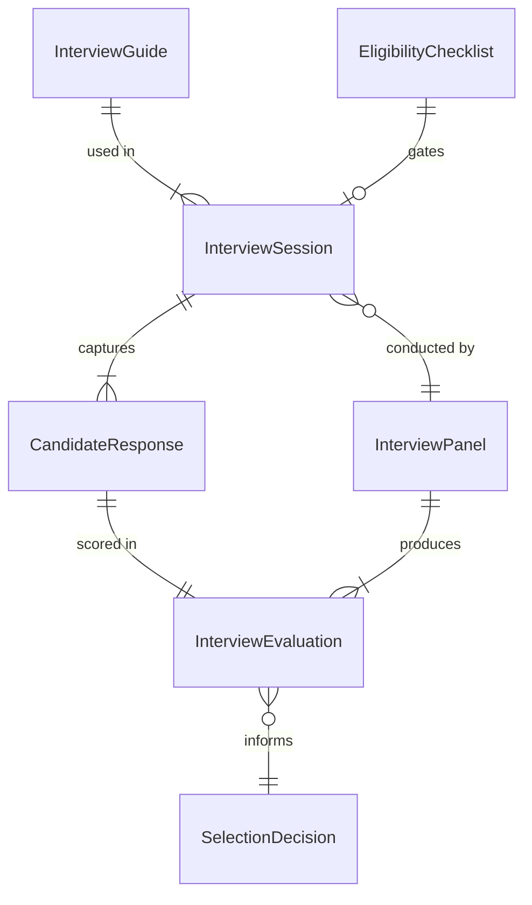
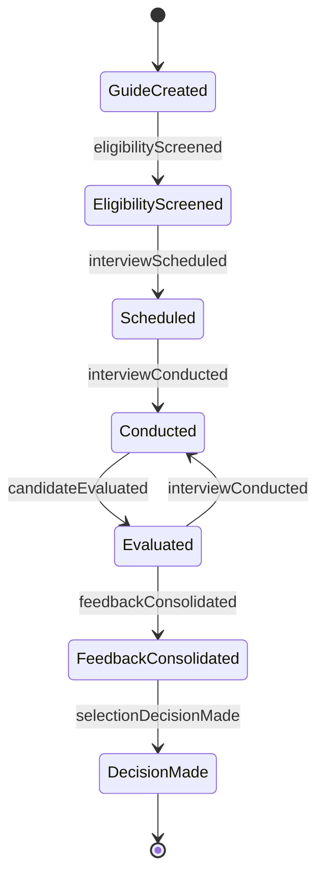
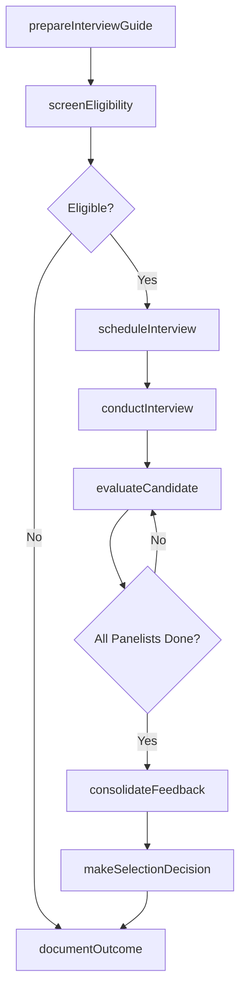
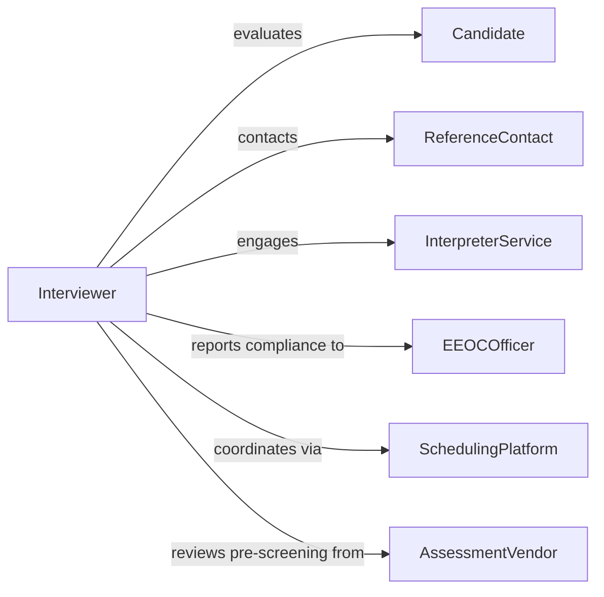

# Conduct Eligibility Selection Interviews

> Business-as-Code definition for conducting eligibility and selection interviews. Models the structured process of screening candidates through interviews to assess qualifications, determine program eligibility, and make selection decisions.

## Overview

Conducting eligibility and selection interviews involves preparing structured interview guides, scheduling and facilitating interview sessions, evaluating candidates against defined criteria, determining eligibility for positions or programs, and documenting outcomes. This definition provides actions for the full interview lifecycle, events for candidate progression tracking, and searches for interview analytics and compliance data.

## Actors

| Actor | Description |
|-------|-------------|
| Candidate | Individual being interviewed for a position or program eligibility |
| ReferenceContact | Person providing professional or personal references for a candidate |
| InterpreterService | Language services provider assisting with multilingual interviews |
| EEOCOfficer | Compliance officer monitoring interview fairness and legal adherence |
| SchedulingPlatform | Calendar or scheduling tool used to coordinate interview logistics |
| AssessmentVendor | Provider of pre-interview skills tests or assessments |

## Roles

| Role | Description |
|------|-------------|
| Interviewer | Conducts the interview session and evaluates candidate responses |
| InterviewCoordinator | Manages scheduling, logistics, and candidate communications |
| HiringManager | Makes final selection decisions based on interview outcomes |
| PanelChair | Leads a multi-person interview panel and consolidates feedback |
| EligibilityReviewer | Determines whether a candidate meets baseline qualification criteria |

## Entities

| Entity | Description |
|--------|-------------|
| InterviewGuide | A structured set of questions and evaluation criteria for an interview |
| InterviewSession | A scheduled meeting between interviewers and a candidate |
| EligibilityChecklist | Criteria used to determine if a candidate meets minimum qualifications |
| CandidateResponse | Documented answers provided by a candidate during an interview |
| InterviewEvaluation | A structured assessment of a candidate's interview performance |
| SelectionDecision | The outcome determination for a candidate after interview completion |
| InterviewPanel | A group of evaluators assigned to collectively assess a candidate |

## Actions

| Action | Description |
|--------|-------------|
| prepareInterviewGuide | Create a structured question set aligned to position requirements |
| scheduleInterview | Book an interview session with candidate and panel members |
| screenEligibility | Verify a candidate meets minimum qualifications before interview |
| conductInterview | Facilitate the interview session and document candidate responses |
| evaluateCandidate | Rate a candidate against the interview guide criteria |
| consolidateFeedback | Aggregate evaluations from multiple panel members |
| makeSelectionDecision | Determine whether to advance, hold, or reject a candidate |
| documentOutcome | Record the interview result and supporting rationale |

## Events

| Event | Description |
|-------|-------------|
| interviewGuideCreated | A structured interview guide has been prepared |
| interviewScheduled | An interview session has been booked |
| eligibilityScreened | A candidate's baseline qualifications have been verified |
| interviewConducted | An interview session has been completed |
| candidateEvaluated | An interviewer has submitted their evaluation |
| feedbackConsolidated | Panel evaluations have been aggregated |
| selectionDecisionMade | A hiring or eligibility decision has been recorded |

## Searches

| Search | Description |
|--------|-------------|
| findInterviewSessions | List interviews by date, position, candidate, or status |
| getEvaluations | Retrieve interview evaluations by candidate or panelist |
| findInterviewGuides | List interview guides by position type or department |
| getCandidateHistory | Fetch a candidate's complete interview history and outcomes |
| getSelectionAnalytics | Retrieve selection rates, pass-through ratios, and diversity metrics |

## Entity Relationships



## State Diagram



## Workflow



## Actor Relationships



## Usage

### Calling Actions

```typescript
import { conductEligibilitySelectionInterviews } from '@headlessly/conduct-eligibility-selection-interviews'

const interviews = conductEligibilitySelectionInterviews()

// Prepare an interview guide
const guide = await interviews.prepareInterviewGuide({
  position: 'Product Manager',
  competencies: ['strategic-thinking', 'stakeholder-management', 'data-analysis'],
  questionCount: 8,
  format: 'behavioral'
})

// Screen eligibility and schedule
await interviews.screenEligibility({
  candidateId: 'cand-5503',
  criteria: { minYearsExperience: 5, requiredDegree: 'bachelors', requiredSkills: ['product-strategy'] }
})

await interviews.scheduleInterview({
  candidateId: 'cand-5503',
  guideId: guide.id,
  panelists: ['emp-101', 'emp-205', 'emp-312'],
  date: '2026-05-08',
  format: 'video',
  duration: 60
})

// Submit evaluation after interview
await interviews.evaluateCandidate({
  candidateId: 'cand-5503',
  panelistId: 'emp-101',
  ratings: {
    strategicThinking: 4,
    stakeholderManagement: 5,
    dataAnalysis: 3,
    overallFit: 4
  },
  recommendation: 'advance'
})
```

### Event-Driven Automation

```typescript
// Consolidate feedback when all panelists submit evaluations
interviews.candidateEvaluated(async ({ candidateId, positionId }) => {
  const evaluations = await interviews.getEvaluations({ candidateId, positionId })
  const totalPanelists = 3
  if (evaluations.length === totalPanelists) {
    await interviews.consolidateFeedback({ candidateId, positionId })
  }
})

// Notify candidate of outcome
interviews.selectionDecisionMade(async ({ candidateId, decision, positionId }) => {
  const status = decision === 'selected' ? 'moving forward' : 'not selected'
  await notify({
    to: candidateId,
    message: `Your application for position ${positionId}: ${status}`
  })
})
```
