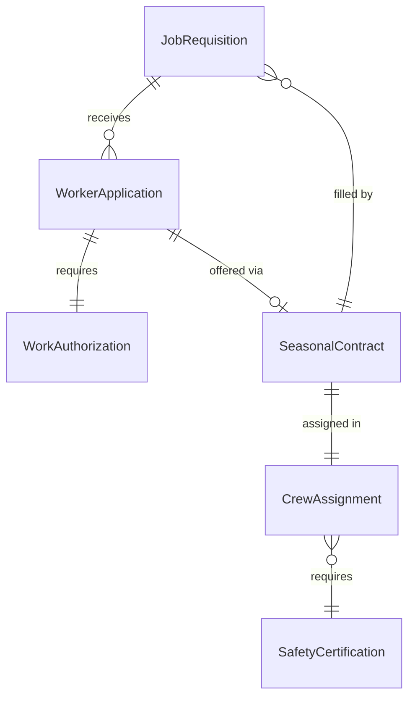
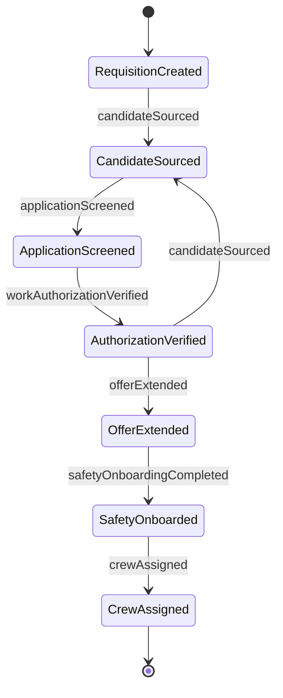
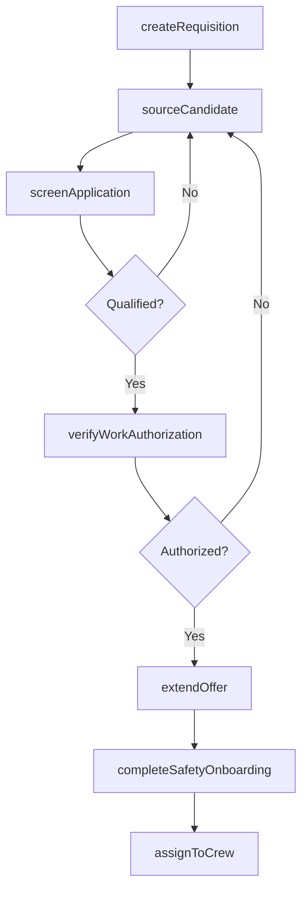
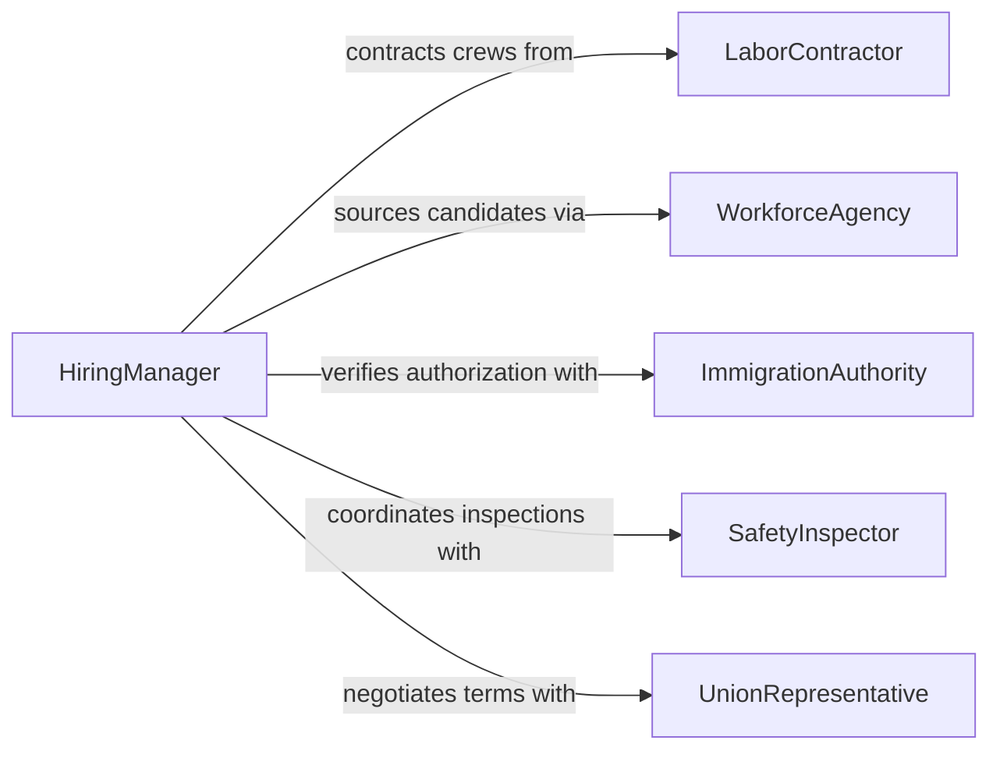

# Hire Farming Fishing Forestry Workers

> Business-as-Code definition for hiring farming, fishing, or forestry workers. Models the recruitment, screening, and onboarding of seasonal and permanent labor for agricultural, aquacultural, and forestry operations.

## Overview

Hiring farming, fishing, or forestry workers involves sourcing candidates for physically demanding roles in primary industries, evaluating their qualifications and experience, and managing the unique requirements of seasonal and migrant labor. This activity addresses compliance with agricultural labor laws, visa and work authorization requirements, and the coordination of crew-based hiring for planting, harvesting, fishing, and timber operations.

## Actors

| Actor | Description |
|-------|-------------|
| LaborContractor | Supplies crews of agricultural, fishing, or forestry workers |
| WorkforceAgency | Connects employers with available labor pools and job seekers |
| ImmigrationAuthority | Administers work visas and employment authorization for migrant workers |
| SafetyInspector | Verifies workplace safety compliance for labor-intensive operations |
| UnionRepresentative | Advocates for worker rights and collective bargaining terms |

## Roles

| Role | Description |
|------|-------------|
| HiringManager | Oversees recruitment and selection of field workers |
| CrewSupervisor | Manages daily work assignments and worker performance |
| HRAdministrator | Processes employment paperwork, visas, and compliance documentation |
| OperationsPlanner | Forecasts labor needs based on seasonal production schedules |

## Entities

| Entity | Description |
|--------|-------------|
| JobRequisition | A formal request to fill a farming, fishing, or forestry position |
| WorkerApplication | A candidate's submission of qualifications and availability |
| WorkAuthorization | Legal documentation permitting employment in the jurisdiction |
| SeasonalContract | A time-bound employment agreement tied to production cycles |
| CrewAssignment | Allocation of workers to specific crews, locations, or tasks |
| SafetyCertification | Documentation that a worker has completed required safety training |

## Actions

| Action | Description |
|--------|-------------|
| createRequisition | Open a new position for farming, fishing, or forestry labor |
| sourceCandidate | Identify potential workers through agencies, contractors, or referrals |
| screenApplication | Evaluate a candidate's qualifications, experience, and availability |
| verifyWorkAuthorization | Confirm legal eligibility to work in the jurisdiction |
| extendOffer | Issue a formal employment offer or seasonal contract |
| assignToCrew | Place a hired worker into a crew, location, or task group |
| completeSafetyOnboarding | Ensure the worker completes required safety certifications |

## Events

| Event | Description |
|-------|-------------|
| requisitionCreated | A new labor requisition has been opened |
| candidateSourced | A potential worker has been identified |
| applicationScreened | A candidate's qualifications have been evaluated |
| workAuthorizationVerified | Legal employment eligibility has been confirmed |
| offerExtended | A formal employment offer has been issued |
| crewAssigned | A worker has been placed into a crew or task group |
| safetyOnboardingCompleted | Required safety training has been finished |

## Searches

| Search | Description |
|--------|-------------|
| findRequisitions | Retrieve open positions by operation type, location, or season |
| getCandidates | List applicants by skill, availability, or authorization status |
| getCrewAssignments | Query crew rosters by location, supervisor, or date range |
| getAuthorizationStatus | Check work authorization status for individual workers |

## Entity Relationships



## State Diagram



## Workflow



## Actor Relationships



## Usage

### Calling Actions

```typescript
import { hireFarmingFishingForestryWorkers } from '@headlessly/hire-farming-fishing-forestry-workers'

const hiring = hireFarmingFishingForestryWorkers()

// Create a seasonal requisition
const requisition = await hiring.createRequisition({
  operationType: 'farming',
  role: 'harvest-laborer',
  headcount: 30,
  season: { start: '2026-06-15', end: '2026-09-30' },
  location: 'Salinas Valley, CA'
})

// Source and screen candidates
const candidates = await hiring.sourceCandidate({
  requisitionId: requisition.id,
  source: 'labor-contractor',
  contractorId: 'lc-westcoast-ag'
})

const screened = await hiring.screenApplication({
  candidateId: candidates[0].id,
  criteria: ['harvest-experience', 'physical-fitness', 'equipment-operation']
})

// Verify authorization and extend offer
await hiring.verifyWorkAuthorization({
  candidateId: screened.candidateId,
  visaType: 'H-2A'
})

await hiring.extendOffer({
  candidateId: screened.candidateId,
  requisitionId: requisition.id,
  contractType: 'seasonal',
  hourlyRate: 18.50
})
```

### Event-Driven Automation

```typescript
// Auto-assign to crew after safety onboarding
hiring.safetyOnboardingCompleted(async ({ workerId, location }) => {
  await hiring.assignToCrew({
    workerId,
    crewId: await getAvailableCrew(location),
    startDate: new Date().toISOString()
  })
})

// Alert on authorization issues
hiring.applicationScreened(async ({ candidateId, passed }) => {
  if (passed) {
    await hiring.verifyWorkAuthorization({ candidateId })
  }
})
```
