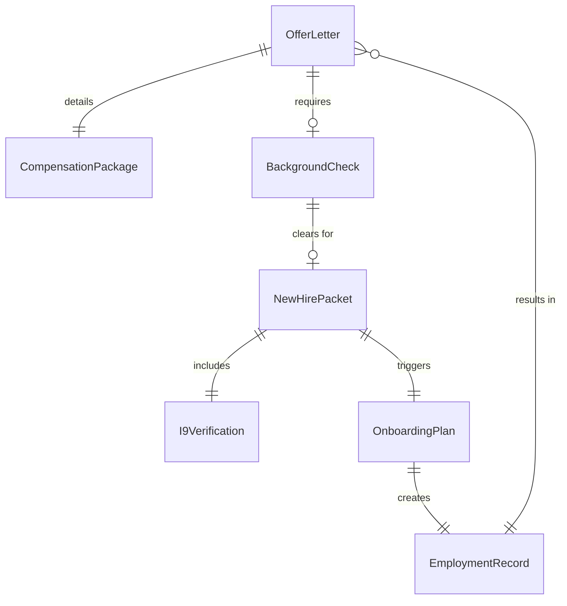
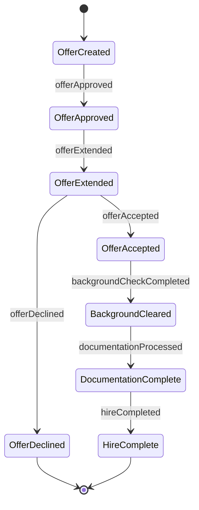
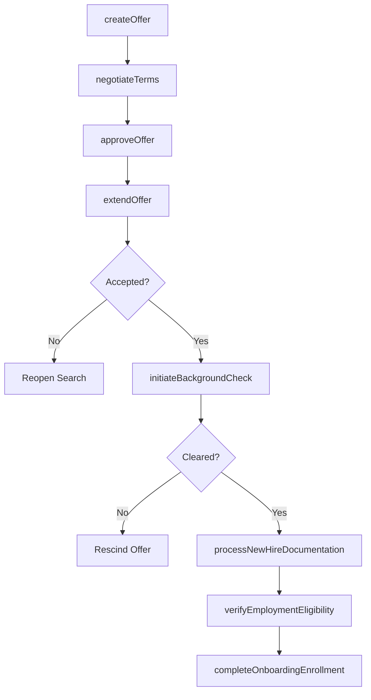
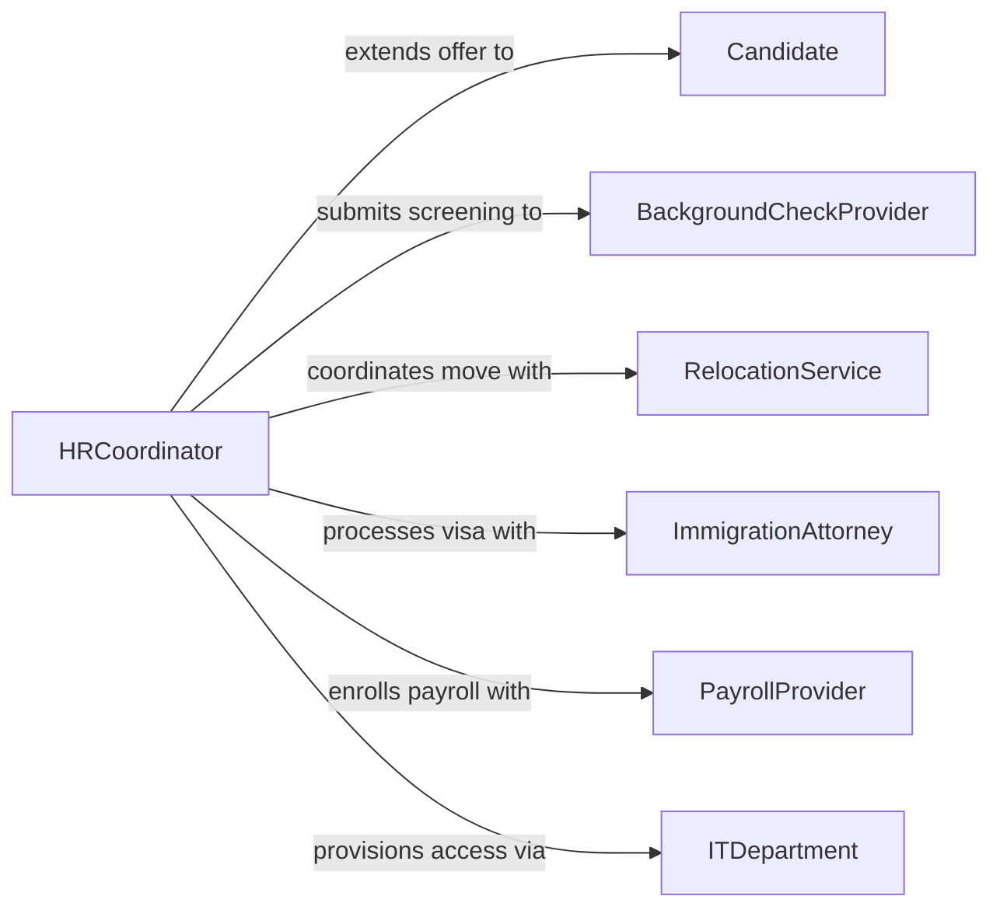

# Hire Personnel

> Business-as-Code definition for hiring personnel. Models the final stages of talent acquisition from offer creation through acceptance, pre-boarding verification, and employment commencement.

## Overview

Hiring personnel encompasses the activities that convert a selected candidate into an active employee, including extending job offers, negotiating compensation and terms, conducting background checks, processing new-hire documentation, completing onboarding enrollment, and recording the official start of employment. This definition provides actions for the offer-to-start lifecycle, events for onboarding automation, and searches for hiring analytics and compliance tracking.

## Actors

| Actor | Description |
|-------|-------------|
| Candidate | Selected individual receiving and negotiating a job offer |
| BackgroundCheckProvider | Vendor conducting criminal, credit, and employment verification |
| RelocationService | Provider assisting with employee relocation logistics |
| ImmigrationAttorney | Legal counsel managing work authorization and visa processing |
| PayrollProvider | Service processing new-hire payroll setup and tax registration |
| ITDepartment | Internal team provisioning equipment and system access for new hires |

## Roles

| Role | Description |
|------|-------------|
| HiringManager | Approves offers and welcomes new hires into the team |
| HRCoordinator | Manages offer paperwork, background checks, and onboarding logistics |
| CompensationAnalyst | Structures offer packages and validates pay equity |
| OnboardingSpecialist | Coordinates the new-hire orientation and enrollment process |
| LegalCompliance Officer | Ensures hiring documentation meets I-9 and employment law requirements |

## Entities

| Entity | Description |
|--------|-------------|
| OfferLetter | A formal document extending employment terms to a candidate |
| CompensationPackage | The total pay, equity, benefits, and perks offered to a candidate |
| BackgroundCheck | A pre-employment screening report on a candidate |
| NewHirePacket | Collection of forms and documents a new employee must complete |
| I9Verification | Employment eligibility verification required by federal law |
| OnboardingPlan | A structured schedule of orientation activities for a new hire |
| EmploymentRecord | The official personnel record created upon hire |

## Actions

| Action | Description |
|--------|-------------|
| createOffer | Draft a formal offer letter with compensation and terms |
| negotiateTerms | Adjust offer details based on candidate counter-proposals |
| approveOffer | Obtain management authorization to extend the final offer |
| extendOffer | Deliver the approved offer letter to the candidate |
| initiateBackgroundCheck | Submit a candidate for pre-employment screening |
| processNewHireDocumentation | Collect and verify all required employment forms |
| verifyEmploymentEligibility | Complete I-9 verification and work authorization checks |
| completeOnboardingEnrollment | Enroll the new hire in benefits, payroll, and systems |

## Events

| Event | Description |
|-------|-------------|
| offerCreated | A draft offer letter has been prepared |
| offerApproved | An offer has been authorized for delivery |
| offerExtended | An offer letter has been delivered to the candidate |
| offerAccepted | A candidate has accepted the employment offer |
| offerDeclined | A candidate has declined the employment offer |
| backgroundCheckCompleted | Pre-employment screening results have been received |
| documentationProcessed | All new-hire forms and verifications are complete |
| hireCompleted | The new employee's employment record has been activated |

## Searches

| Search | Description |
|--------|-------------|
| findOffers | List offers by position, status, or date range |
| getBackgroundChecks | Retrieve screening results by candidate or status |
| getNewHireDocumentation | Fetch documentation status by new hire or completion stage |
| getHiringMetrics | Retrieve offer acceptance rates, time-to-hire, and cost-per-hire |
| findPendingOnboarding | List new hires awaiting onboarding completion |

## Entity Relationships



## State Diagram



## Workflow



## Actor Relationships



## Usage

### Calling Actions

```typescript
import { hirePersonnel } from '@headlessly/hire-personnel'

const hiring = hirePersonnel()

// Create and extend an offer
const offer = await hiring.createOffer({
  candidateId: 'cand-7821',
  position: 'Senior Software Engineer',
  compensation: {
    baseSalary: 175000,
    signingBonus: 15000,
    equity: { shares: 5000, vestingSchedule: '4-year-1-year-cliff' },
    benefits: ['medical-ppo', 'dental', 'vision', '401k-match']
  },
  startDate: '2026-05-01',
  location: 'San Francisco, CA'
})

await hiring.approveOffer({ offerId: offer.id, approver: 'mgr-2045' })
await hiring.extendOffer({ offerId: offer.id, deliveryMethod: 'email' })

// Process after acceptance
await hiring.initiateBackgroundCheck({
  candidateId: 'cand-7821',
  checks: ['criminal', 'employment-history', 'education-verification']
})

await hiring.processNewHireDocumentation({
  candidateId: 'cand-7821',
  forms: ['W-4', 'I-9', 'direct-deposit', 'emergency-contact', 'nda']
})
```

### Event-Driven Automation

```typescript
// Trigger onboarding when all documentation is complete
hiring.documentationProcessed(async ({ candidateId, startDate }) => {
  await hiring.completeOnboardingEnrollment({
    candidateId,
    enrollments: ['payroll', 'benefits', 'equipment', 'badge-access'],
    orientationDate: startDate
  })
})

// Alert hiring manager when offer is declined
hiring.offerDeclined(async ({ candidateId, positionId, reason }) => {
  await notify({
    to: 'hiring-manager',
    message: `Candidate ${candidateId} declined offer for ${positionId}. Reason: ${reason}`
  })
})
```
