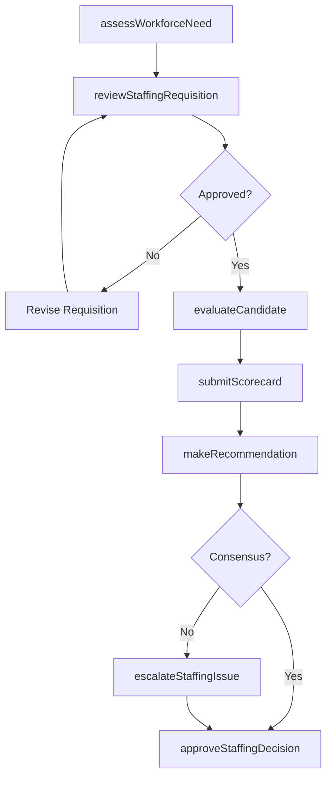
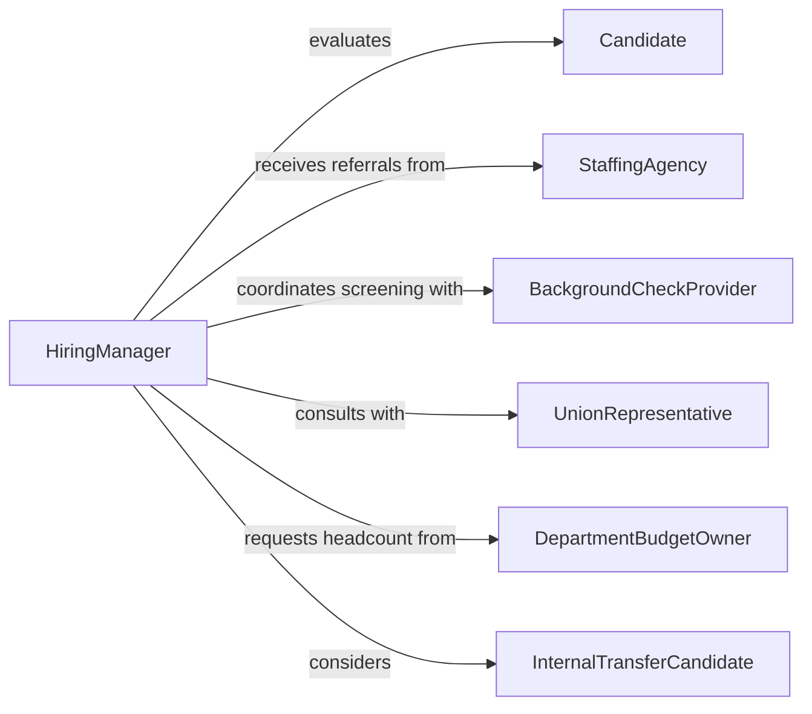

# Participate Staffing Decisions

> Business-as-Code definition for participating in staffing decisions. Models the collaborative process of evaluating workforce needs, reviewing candidates, contributing to hiring panels, and making selection recommendations.

## Overview

Participating in staffing decisions involves contributing expertise and judgment to workforce planning, candidate evaluation, and selection processes. This includes reviewing staffing requisitions, serving on interview panels, providing assessment feedback, making hiring recommendations, and approving personnel selections. This definition provides actions for each phase of collaborative staffing, events for decision tracking, and searches for candidate and workforce data.

## Actors

| Actor | Description |
|-------|-------------|
| Candidate | Job applicant being evaluated for a position |
| StaffingAgency | External recruitment firm providing candidate referrals |
| BackgroundCheckProvider | Vendor conducting employment verification and screening |
| UnionRepresentative | Labor representative involved in staffing for unionized positions |
| DepartmentBudgetOwner | Financial authority controlling headcount budget |
| InternalTransferCandidate | Current employee applying for an open position |

## Roles

| Role | Description |
|------|-------------|
| HiringManager | Department leader initiating staffing requests and making final decisions |
| InterviewPanelist | Subject-matter expert evaluating candidates during interviews |
| HRRecruiter | Coordinates the staffing process and facilitates decision-making |
| DivisionDirector | Senior leader approving headcount and staffing priorities |
| PeerReviewer | Team member assessing candidate cultural and technical fit |

## Entities

| Entity | Description |
|--------|-------------|
| StaffingRequisition | A formal request to fill an open position |
| CandidateEvaluation | A structured assessment of a candidate by a panelist |
| InterviewScorecard | A standardized rating form used during candidate interviews |
| SelectionRecommendation | A documented hiring recommendation with supporting rationale |
| HeadcountPlan | An approved staffing plan specifying positions and timeline |
| StaffingDecision | The final hiring or rejection outcome for a candidate |

## Actions

| Action | Description |
|--------|-------------|
| reviewStaffingRequisition | Evaluate a request to fill a position for business justification |
| assessWorkforceNeed | Analyze current staffing levels against workload demands |
| evaluateCandidate | Review a candidate's qualifications, interview performance, and fit |
| submitScorecard | Record structured interview feedback and ratings |
| makeRecommendation | Provide a formal hiring recommendation with rationale |
| approveStaffingDecision | Authorize the final selection decision for a position |
| declineCandidate | Record and communicate a non-selection decision |
| escalateStaffingIssue | Raise a concern about a staffing decision for leadership review |

## Events

| Event | Description |
|-------|-------------|
| staffingRequisitionReviewed | A staffing request has been evaluated and approved or rejected |
| candidateEvaluated | A panelist has completed assessment of a candidate |
| scorecardSubmitted | An interview scorecard has been recorded |
| recommendationMade | A formal hiring recommendation has been submitted |
| staffingDecisionApproved | A final selection decision has been authorized |
| candidateDeclined | A non-selection decision has been recorded |
| staffingIssueEscalated | A staffing concern has been raised to leadership |

## Searches

| Search | Description |
|--------|-------------|
| findStaffingRequisitions | List open requisitions by department, role, or priority |
| getCandidateEvaluations | Retrieve evaluations by candidate, panelist, or position |
| getScorecards | Fetch interview scorecards by candidate or interview round |
| getRecommendations | List hiring recommendations by position or decision status |
| getHeadcountPlan | Retrieve approved headcount data by department or fiscal period |

## Workflow



## Actor Relationships



## Usage

### Calling Actions

```typescript
import { participateStaffingDecisions } from '@headlessly/participate-staffing-decisions'

const staffing = participateStaffingDecisions()

// Review a staffing requisition
await staffing.reviewStaffingRequisition({
  requisitionId: 'req-3045',
  decision: 'approved',
  justification: 'Team capacity at 115% utilization, need additional headcount'
})

// Submit an interview scorecard
await staffing.submitScorecard({
  candidateId: 'cand-7821',
  positionId: 'req-3045',
  panelistId: 'emp-1234',
  ratings: {
    technicalSkills: 4,
    communication: 5,
    problemSolving: 4,
    culturalFit: 5
  },
  recommendation: 'strong-hire',
  notes: 'Excellent systems design experience, strong communicator'
})

// Make a formal recommendation
await staffing.makeRecommendation({
  positionId: 'req-3045',
  candidateId: 'cand-7821',
  recommendation: 'hire',
  rationale: 'Top scorer across all panelists, 8 years relevant experience'
})
```

### Event-Driven Automation

```typescript
// Notify hiring manager when all scorecards are in
staffing.scorecardSubmitted(async ({ positionId, candidateId }) => {
  const scorecards = await staffing.getScorecards({ positionId, candidateId })
  const totalPanelists = 4
  if (scorecards.length === totalPanelists) {
    await notify({
      to: 'hiring-manager',
      message: `All scorecards submitted for candidate ${candidateId}. Ready for decision.`
    })
  }
})

// Alert HR when a staffing issue is escalated
staffing.staffingIssueEscalated(async ({ positionId, issue, escalatedBy }) => {
  await notify({
    to: 'hr-leadership',
    message: `Staffing issue for position ${positionId}: ${issue}`
  })
})
```
