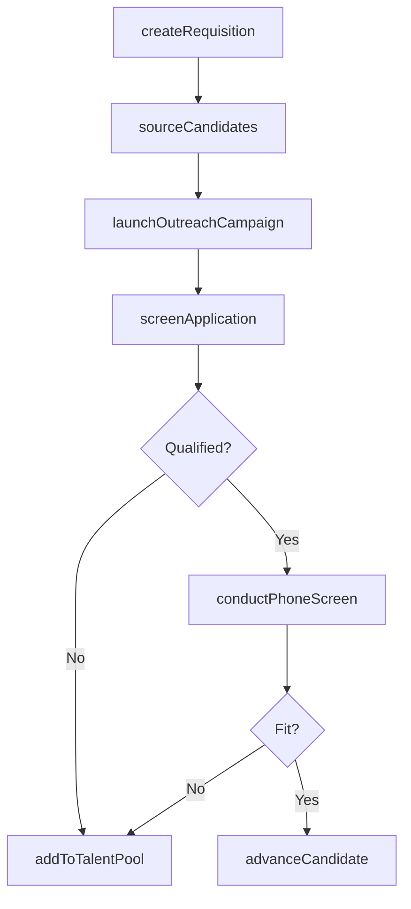
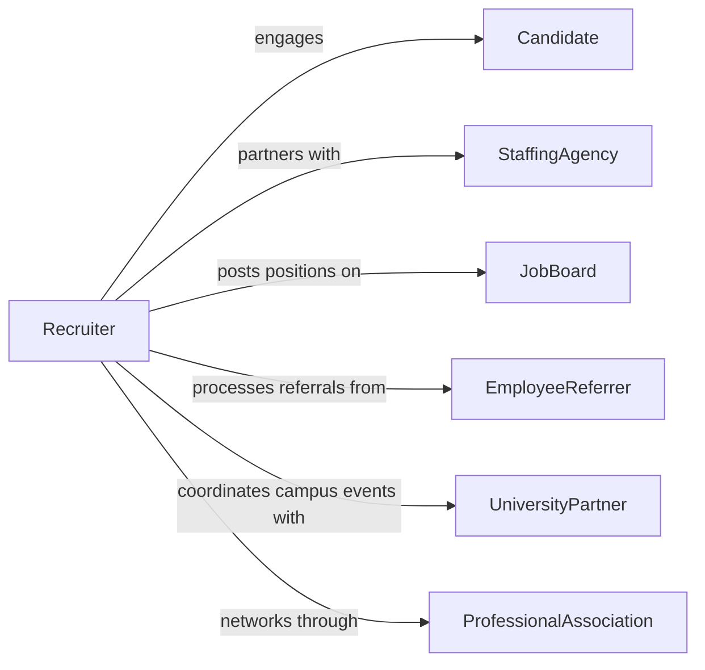

# Recruit Personnel

> Business-as-Code definition for recruiting personnel. Models the talent sourcing pipeline from identifying hiring needs through candidate attraction, outreach, screening, and pipeline management.

## Overview

Recruiting personnel involves identifying talent needs, defining position requirements, sourcing candidates through multiple channels, conducting outreach, screening applicants, managing the candidate pipeline, and building talent pools for current and future openings. This definition provides actions for the sourcing and attraction phases of talent acquisition, events for pipeline progression, and searches for candidate and sourcing analytics.

## Actors

| Actor | Description |
|-------|-------------|
| Candidate | Prospective employee being recruited for a position |
| StaffingAgency | External firm sourcing and presenting qualified candidates |
| JobBoard | Online platform hosting job advertisements and collecting applications |
| EmployeeReferrer | Current employee recommending a candidate from their network |
| UniversityPartner | Academic institution providing access to graduating talent |
| ProfessionalAssociation | Industry group with member networks for specialized recruiting |

## Roles

| Role | Description |
|------|-------------|
| Recruiter | Sources candidates, conducts outreach, and manages the pipeline |
| SourcingSpecialist | Identifies and engages passive candidates through targeted research |
| HiringManager | Defines position requirements and evaluates sourced candidates |
| RecruitmentMarketingManager | Creates employer branding content and recruitment campaigns |
| TalentPoolManager | Maintains and nurtures databases of qualified candidates for future roles |

## Entities

| Entity | Description |
|--------|-------------|
| JobRequisition | An approved request to fill a specific position |
| CandidateProfile | A prospective hire's qualifications, experience, and contact details |
| SourcingChannel | A platform or method used to find and attract candidates |
| OutreachCampaign | A targeted communication initiative to attract candidates |
| TalentPool | A curated database of qualified candidates for future openings |
| Referral | A candidate recommendation submitted by a current employee |
| ApplicationSubmission | A formal job application received from a candidate |

## Actions

| Action | Description |
|--------|-------------|
| createRequisition | Open a new position requisition with requirements and qualifications |
| sourceCandidates | Search for and identify potential candidates across channels |
| launchOutreachCampaign | Deploy targeted messaging to attract candidates for open roles |
| screenApplication | Review an application for minimum qualification alignment |
| conductPhoneScreen | Perform an initial phone conversation to assess candidate fit |
| addToTalentPool | Place a qualified candidate into a nurture pool for future roles |
| processReferral | Evaluate and track an employee-referred candidate |
| advanceCandidate | Move a candidate to the next stage of the recruitment pipeline |

## Events

| Event | Description |
|-------|-------------|
| requisitionCreated | A new position requisition has been opened |
| candidateSourced | A potential candidate has been identified and added to the pipeline |
| outreachCampaignLaunched | A recruitment outreach campaign has been deployed |
| applicationScreened | An application has been reviewed against minimum qualifications |
| phoneScreenCompleted | An initial phone screen has been conducted with a candidate |
| candidateAddedToPool | A candidate has been placed in a talent pool for future roles |
| referralProcessed | An employee referral has been evaluated and tracked |
| candidateAdvanced | A candidate has been moved to the next pipeline stage |

## Searches

| Search | Description |
|--------|-------------|
| findRequisitions | List open requisitions by department, role level, or priority |
| searchCandidates | Query candidate profiles by skills, experience, or location |
| getSourceChannelMetrics | Retrieve sourcing effectiveness by channel, cost, and quality |
| findTalentPools | List talent pools by skill area, size, or last engagement date |
| getPipelineStatus | Fetch candidate counts and conversion rates by pipeline stage |

## Workflow



## Actor Relationships



## Usage

### Calling Actions

```typescript
import { recruitPersonnel } from '@headlessly/recruit-personnel'

const recruiting = recruitPersonnel()

// Open a new requisition
const req = await recruiting.createRequisition({
  title: 'Senior Data Engineer',
  department: 'Data Platform',
  level: 'senior',
  skills: ['Apache Spark', 'Python', 'dbt', 'Snowflake'],
  location: 'Remote - US',
  compensation: { min: 160000, max: 200000, currency: 'USD' }
})

// Source candidates across channels
await recruiting.sourceCandidates({
  requisitionId: req.id,
  channels: ['linkedin', 'github', 'referrals'],
  targetCount: 50
})

// Launch a targeted outreach campaign
await recruiting.launchOutreachCampaign({
  requisitionId: req.id,
  channel: 'linkedin',
  messageTemplate: 'senior-data-engineer-outreach',
  targetAudience: { skills: ['Apache Spark', 'dbt'], minExperience: 5 }
})

// Conduct a phone screen
await recruiting.conductPhoneScreen({
  candidateId: 'cand-8834',
  requisitionId: req.id,
  duration: 30,
  topics: ['technical-background', 'role-interest', 'compensation-alignment']
})
```

### Event-Driven Automation

```typescript
// Auto-screen new applications
recruiting.candidateSourced(async ({ candidateId, requisitionId }) => {
  await recruiting.screenApplication({
    candidateId,
    requisitionId,
    autoScreen: true
  })
})

// Notify recruiter when referral is submitted
recruiting.referralProcessed(async ({ candidateId, referrerId, requisitionId }) => {
  await notify({
    to: 'recruiting-team',
    message: `Employee ${referrerId} referred candidate ${candidateId} for requisition ${requisitionId}`
  })
})
```
