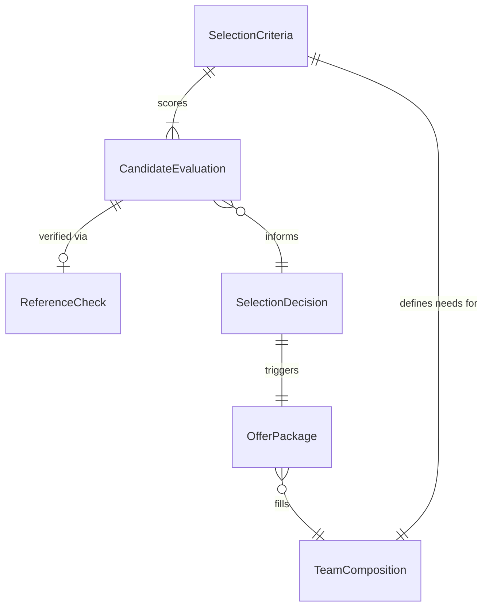
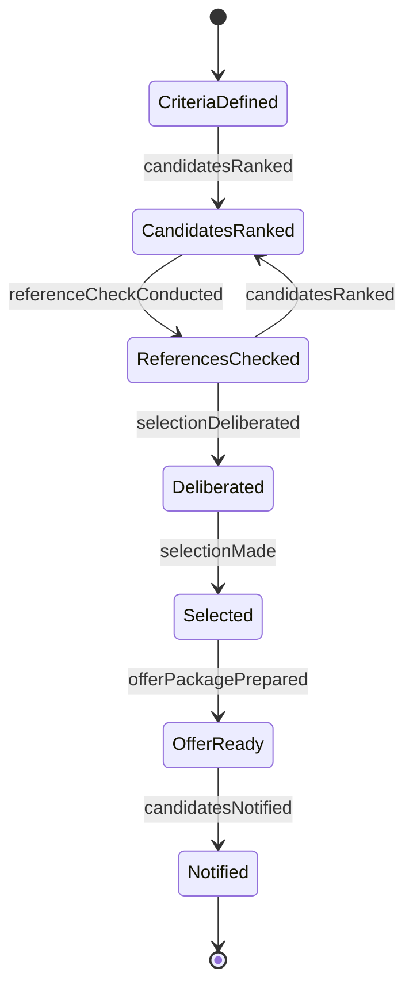
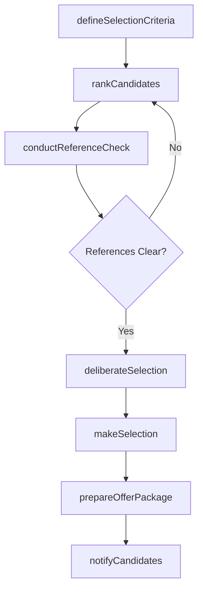
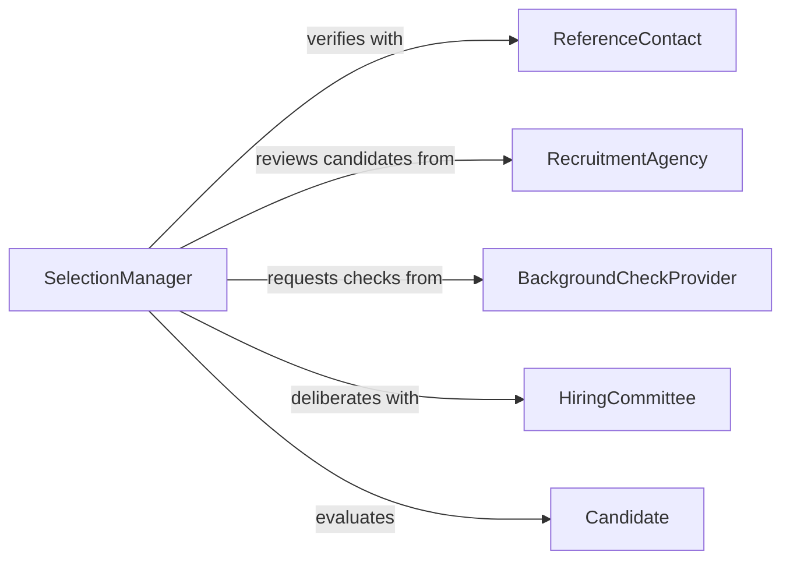

# Select Staff Team Members Performers

> Business-as-Code definition for selecting staff, team members, or performers. Models the decision-making process of evaluating candidates and making final selection choices for organizational roles, project teams, or performance ensembles.

## Overview

Selecting staff, team members, or performers involves comparing evaluated candidates against role requirements, organizational needs, and team dynamics to make final hiring or assignment decisions. This activity encompasses reviewing assessment results, conducting reference checks, deliberating among decision-makers, and formalizing selections. It applies across corporate hiring, project team assembly, and creative casting contexts.

## Actors

| Actor | Description |
|-------|-------------|
| ReferenceContact | Provides verification of a candidate's past performance and character |
| RecruitmentAgency | Presents pre-screened candidates for consideration |
| BackgroundCheckProvider | Conducts employment verification, criminal, and credential checks |
| HiringCommittee | A group of stakeholders who collectively evaluate and select candidates |
| Candidate | An individual being considered for a staff, team, or performer role |

## Roles

| Role | Description |
|------|-------------|
| SelectionManager | Leads the final candidate evaluation and decision process |
| TeamLead | Provides input on team fit and technical requirements |
| HRBusiness Partner | Ensures selection process compliance and equity |
| DepartmentHead | Approves final selections and headcount allocation |

## Entities

| Entity | Description |
|--------|-------------|
| CandidateEvaluation | A compiled assessment of a candidate's qualifications and fit |
| SelectionCriteria | The weighted factors used to compare and rank candidates |
| ReferenceCheck | Verified feedback from a candidate's prior employers or colleagues |
| OfferPackage | The compensation, benefits, and terms presented to a selected candidate |
| SelectionDecision | The documented outcome of the candidate evaluation process |
| TeamComposition | The current structure and skill mix of the team being staffed |

## Actions

| Action | Description |
|--------|-------------|
| defineSelectionCriteria | Establish the factors and weights for evaluating candidates |
| rankCandidates | Order candidates by their evaluation scores and qualifications |
| conductReferenceCheck | Verify a candidate's background and past performance |
| deliberateSelection | Discuss and compare finalists among decision-makers |
| makeSelection | Choose the final candidate for the role or team |
| prepareOfferPackage | Assemble compensation and terms for the selected candidate |
| notifyCandidates | Inform all candidates of the selection outcome |

## Events

| Event | Description |
|-------|-------------|
| selectionCriteriaDefined | Evaluation factors and weights have been established |
| candidatesRanked | Candidates have been ordered by evaluation scores |
| referenceCheckConducted | A candidate's background has been verified |
| selectionDeliberated | Decision-makers have discussed and compared finalists |
| selectionMade | A final candidate has been chosen for the role |
| offerPackagePrepared | Compensation and terms have been assembled |
| candidatesNotified | All candidates have been informed of the outcome |

## Searches

| Search | Description |
|--------|-------------|
| findCandidateEvaluations | Retrieve evaluations by role, score range, or evaluator |
| getReferenceChecks | Query reference verification results by candidate or status |
| getSelectionDecisions | List final selections by department, role, or date |
| getTeamComposition | View current team structure and open positions |

## Entity Relationships



## State Diagram



## Workflow



## Actor Relationships



## Usage

### Calling Actions

```typescript
import { selectStaffTeamMembersPerformers } from '@headlessly/select-staff-team-members-performers'

const selection = selectStaffTeamMembersPerformers()

// Define selection criteria
await selection.defineSelectionCriteria({
  roleId: 'senior-engineer',
  criteria: [
    { factor: 'technical-skills', weight: 0.35 },
    { factor: 'experience', weight: 0.25 },
    { factor: 'cultural-fit', weight: 0.20 },
    { factor: 'leadership-potential', weight: 0.20 }
  ]
})

// Rank and check references
const ranked = await selection.rankCandidates({
  roleId: 'senior-engineer',
  candidateIds: ['cand-101', 'cand-102', 'cand-103']
})

await selection.conductReferenceCheck({
  candidateId: ranked[0].candidateId,
  referenceContacts: ['ref-mgr-prev', 'ref-peer-prev']
})

// Deliberate and select
await selection.deliberateSelection({
  roleId: 'senior-engineer',
  finalists: [ranked[0].candidateId, ranked[1].candidateId],
  panelMembers: ['hiring-mgr', 'tech-lead', 'hr-partner']
})

const decision = await selection.makeSelection({
  roleId: 'senior-engineer',
  selectedCandidate: ranked[0].candidateId,
  rationale: 'Strongest technical assessment with proven leadership track record'
})
```

### Event-Driven Automation

```typescript
// Auto-prepare offer when selection is made
selection.selectionMade(async ({ selectedCandidate, roleId }) => {
  await selection.prepareOfferPackage({
    candidateId: selectedCandidate,
    roleId,
    template: 'standard-full-time'
  })
})

// Notify all candidates after offer is prepared
selection.offerPackagePrepared(async ({ roleId, selectedCandidate }) => {
  await selection.notifyCandidates({
    roleId,
    selectedCandidate,
    notificationType: 'selection-outcome'
  })
})
```
