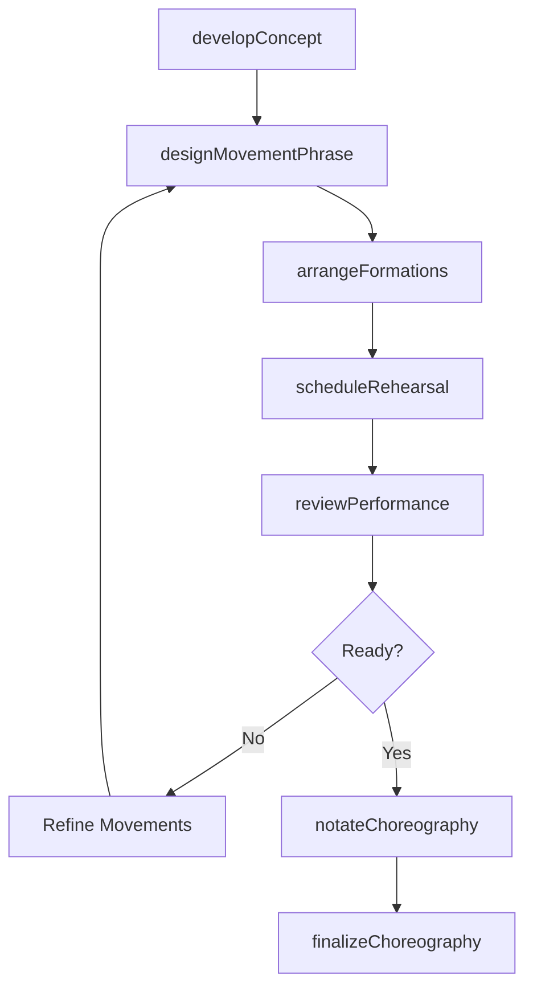
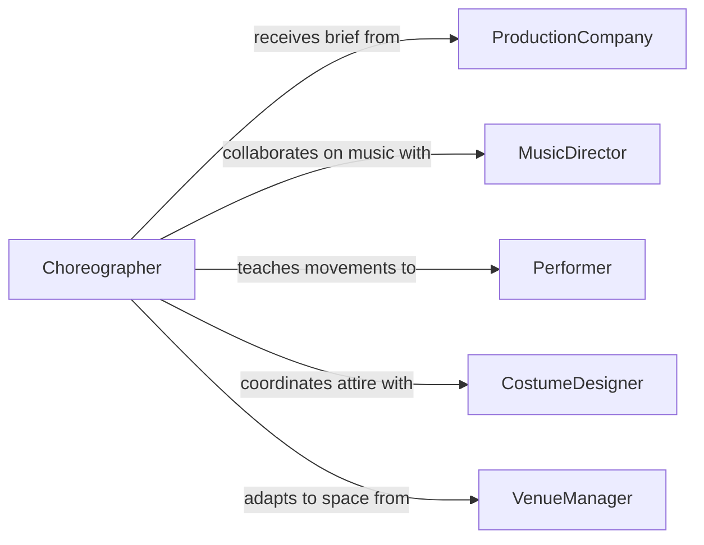

# Choreograph Dances

> Business-as-Code definition for choreographing dances. Models the creative and production workflow from concept development through movement design, rehearsal management, and performance readiness.

## Overview

Dance choreography involves creating, structuring, and refining movement sequences for performances, productions, music videos, ceremonies, or educational programs. This definition exposes actions for developing choreographic concepts, designing movement phrases, managing rehearsal schedules, notating sequences, and preparing performances. Events enable automated tracking of rehearsal progress, and searches provide access to movement libraries and production schedules.

## Actors

| Actor | Description |
|-------|-------------|
| ProductionCompany | Commissions choreography for shows, films, or events |
| MusicDirector | Provides musical selections and tempo requirements |
| Performer | Executes the choreographed movement sequences |
| CostumeDesigner | Designs attire that must accommodate movement requirements |
| VenueManager | Provides stage dimensions and technical specifications |

## Roles

| Role | Description |
|------|-------------|
| Choreographer | Creates and directs the overall dance composition |
| RehearsalDirector | Manages rehearsal schedules and teaches choreography to performers |
| DanceNotator | Documents movement sequences in written notation systems |
| AssistantChoreographer | Supports the lead choreographer and demonstrates movements |

## Entities

| Entity | Description |
|--------|-------------|
| Choreography | A complete dance composition for a production or piece |
| MovementPhrase | A discrete sequence of steps and gestures within a piece |
| RehearsalSession | A scheduled practice period for learning and refining choreography |
| DanceNotation | A written record of movements using a formal notation system |
| ProductionBrief | The creative and technical requirements for the choreographic work |
| FormationChart | A diagram showing performer positions and spatial patterns |

## Actions

| Action | Description |
|--------|-------------|
| developConcept | Define the artistic vision, style, and narrative for the piece |
| designMovementPhrase | Create a specific sequence of steps, gestures, and transitions |
| arrangeFormations | Design spatial patterns and performer positioning on stage |
| scheduleRehearsal | Book rehearsal sessions and assign performers |
| notateChoreography | Document the movement sequences in formal notation |
| reviewPerformance | Evaluate dancers executing the choreography and provide feedback |
| finalizeChoreography | Lock the composition as ready for performance |

## Events

| Event | Description |
|-------|-------------|
| conceptDeveloped | The artistic vision and style for the piece have been defined |
| movementPhraseDesigned | A new movement sequence has been created |
| formationsArranged | Performer spatial patterns have been designed |
| rehearsalScheduled | A rehearsal session has been booked |
| choreographyNotated | Movement sequences have been formally documented |
| performanceReviewed | Dancers have been evaluated and feedback has been given |
| choreographyFinalized | The composition has been locked for performance |

## Searches

| Search | Description |
|--------|-------------|
| findChoreographies | List choreographic works by production, style, or status |
| getMovementPhrases | Retrieve movement sequences for a specific piece |
| getRehearsalSchedule | Look up upcoming rehearsal sessions by date or production |
| getFormationCharts | Find spatial formation diagrams for a choreography |

## Workflow



## Actor Relationships



## Usage

### Calling Actions

```typescript
import { choreographDances } from '@headlessly/choreograph-dances'

const choreo = choreographDances()

// Develop the choreographic concept
const piece = await choreo.developConcept({
  title: 'Autumn Reverie',
  production: 'Annual Gala 2026',
  style: 'contemporary',
  musicTrack: 'Debussy - Clair de Lune',
  duration: { value: 4, unit: 'minutes' },
  performerCount: 8
})

// Design a movement phrase
await choreo.designMovementPhrase({
  choreographyId: piece.id,
  name: 'Opening Tableau',
  startBeat: 1,
  endBeat: 32,
  movements: ['stage-left entrance', 'spiral turn', 'floor descent', 'canon wave']
})

// Schedule a rehearsal
await choreo.scheduleRehearsal({
  choreographyId: piece.id,
  date: '2026-04-10',
  time: '14:00',
  duration: { value: 2, unit: 'hours' },
  studio: 'Studio B',
  performers: ['dancer-01', 'dancer-02', 'dancer-03', 'dancer-04']
})
```

### Event-Driven Automation

```typescript
// Track rehearsal progress toward performance readiness
choreo.performanceReviewed(async ({ choreographyId, readinessScore }) => {
  if (readinessScore >= 0.9) {
    await choreo.finalizeChoreography({ choreographyId })
  }
})

// Notify costume designer when formations change
choreo.formationsArranged(async ({ choreographyId, formations }) => {
  await notify({
    to: 'costume-designer',
    message: `Formations updated for choreography ${choreographyId} - please review movement clearance requirements`
  })
})
```
