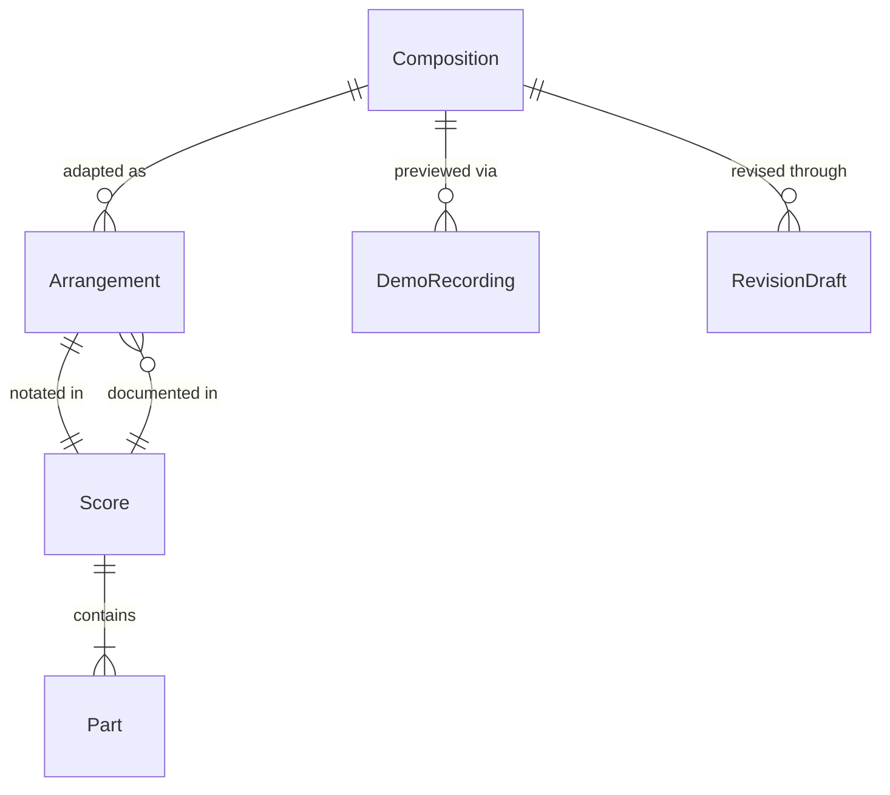
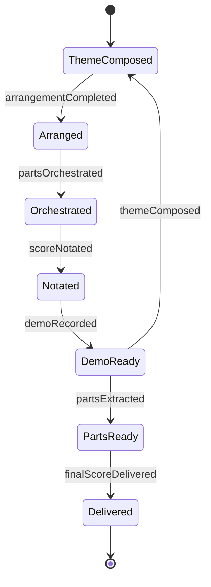
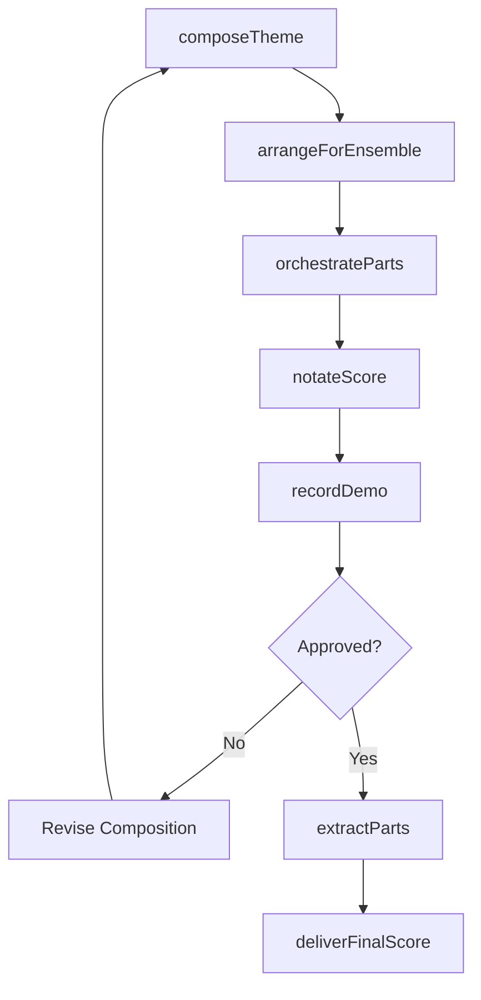
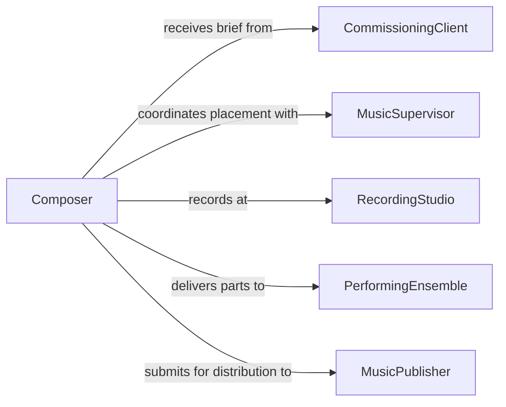

# Create Musical Compositions Arrangements Scores

> Business-as-Code definition for creating musical compositions, arrangements, and scores. Models the creative workflow from ideation through composition, orchestration, notation, and final score preparation.

## Overview

Creating musical compositions, arrangements, and scores involves developing original melodies, harmonies, and rhythmic structures or adapting existing works for different ensembles and contexts. This includes composing for film, television, theater, recordings, live performances, and commercial media. This definition exposes actions for drafting themes, arranging instrumentation, notating parts, producing demo recordings, and delivering final scores. Events enable automated tracking of revision cycles, and searches provide access to score libraries and instrumentation catalogs.

## Actors

| Actor | Description |
|-------|-------------|
| CommissioningClient | Requests the composition for a specific project or purpose |
| MusicPublisher | Licenses and distributes the finished compositions |
| RecordingStudio | Provides facilities for recording demos and final tracks |
| PerformingEnsemble | Musicians who will perform the composed or arranged work |
| MusicSupervisor | Oversees music selection and placement in media productions |

## Roles

| Role | Description |
|------|-------------|
| Composer | Creates original musical works and thematic material |
| Arranger | Adapts compositions for specific instruments or ensembles |
| Orchestrator | Assigns musical lines to specific instruments within an ensemble |
| Copyist | Prepares clean, performance-ready parts from the full score |
| MusicProducer | Oversees the recording and production of composed works |

## Entities

| Entity | Description |
|--------|-------------|
| Composition | An original musical work with melody, harmony, and structure |
| Arrangement | An adaptation of a composition for a specific ensemble or context |
| Score | A complete notated document showing all instrumental and vocal parts |
| Part | An individual instrumental or vocal line extracted from the score |
| DemoRecording | A preliminary audio rendering of the composition |
| RevisionDraft | A tracked version of the composition during the creative process |

## Actions

| Action | Description |
|--------|-------------|
| composeTheme | Write the primary melodic and harmonic material for a work |
| arrangeForEnsemble | Adapt the composition for a specific instrumentation |
| orchestrateParts | Assign musical lines to individual instruments |
| notateScore | Produce the full score in standard notation |
| extractParts | Generate individual performer parts from the full score |
| recordDemo | Create a preliminary audio rendering for review |
| deliverFinalScore | Submit the completed score and parts to the client |

## Events

| Event | Description |
|-------|-------------|
| themeComposed | Primary melodic and harmonic material has been written |
| arrangementCompleted | The composition has been adapted for the target ensemble |
| partsOrchestrated | Musical lines have been assigned to instruments |
| scoreNotated | The full score has been produced in standard notation |
| partsExtracted | Individual performer parts have been generated |
| demoRecorded | A preliminary audio rendering has been created |
| finalScoreDelivered | The completed score and parts have been submitted |

## Searches

| Search | Description |
|--------|-------------|
| findCompositions | List compositions by genre, client, or creation date |
| getArrangements | Retrieve arrangements for a specific composition |
| getScoreVersions | Look up revision drafts and final versions of a score |
| getInstrumentation | Find instrumentation details for a composition or arrangement |

## Entity Relationships



## State Diagram



## Workflow



## Actor Relationships



## Usage

### Calling Actions

```typescript
import { createMusicalCompositionsArrangementsScores } from '@headlessly/create-musical-compositions-arrangements-scores'

const music = createMusicalCompositionsArrangementsScores()

// Compose a theme for a film score
const theme = await music.composeTheme({
  title: 'Rising Dawn',
  project: 'Feature Film - Horizon',
  genre: 'orchestral',
  tempo: 72,
  key: 'D major',
  duration: { value: 3, unit: 'minutes' }
})

// Arrange for a full orchestra
const arrangement = await music.arrangeForEnsemble({
  compositionId: theme.id,
  ensemble: 'full-orchestra',
  sections: ['strings', 'woodwinds', 'brass', 'percussion', 'harp']
})

// Notate and extract parts
await music.notateScore({
  compositionId: theme.id,
  arrangementId: arrangement.id,
  format: 'MusicXML'
})

const parts = await music.extractParts({
  compositionId: theme.id,
  arrangementId: arrangement.id,
  format: 'pdf'
})
```

### Event-Driven Automation

```typescript
// Notify client when demo recording is ready for review
music.demoRecorded(async ({ compositionId, title, audioUrl }) => {
  await notify({
    to: 'commissioning-client',
    message: `Demo recording of "${title}" is ready for review`,
    attachments: [audioUrl]
  })
})

// Auto-extract parts when score notation is complete
music.scoreNotated(async ({ compositionId, arrangementId }) => {
  await music.extractParts({
    compositionId,
    arrangementId,
    format: 'pdf'
  })
})
```
