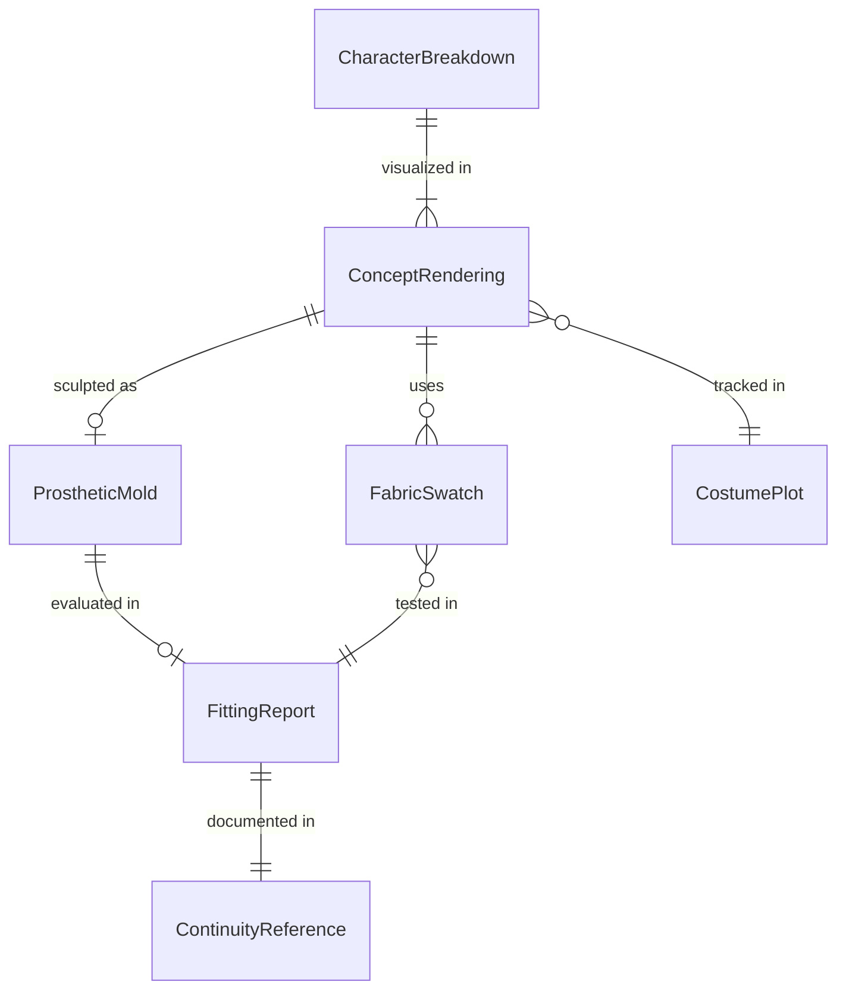
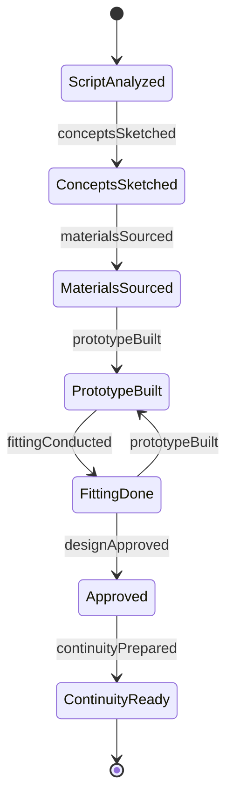
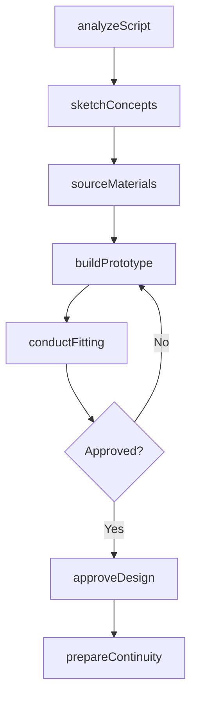
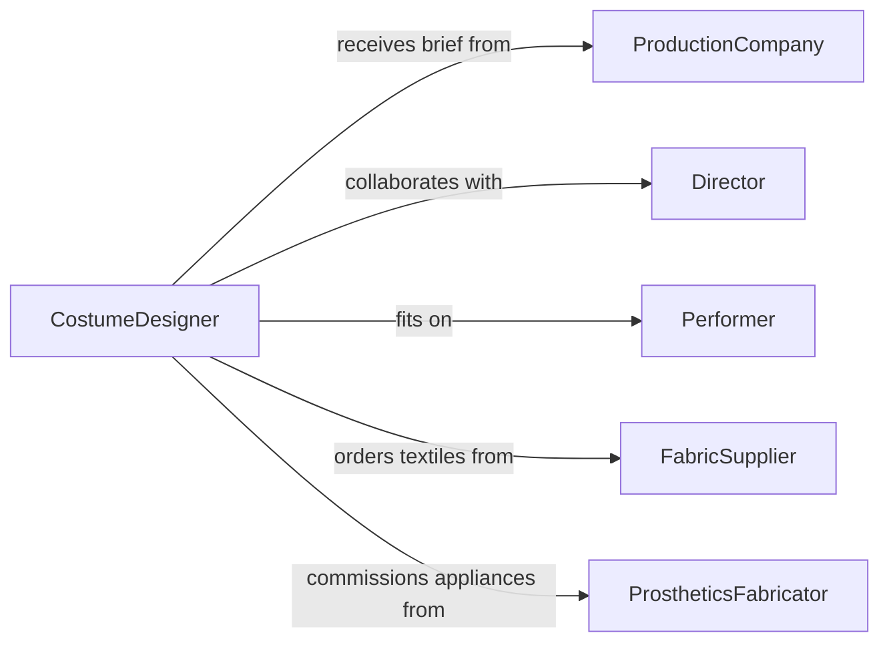

# Design Costumes or Cosmetic Effects for Characters

> Business-as-Code definition for designing costumes, makeup, prosthetics, and cosmetic special effects for characters in film, television, theater, and live entertainment productions.

## Overview

Costume and cosmetic effects design involves translating character descriptions and narrative requirements into wearable garments, makeup looks, prosthetic appliances, and special effects that support storytelling and visual continuity. This definition models the process from script analysis and character breakdown through concept sketching, material sourcing, fitting, and final approval for production use.

## Actors

| Actor | Description |
|-------|-------------|
| ProductionCompany | Studio or theater company commissioning costume and effects work |
| Director | Creative lead defining the visual tone and character interpretation |
| Performer | Actor or talent wearing the costumes and effects |
| FabricSupplier | Vendor providing textiles, trims, and specialty materials |
| ProstheticsFabricator | Workshop creating foam latex, silicone, or 3D-printed appliances |
| HairWigMaker | Specialist producing custom wigs and hairpieces |

## Roles

| Role | Description |
|------|-------------|
| CostumeDesigner | Conceives and designs the wardrobe for each character |
| MakeupDesigner | Creates makeup looks and prosthetic effects designs |
| Costumer | Builds, alters, and maintains garments for production |
| ProstheticArtist | Sculpts, molds, and applies prosthetic appliances |

## Entities

| Entity | Description |
|--------|-------------|
| CharacterBreakdown | Script analysis identifying each character's visual requirements |
| ConceptRendering | Illustration or digital rendering of the proposed design |
| CostumePlot | Chart tracking every garment by character, scene, and change |
| FabricSwatch | Sample of textile selected for a garment |
| ProstheticMold | Sculpted form used to cast silicone or foam latex appliances |
| FittingReport | Record of measurements, adjustments, and approval notes |
| ContinuityReference | Photographs and notes ensuring visual consistency across scenes |

## Actions

| Action | Description |
|--------|-------------|
| analyzeScript | Break down the script to identify character and scene requirements |
| sketchConcepts | Create preliminary design illustrations for characters |
| sourceMaterials | Select fabrics, prosthetic compounds, and specialty supplies |
| buildPrototype | Construct initial garment or prosthetic for fitting evaluation |
| conductFitting | Fit costumes and appliances on the performer for adjustments |
| approveDesign | Obtain director and production sign-off on the final look |
| prepareContinuity | Document the approved design for on-set reference |

## Events

| Event | Description |
|-------|-------------|
| scriptAnalyzed | Character and scene requirements have been identified |
| conceptsSketched | Preliminary design illustrations have been created |
| materialsSourced | Fabrics and specialty supplies have been selected |
| prototypeBuilt | Initial garment or prosthetic has been constructed |
| fittingConducted | Performer fitting and adjustments are complete |
| designApproved | Director and production have signed off on the look |
| continuityPrepared | On-set reference documentation has been compiled |

## Searches

| Search | Description |
|--------|-------------|
| findDesigns | Search costume or effects designs by production, character, or scene |
| getCostumePlot | Retrieve the full wardrobe chart for a production |
| listFittings | Enumerate fitting sessions by performer or date |
| getMaterials | Look up fabric swatches and supplies for a design |
| findByPeriod | Search designs by historical period or style genre |

## Entity Relationships



## State Diagram



## Workflow



## Actor Relationships



## Usage

### Calling Actions

```typescript
import { designCostumesCosmeticEffectsCharacters } from '@headlessly/design-costumes-cosmetic-effects-characters'

const costumes = designCostumesCosmeticEffectsCharacters()

// Analyze script for character requirements
const breakdown = await costumes.analyzeScript({
  production: 'the-tempest',
  medium: 'theater',
  characters: [
    { name: 'Prospero', scenes: 12, changes: 3, era: 'Renaissance-fantasy' },
    { name: 'Ariel', scenes: 8, changes: 5, effects: ['body-paint', 'wing-harness'] },
    { name: 'Caliban', scenes: 7, changes: 1, effects: ['full-body-prosthetic'] }
  ]
})

// Sketch concepts
const concepts = await costumes.sketchConcepts({
  breakdownId: breakdown.id,
  character: 'Caliban',
  approach: 'creature-design',
  references: ['amphibian-textures', 'barnacle-formations', 'kelp-coloration'],
  renderCount: 4
})

// Build prototype prosthetic
await costumes.buildPrototype({
  conceptId: concepts.selected,
  type: 'full-body-prosthetic',
  material: 'platinum-cure-silicone',
  pieces: ['head-cowl', 'torso-suit', 'hand-gloves', 'foot-covers'],
  applicationTime: 180,
  unit: 'minutes'
})
```

### Event-Driven Automation

```typescript
// Notify wardrobe team when design is approved
costumes.designApproved(async ({ production, character, designId }) => {
  await notify({
    to: 'wardrobe-department',
    message: `${character} costume approved for ${production} - begin multiples fabrication for design ${designId}`
  })
})

// Auto-prepare continuity after fitting is complete
costumes.fittingConducted(async ({ fittingId, character, approved }) => {
  if (approved) {
    await costumes.prepareContinuity({
      fittingId,
      documentation: ['front-photo', 'side-photo', 'back-photo', 'detail-shots'],
      notes: true
    })
  }
})
```
