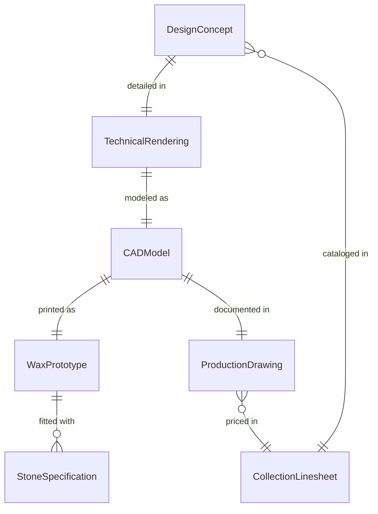
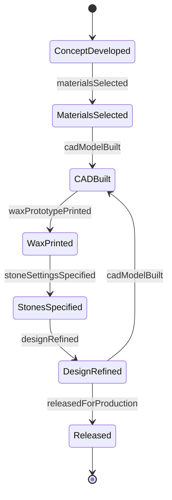
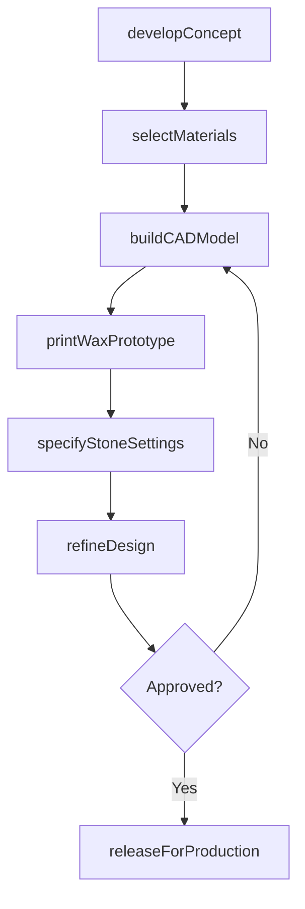
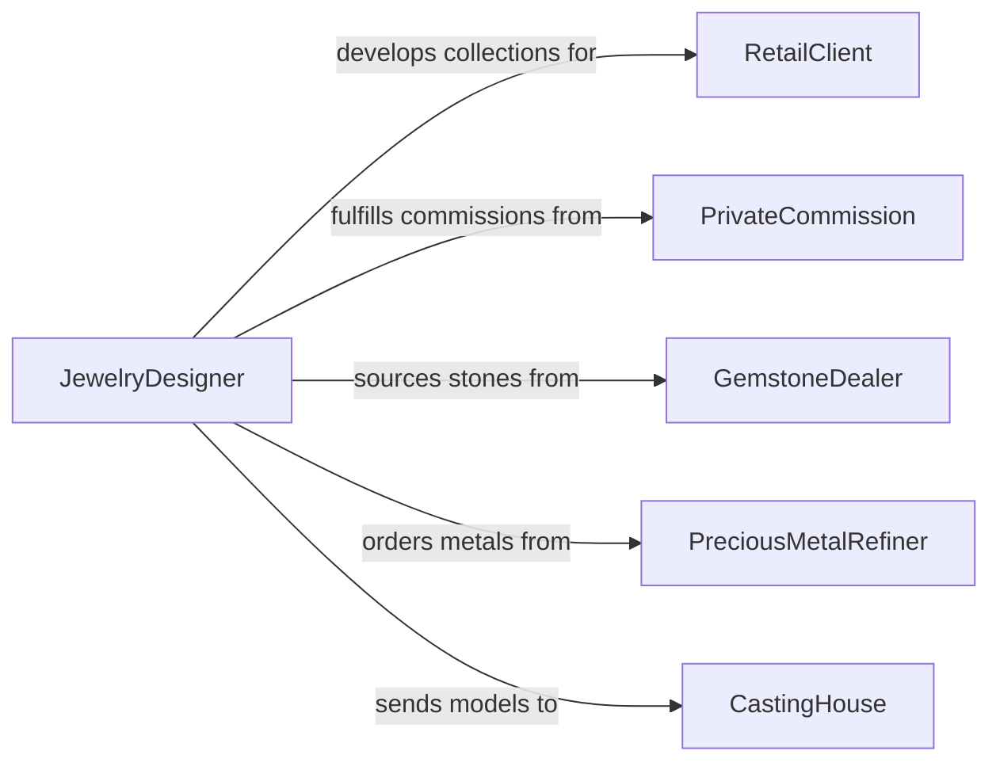

# Design Jewelry or Decorative Objects

> Business-as-Code definition for designing jewelry and decorative objects including rings, necklaces, bracelets, brooches, ornamental vessels, and sculptural accessories using precious metals, gemstones, and artisanal techniques.

## Overview

Jewelry and decorative object design involves conceiving original pieces that balance aesthetic vision, material properties, wearability, and manufacturing feasibility. This definition models the workflow from concept development through material selection, CAD modeling, wax prototyping, stone setting specification, and release for production or commission fulfillment.

## Actors

| Actor | Description |
|-------|-------------|
| RetailClient | Jewelry brand or retailer commissioning new collections |
| PrivateCommission | Individual customer requesting bespoke pieces |
| GemstoneDealer | Supplier of cut and rough gemstones for incorporation |
| PreciousMetalRefiner | Provider of gold, silver, platinum, and alloy materials |
| CastingHouse | Facility performing lost-wax casting and metal fabrication |
| HallmarkAssayOffice | Authority certifying metal purity and applying hallmarks |

## Roles

| Role | Description |
|------|-------------|
| JewelryDesigner | Conceives original designs and creates technical specifications |
| CADModeler | Translates concepts into 3D digital models for production |
| Goldsmith | Handcrafts metal components and performs finishing operations |
| Gemologist | Evaluates and selects gemstones for design incorporation |

## Entities

| Entity | Description |
|--------|-------------|
| DesignConcept | Sketch or mood board expressing the creative direction |
| TechnicalRendering | Detailed illustration with dimensions and material callouts |
| CADModel | Three-dimensional digital file for prototyping and casting |
| WaxPrototype | Physical model produced from CAD for fit and visual evaluation |
| StoneSpecification | Gemstone requirements including cut, color, clarity, and carat |
| ProductionDrawing | Manufacturing document with tolerances and finishing instructions |
| CollectionLinesheet | Catalog of designs with pricing for wholesale presentation |

## Actions

| Action | Description |
|--------|-------------|
| developConcept | Create initial sketches and mood boards for the design |
| selectMaterials | Choose metals, gemstones, and finishing treatments |
| buildCADModel | Create the three-dimensional digital model of the piece |
| printWaxPrototype | Produce a physical model for fit and visual evaluation |
| specifyStoneSettings | Define gemstone positions, setting styles, and tolerances |
| refineDesign | Adjust proportions and details based on prototype evaluation |
| releaseForProduction | Approve the design and deliver specifications for manufacturing |

## Events

| Event | Description |
|-------|-------------|
| conceptDeveloped | Initial sketches and mood boards have been created |
| materialsSelected | Metals and gemstones have been chosen |
| cadModelBuilt | Three-dimensional digital model has been completed |
| waxPrototypePrinted | Physical evaluation model has been produced |
| stoneSettingsSpecified | Gemstone positions and setting details have been defined |
| designRefined | Proportions and details have been adjusted |
| releasedForProduction | Design specifications have been approved for manufacturing |

## Searches

| Search | Description |
|--------|-------------|
| findDesigns | Search jewelry designs by collection, material, or style |
| getStoneRequirements | Retrieve gemstone specifications for a design |
| listPrototypes | Enumerate wax models by design or evaluation status |
| getProductionSpecs | Look up manufacturing documents for a design |
| findByMetal | Search designs using a specific precious metal or alloy |

## Entity Relationships



## State Diagram



## Workflow



## Actor Relationships



## Usage

### Calling Actions

```typescript
import { designJewelryDecorativeObjects } from '@headlessly/design-jewelry-decorative-objects'

const jewelry = designJewelryDecorativeObjects()

// Develop concept
const concept = await jewelry.developConcept({
  collection: 'celestial-collection',
  pieceType: 'pendant-necklace',
  inspiration: ['Art-Nouveau', 'astronomical-motifs', 'flowing-organic-lines'],
  sketches: 6,
  targetPrice: { min: 2400, max: 3800, currency: 'USD' }
})

// Select materials
const materials = await jewelry.selectMaterials({
  conceptId: concept.id,
  metal: { type: '18k-yellow-gold', weight: 12.5, unit: 'grams' },
  stones: [
    { type: 'moonstone', cut: 'cabochon', size: 10, unit: 'mm', quantity: 1 },
    { type: 'diamond', cut: 'brilliant-round', size: 1.5, unit: 'mm', quantity: 8 }
  ],
  finish: 'satin-with-polished-highlights'
})

// Build CAD model
await jewelry.buildCADModel({
  conceptId: concept.id,
  materialsId: materials.id,
  software: 'Rhino-MatrixGold',
  resolution: 'high',
  bailType: 'hidden-bail',
  chainLength: 450,
  unit: 'mm'
})
```

### Event-Driven Automation

```typescript
// Notify casting house when design is released
jewelry.releasedForProduction(async ({ designId, collection, metal }) => {
  await notify({
    to: 'casting-house',
    message: `Design ${designId} from ${collection} released - ${metal} casting required`
  })
})

// Auto-specify stone settings after wax prototype is approved
jewelry.waxPrototypePrinted(async ({ designId, approved }) => {
  if (approved) {
    await jewelry.specifyStoneSettings({
      designId,
      settingStyle: 'bezel-set',
      prongs: 0,
      tolerance: 0.1,
      unit: 'mm'
    })
  }
})
```
