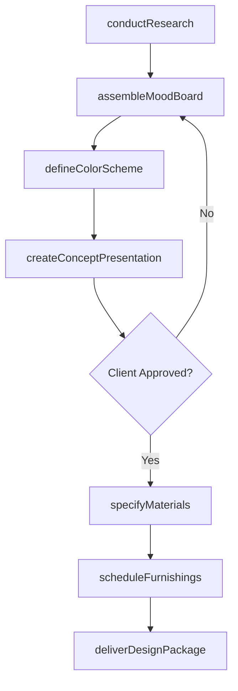
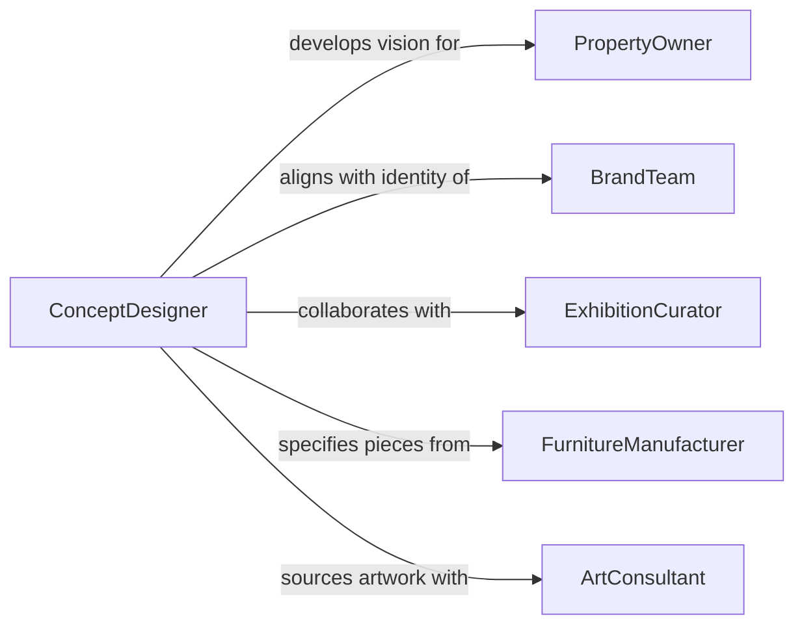

# Develop Artistic or Design Concepts for Decoration, Exhibition, or Commercial Purposes

> Business-as-Code definition for developing artistic and design concepts used in interior decoration, exhibition design, commercial branding environments, and visual merchandising that shape spatial experiences and brand narratives.

## Overview

Artistic concept development for decorative and commercial purposes involves synthesizing client vision, spatial constraints, cultural context, and brand identity into cohesive design directions that guide material selection, color palettes, furniture specification, and decorative detailing. This definition models the workflow from creative research through concept presentation, design development, specification, and handoff to fabrication and installation teams.

## Actors

| Actor | Description |
|-------|-------------|
| PropertyOwner | Client commissioning decorative or commercial design |
| BrandTeam | Organization defining visual identity requirements |
| ExhibitionCurator | Specialist directing thematic content for display environments |
| FurnitureManufacturer | Supplier producing custom and specified furnishings |
| ArtConsultant | Advisor sourcing artwork and decorative pieces |
| ConstructionContractor | Builder executing architectural modifications for the design |

## Roles

| Role | Description |
|------|-------------|
| ConceptDesigner | Creates overarching artistic vision and design direction |
| InteriorDesigner | Develops spatial layouts and material specifications |
| ColorSpecialist | Defines color palettes and finish combinations |
| PresentationDesigner | Produces visual boards and renderings for client communication |

## Entities

| Entity | Description |
|--------|-------------|
| CreativeBrief | Client requirements, brand guidelines, and spatial parameters |
| MoodBoard | Curated collection of images, textures, and references expressing direction |
| ConceptPresentation | Rendered visualizations and material samples for client review |
| ColorScheme | Defined palette with primary, secondary, and accent colors |
| MaterialPalette | Selected finishes, fabrics, and surface treatments |
| FurnitureSchedule | Specified list of furnishings with dimensions and sourcing details |
| DesignDevelopmentPackage | Detailed specifications for fabrication and installation |

## Actions

| Action | Description |
|--------|-------------|
| conductResearch | Study trends, references, and cultural context for the concept |
| assembleMoodBoard | Curate visual references expressing the design direction |
| defineColorScheme | Develop the color palette and finish combinations |
| createConceptPresentation | Produce renderings and material samples for client review |
| specifyMaterials | Select and document finishes, fabrics, and surface treatments |
| scheduleFurnishings | Specify furniture pieces with dimensions and sourcing |
| deliverDesignPackage | Compile and release detailed specifications for execution |

## Events

| Event | Description |
|-------|-------------|
| researchConducted | Trend and context analysis is complete |
| moodBoardAssembled | Visual references have been curated |
| colorSchemeDefined | Palette and finish combinations have been established |
| conceptPresented | Renderings and samples have been presented to the client |
| materialsSpecified | Finishes and treatments have been selected and documented |
| furnishingsScheduled | Furniture pieces have been specified and sourced |
| designPackageDelivered | Detailed specifications have been released for execution |

## Searches

| Search | Description |
|--------|-------------|
| findConcepts | Search design concepts by client, style, or project type |
| getMoodBoards | Retrieve visual reference boards for a project |
| listMaterials | Enumerate specified finishes and fabrics for a concept |
| getFurnitureSchedule | Look up furnishing specifications for a project |
| findByStyle | Search concepts by aesthetic style or period reference |

## Workflow



## Actor Relationships



## Usage

### Calling Actions

```typescript
import { developArtisticDesignConceptsDecoration } from '@headlessly/develop-artistic-design-concepts-decoration'

const concepts = developArtisticDesignConceptsDecoration()

// Conduct research
const research = await concepts.conductResearch({
  project: 'boutique-hotel-lobby',
  client: 'maison-veritas',
  context: {
    location: 'Paris-Marais-district',
    era: 'contemporary-with-Art-Deco-references',
    audience: 'luxury-traveler',
    squareMeters: 280
  },
  references: ['1920s-Parisian-salons', 'contemporary-Japanese-minimalism', 'biophilic-design']
})

// Assemble mood board
const moodBoard = await concepts.assembleMoodBoard({
  researchId: research.id,
  themes: ['gilded-restraint', 'natural-stone-textures', 'velvet-and-brass'],
  imageCount: 24,
  materialSwatches: 8
})

// Define color scheme
await concepts.defineColorScheme({
  projectId: research.projectId,
  palette: {
    primary: { name: 'warm-ivory', hex: '#F5F0E8' },
    secondary: { name: 'deep-forest', hex: '#2C3E2D' },
    accent: { name: 'antiqued-gold', hex: '#C5A55A' },
    neutral: { name: 'warm-grey', hex: '#9B9590' }
  },
  application: {
    walls: 'warm-ivory',
    upholstery: 'deep-forest',
    metalwork: 'antiqued-gold',
    flooring: 'natural-honed-limestone'
  }
})
```

### Event-Driven Automation

```typescript
// Notify contractor when design package is delivered
concepts.designPackageDelivered(async ({ projectId, client }) => {
  await notify({
    to: 'construction-contractor',
    message: `Design package for ${client} project ${projectId} delivered - ready for buildout scheduling`
  })
})

// Auto-specify materials after concept is approved
concepts.conceptPresented(async ({ projectId, approved }) => {
  if (approved) {
    await concepts.specifyMaterials({
      projectId,
      categories: ['wall-finishes', 'flooring', 'upholstery', 'metalwork', 'stone'],
      sampleRequired: true
    })
  }
})
```
