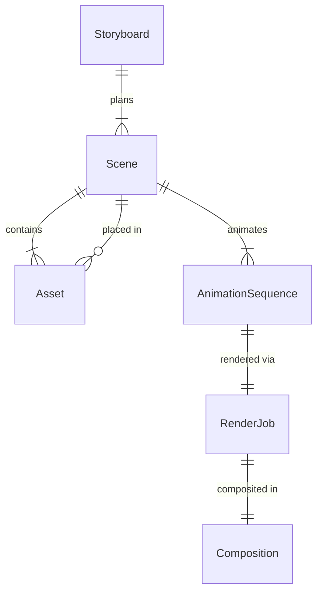
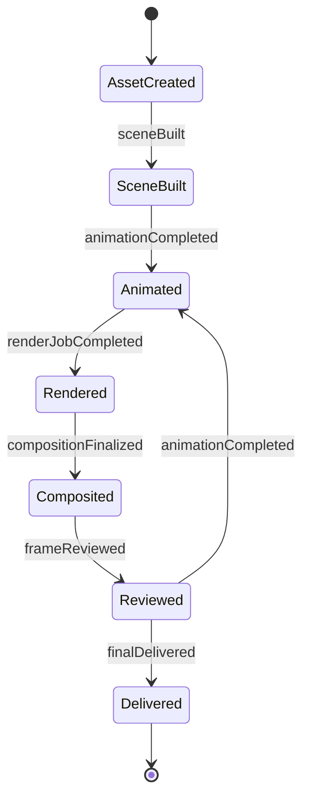
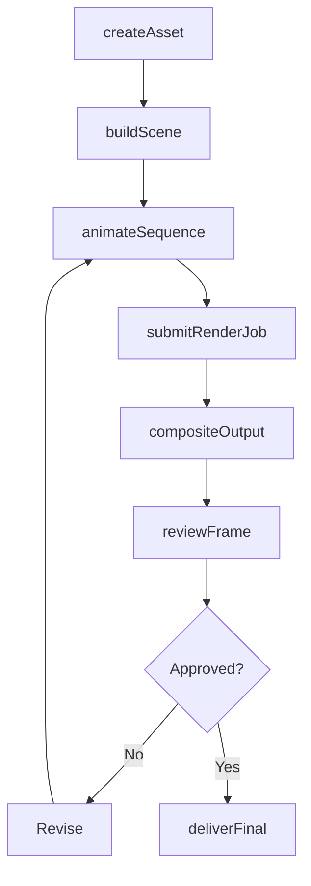
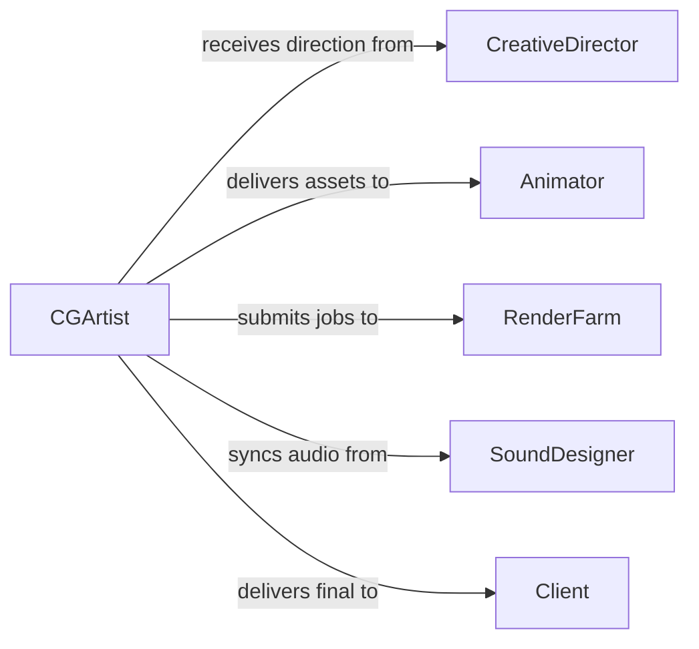

# Create Computer-generated Graphics Animation

> Business-as-Code definition for creating computer-generated graphics and animation. Models the digital production pipeline from concept development through rendering, compositing, and final delivery.

## Overview

Creating computer-generated graphics and animation involves designing, modeling, texturing, rigging, animating, and rendering digital visual content for film, games, advertising, simulations, and interactive media. This definition exposes actions for each stage of the CG pipeline, events for production automation, and searches for asset and project management.

## Actors

| Actor | Description |
|-------|-------------|
| Client | Commissions CG graphics or animation for a project or campaign |
| CreativeDirector | Provides artistic direction and approves visual concepts |
| SoundDesigner | Supplies audio assets that synchronize with animation timing |
| VoiceTalent | Provides recorded dialogue used to drive lip-sync and character animation |
| RenderFarm | External compute infrastructure that processes rendering jobs |

## Roles

| Role | Description |
|------|-------------|
| CGArtist | Creates 3D models, textures, and visual assets |
| Animator | Brings characters and objects to life through keyframe or procedural animation |
| TechnicalDirector | Manages rendering pipelines, shaders, and simulation setups |
| Compositor | Combines rendered layers, effects, and color grades into final output |
| ProductionCoordinator | Tracks schedules, asset delivery, and milestone reviews |

## Entities

| Entity | Description |
|--------|-------------|
| Asset | A 3D model, texture, rig, or other digital resource used in production |
| Scene | A composed arrangement of assets, cameras, and lighting for rendering |
| AnimationSequence | A series of keyframes defining motion over a time range |
| RenderJob | A queued task that processes a scene into image frames or video |
| Composition | A layered assembly of rendered passes, effects, and corrections |
| Storyboard | A visual plan depicting the sequence of shots and camera angles |

## Actions

| Action | Description |
|--------|-------------|
| createAsset | Model, texture, and rig a new 3D asset |
| buildScene | Assemble assets, lighting, and cameras into a renderable scene |
| animateSequence | Define keyframes and motion curves for objects or characters |
| submitRenderJob | Queue a scene for rendering on local or remote infrastructure |
| compositeOutput | Layer rendered passes and apply color grading and effects |
| reviewFrame | Present rendered frames or sequences for creative review |
| deliverFinal | Export the approved final output in the required delivery format |

## Events

| Event | Description |
|-------|-------------|
| assetCreated | A new CG asset has been modeled and prepared for production |
| sceneBuilt | A scene has been assembled and is ready for animation or rendering |
| animationCompleted | An animation sequence has been finalized |
| renderJobCompleted | A rendering job has finished processing |
| compositionFinalized | Compositing and color grading are complete |
| frameReviewed | A creative review cycle has been completed with feedback |
| finalDelivered | The approved output has been exported and delivered |

## Searches

| Search | Description |
|--------|-------------|
| findAssets | List CG assets by type, project, or creation date |
| getRenderJobs | Retrieve render jobs by status, scene, or date range |
| getAnimationSequences | Find animation sequences by character, scene, or frame range |
| getReviewFeedback | Retrieve review comments and approval status for a deliverable |

## Entity Relationships



## State Diagram



## Workflow



## Actor Relationships



## Usage

### Calling Actions

```typescript
import { createComputerGeneratedGraphicsAnimation } from '@headlessly/create-computer-generated-graphics-animation'

const cg = createComputerGeneratedGraphicsAnimation()

// Create a 3D character asset
const character = await cg.createAsset({
  name: 'Hero Character',
  type: '3d-model',
  projectId: 'animated-short-2026',
  tags: ['character', 'rigged', 'hero']
})

// Build a scene and animate
const scene = await cg.buildScene({
  projectId: 'animated-short-2026',
  assets: [character.id],
  lighting: 'studio-three-point',
  camera: { focalLength: 50, position: [0, 1.5, 5] }
})

// Submit for rendering
await cg.submitRenderJob({
  sceneId: scene.id,
  frameRange: { start: 1, end: 240 },
  resolution: { width: 3840, height: 2160 },
  outputFormat: 'EXR'
})
```

### Event-Driven Automation

```typescript
// Auto-composite when render completes
cg.renderJobCompleted(async ({ renderJobId, sceneId, outputPath }) => {
  await cg.compositeOutput({
    renderJobId,
    passes: ['beauty', 'ambient-occlusion', 'shadow'],
    colorSpace: 'ACEScg'
  })
})

// Notify creative director when composition is ready for review
cg.compositionFinalized(async ({ compositionId, projectId }) => {
  await notify({
    to: 'creative-director',
    message: `Composition ${compositionId} for project ${projectId} is ready for review`
  })
})
```
