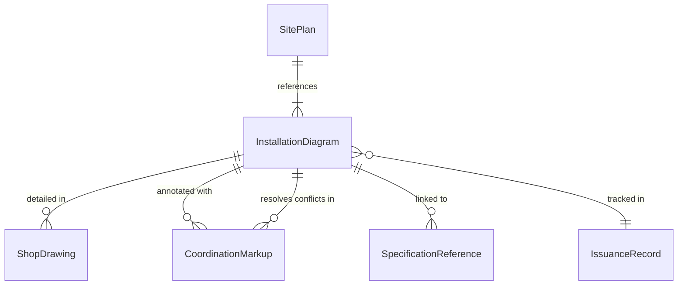
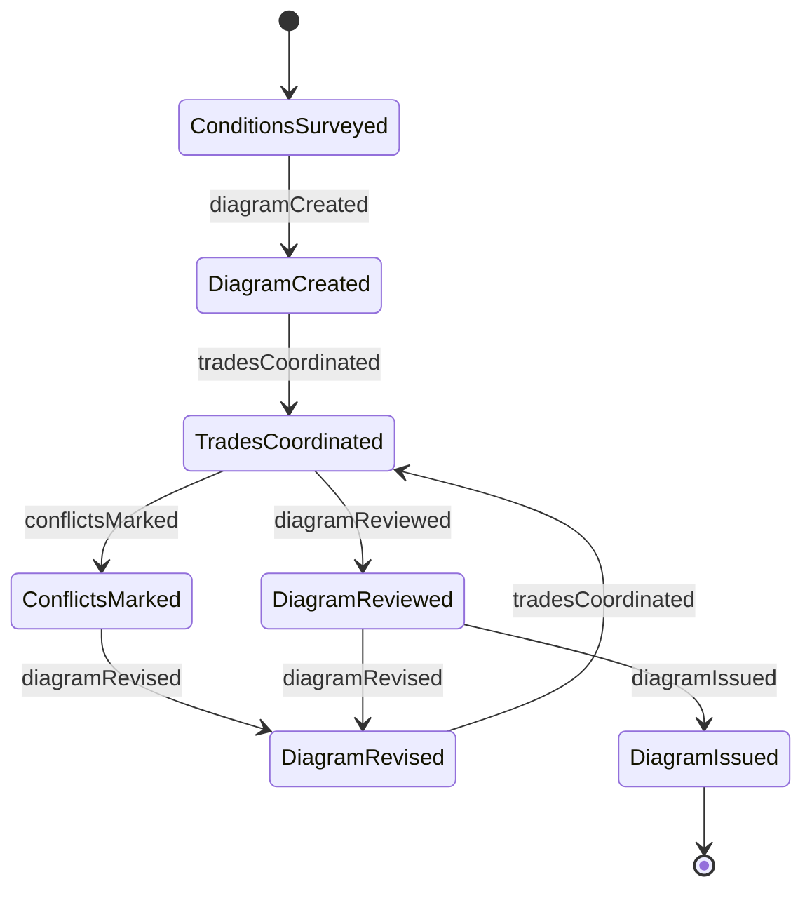
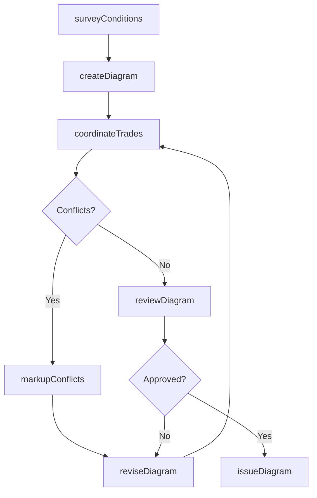
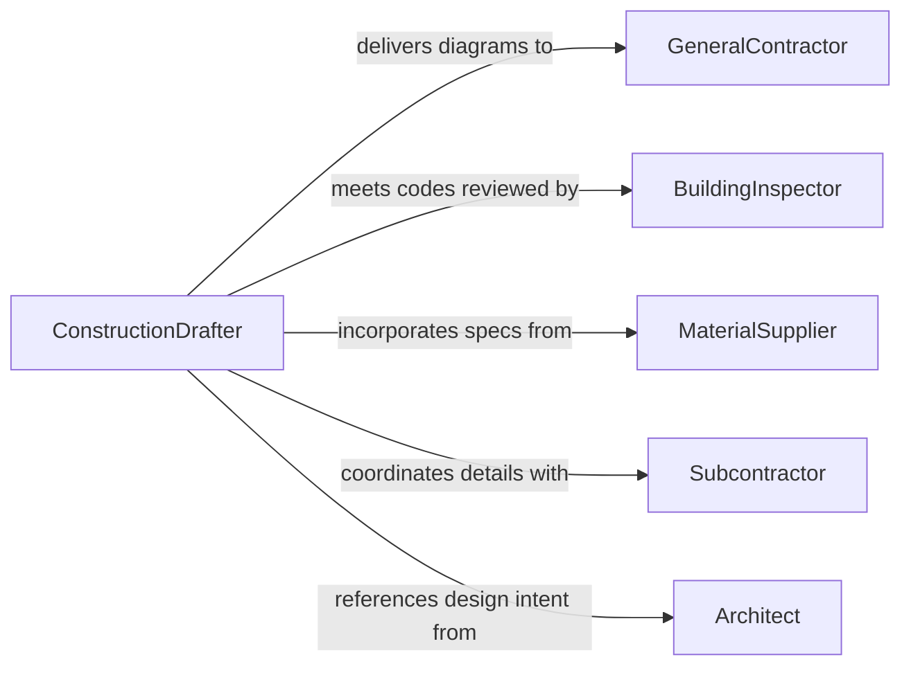

# Create Construction Installation Diagrams

> Business-as-Code definition for creating construction or installation diagrams. Models the drafting lifecycle from site survey and specification gathering through diagram creation, coordination, and issuance for construction.

## Overview

Creating construction or installation diagrams involves producing detailed drawings that guide the physical assembly, placement, and connection of building components, mechanical systems, and equipment at a job site. These diagrams translate architectural and engineering designs into field-ready documents showing exact dimensions, mounting details, routing paths, connection points, and sequencing instructions that contractors and installers rely on to execute work safely and accurately.

## Actors

| Actor | Description |
|-------|-------------|
| GeneralContractor | Coordinates construction activities and uses diagrams for field execution |
| BuildingInspector | Reviews diagrams and installations for code compliance |
| MaterialSupplier | Provides construction materials whose dimensions and specs appear in diagrams |
| Subcontractor | Performs specialized installation work using trade-specific diagrams |
| Architect | Provides design intent documents that installation diagrams must reflect |

## Roles

| Role | Description |
|------|-------------|
| ConstructionDrafter | Produces detailed installation diagrams from engineering specifications |
| ProjectEngineer | Specifies installation requirements and reviews diagram accuracy |
| BIMCoordinator | Manages building information models to detect spatial conflicts between trades |
| FieldSupervisor | Uses diagrams to direct on-site installation activities |

## Entities

| Entity | Description |
|--------|-------------|
| InstallationDiagram | A detailed drawing showing placement, routing, and connection of components |
| SitePlan | A scaled drawing showing the project location and surrounding context |
| ShopDrawing | A fabricator-prepared drawing showing exact manufacturing dimensions for field installation |
| CoordinationMarkup | Annotations identifying spatial conflicts between different building systems |
| SpecificationReference | A link between a diagram element and its corresponding technical specification |
| IssuanceRecord | A log tracking which diagram versions have been distributed to field teams |

## Actions

| Action | Description |
|--------|-------------|
| surveyConditions | Document existing site conditions and measurements for diagram accuracy |
| createDiagram | Produce a construction or installation diagram from specifications |
| coordinateTrades | Overlay diagrams from multiple trades to identify spatial conflicts |
| markupConflicts | Annotate areas where building systems interfere with each other |
| reviewDiagram | Submit a diagram for engineering review and code compliance check |
| reviseDiagram | Update a diagram based on review feedback or field conditions |
| issueDiagram | Release a diagram to field teams for construction use |

## Events

| Event | Description |
|-------|-------------|
| conditionsSurveyed | Existing site conditions have been documented and measured |
| diagramCreated | A new construction or installation diagram has been produced |
| tradesCoordinated | Multi-trade diagram overlay has been completed |
| conflictsMarked | Spatial conflicts between building systems have been annotated |
| diagramReviewed | Engineering review and code compliance check has been completed |
| diagramRevised | A diagram has been updated based on review or field feedback |
| diagramIssued | A diagram has been released for field construction use |

## Searches

| Search | Description |
|--------|-------------|
| findDiagrams | List installation diagrams by project, trade, or revision status |
| getConflicts | Retrieve coordination markups by trade pair, severity, or resolution status |
| getIssuanceHistory | Track diagram distribution records by version, recipient, or date |
| getShopDrawings | Find shop drawings by fabricator, system, or approval status |

## Entity Relationships



## State Diagram



## Workflow



## Actor Relationships



## Usage

### Calling Actions

```typescript
import { createConstructionInstallationDiagrams } from '@headlessly/create-construction-installation-diagrams'

const installDiagrams = createConstructionInstallationDiagrams()

// Survey existing conditions
const survey = await installDiagrams.surveyConditions({
  projectId: 'office-tower-phase-2',
  area: 'mechanical-penthouse',
  measurements: { ceilingHeight: '14ft', clearSpan: '60ft x 40ft' }
})

// Create HVAC installation diagram
const diagram = await installDiagrams.createDiagram({
  projectId: 'office-tower-phase-2',
  trade: 'HVAC',
  system: 'air-handling-unit-installation',
  specifications: ['AHU-3 mounting details', 'ductwork-routing-level-15', 'vibration-isolation-pads']
})

// Coordinate with other trades
await installDiagrams.coordinateTrades({
  diagramId: diagram.id,
  overlayWith: ['electrical-conduit-routing', 'plumbing-riser-diagram', 'fire-sprinkler-layout']
})
```

### Event-Driven Automation

```typescript
// Notify field teams when diagrams are issued
installDiagrams.diagramIssued(async ({ diagramId, trade, revision }) => {
  await notify({
    to: `${trade}-field-team`,
    message: `Installation diagram ${diagramId} rev ${revision} issued for construction`
  })
})

// Auto-trigger coordination review when a new diagram is created
installDiagrams.diagramCreated(async ({ diagramId, projectId, trade }) => {
  const otherTrades = await installDiagrams.findDiagrams({
    projectId,
    excludeTrade: trade,
    status: 'issued'
  })
  if (otherTrades.length > 0) {
    await installDiagrams.coordinateTrades({
      diagramId,
      overlayWith: otherTrades.map(d => d.id)
    })
  }
})
```
