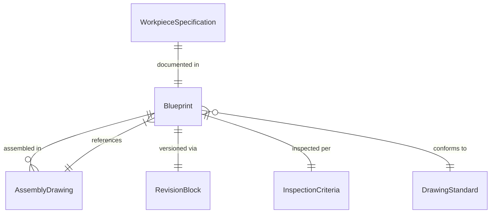
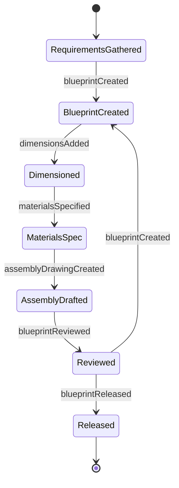
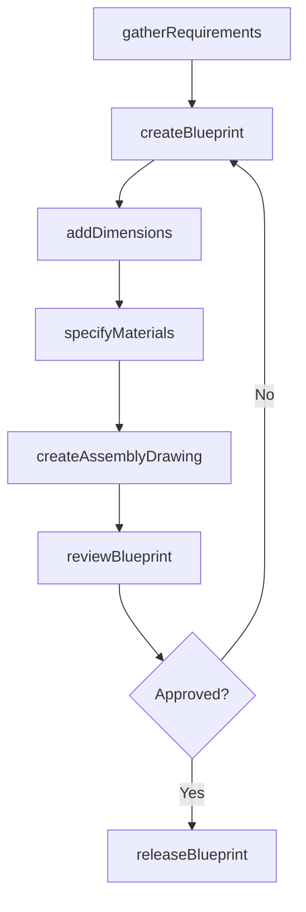
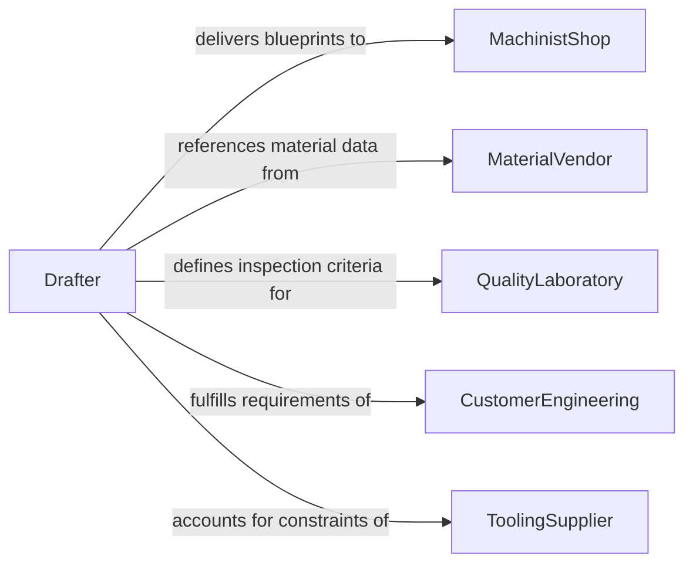

# Create Diagrams Blueprints Workpieces Products

> Business-as-Code definition for creating diagrams or blueprints for workpieces or products. Models the drafting lifecycle from requirements gathering through detailed drawing creation, review, and release for manufacturing.

## Overview

Creating diagrams or blueprints for workpieces or products involves translating product design requirements into precise technical drawings that specify dimensions, materials, surface finishes, assembly sequences, and manufacturing processes. These documents serve as the primary communication medium between design engineering and production, enabling machinists, fabricators, and assembly technicians to manufacture parts that meet exact specifications, tolerances, and quality standards.

## Actors

| Actor | Description |
|-------|-------------|
| MachinistShop | Fabricates workpieces using blueprints as the primary manufacturing reference |
| MaterialVendor | Supplies raw materials whose properties and dimensions inform drawing specifications |
| QualityLaboratory | Inspects finished workpieces against blueprint tolerances and specifications |
| CustomerEngineering | Provides product requirements and approves final blueprint specifications |
| ToolingSupplier | Provides jigs, fixtures, and tooling whose constraints affect workpiece design |

## Roles

| Role | Description |
|------|-------------|
| ProductDesigner | Defines workpiece requirements and initial design intent |
| Drafter | Creates detailed technical drawings with dimensions, notes, and specifications |
| ManufacturingEngineer | Reviews blueprints for producibility and process compatibility |
| QualityEngineer | Validates that drawings include proper inspection criteria and tolerances |

## Entities

| Entity | Description |
|--------|-------------|
| Blueprint | A detailed technical drawing defining all specifications for a workpiece or product |
| WorkpieceSpecification | A document listing material, dimensions, tolerances, and finish requirements |
| AssemblyDrawing | A diagram showing how multiple components fit together into a finished product |
| DrawingStandard | An organizational or industry standard governing drawing practices and symbology |
| RevisionBlock | A section of the blueprint tracking version history and change approvals |
| InspectionCriteria | Defined measurement points and acceptable ranges for quality verification |

## Actions

| Action | Description |
|--------|-------------|
| gatherRequirements | Collect product specifications, material constraints, and performance criteria |
| createBlueprint | Produce a detailed technical drawing for a workpiece or product |
| addDimensions | Apply precise measurements, tolerances, and geometric dimensioning to drawings |
| specifyMaterials | Document material grades, heat treatments, and surface finish requirements |
| createAssemblyDrawing | Produce a diagram showing component relationships and assembly sequence |
| reviewBlueprint | Submit drawings for manufacturing and quality engineering review |
| releaseBlueprint | Authorize final drawings for production use |

## Events

| Event | Description |
|-------|-------------|
| requirementsGathered | Product specifications and constraints have been collected |
| blueprintCreated | A detailed technical drawing has been produced |
| dimensionsAdded | Measurements and tolerances have been applied to a drawing |
| materialsSpecified | Material grades and finish requirements have been documented |
| assemblyDrawingCreated | A component assembly diagram has been produced |
| blueprintReviewed | Manufacturing and quality review of a blueprint has been completed |
| blueprintReleased | A final drawing has been authorized for production |

## Searches

| Search | Description |
|--------|-------------|
| findBlueprints | List blueprints by product, part number, material, or revision status |
| getAssemblyDrawings | Retrieve assembly diagrams by product, component count, or project |
| getRevisionHistory | Track blueprint changes by drawing number, author, or date range |
| getInspectionCriteria | Find quality inspection specifications by part number or tolerance class |

## Entity Relationships



## State Diagram



## Workflow



## Actor Relationships



## Usage

### Calling Actions

```typescript
import { createDiagramsBlueprintsWorkpiecesProducts } from '@headlessly/create-diagrams-blueprints-workpieces-products'

const blueprinting = createDiagramsBlueprintsWorkpiecesProducts()

// Gather requirements for a precision shaft
const requirements = await blueprinting.gatherRequirements({
  productName: 'Drive Shaft Assembly',
  partNumber: 'DS-7200',
  application: 'industrial-gearbox',
  performanceCriteria: { torqueRating: '500 Nm', speed: '3600 RPM' }
})

// Create the detailed blueprint
const blueprint = await blueprinting.createBlueprint({
  requirementsId: requirements.id,
  drawingStandard: 'ASME Y14.5-2018',
  scale: '1:2',
  views: ['front', 'side', 'section-A-A', 'detail-B']
})

// Specify materials and release
await blueprinting.specifyMaterials({
  blueprintId: blueprint.id,
  material: '4140 Alloy Steel',
  heatTreatment: 'Quench and Temper to HRC 28-32',
  surfaceFinish: '32 Ra microinch'
})

await blueprinting.releaseBlueprint({
  blueprintId: blueprint.id,
  approvedBy: 'manufacturing-engineering',
  effectiveDate: '2026-02-15'
})
```

### Event-Driven Automation

```typescript
// Notify machinist shop when blueprints are released
blueprinting.blueprintReleased(async ({ blueprintId, partNumber, revision }) => {
  await notify({
    to: 'machinist-shop',
    message: `Blueprint ${blueprintId} for part ${partNumber} rev ${revision} released for production`
  })
})

// Trigger assembly drawing when all component blueprints are complete
blueprinting.blueprintCreated(async ({ blueprintId, productName }) => {
  const componentBlueprints = await blueprinting.findBlueprints({
    product: productName,
    status: 'released'
  })
  if (componentBlueprints.length >= 4) {
    await blueprinting.createAssemblyDrawing({
      product: productName,
      components: componentBlueprints.map(b => b.partNumber)
    })
  }
})
```
