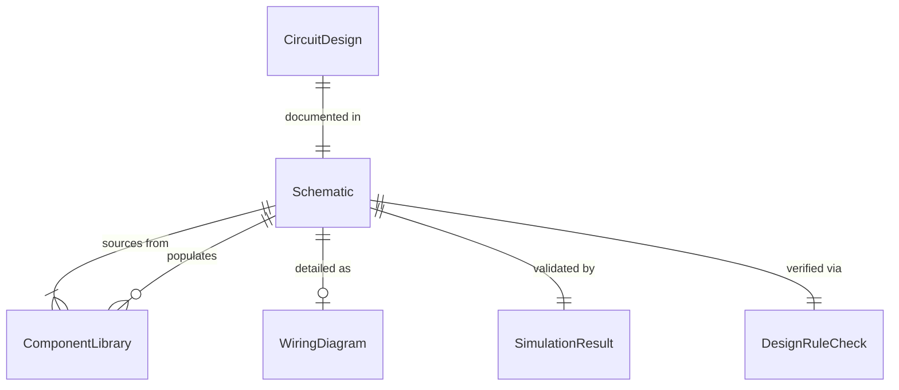
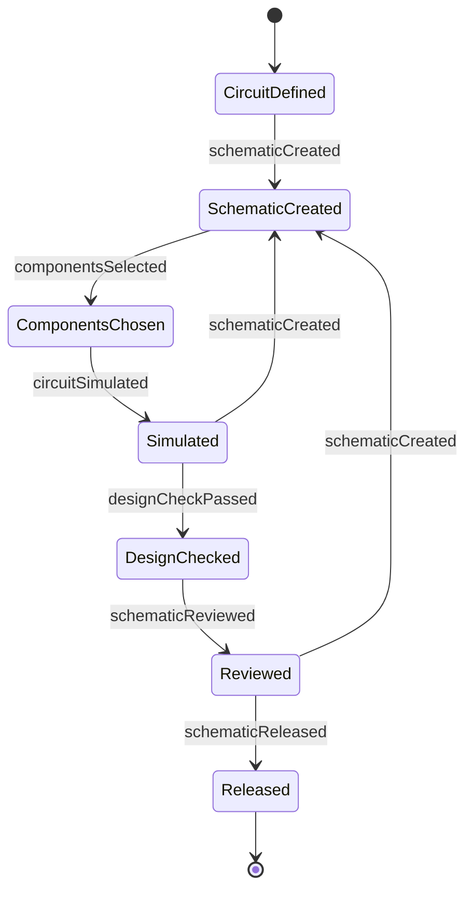
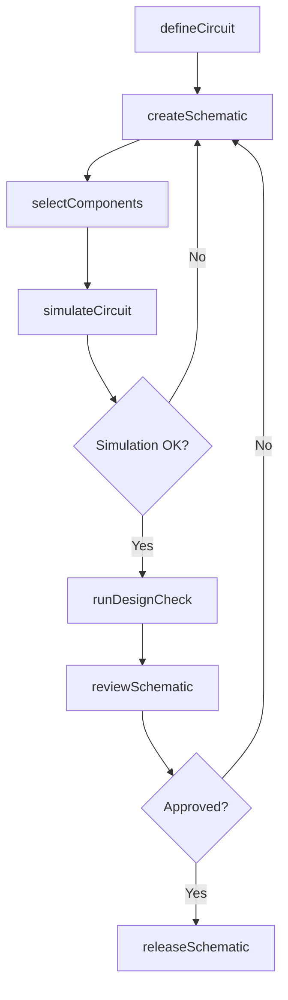
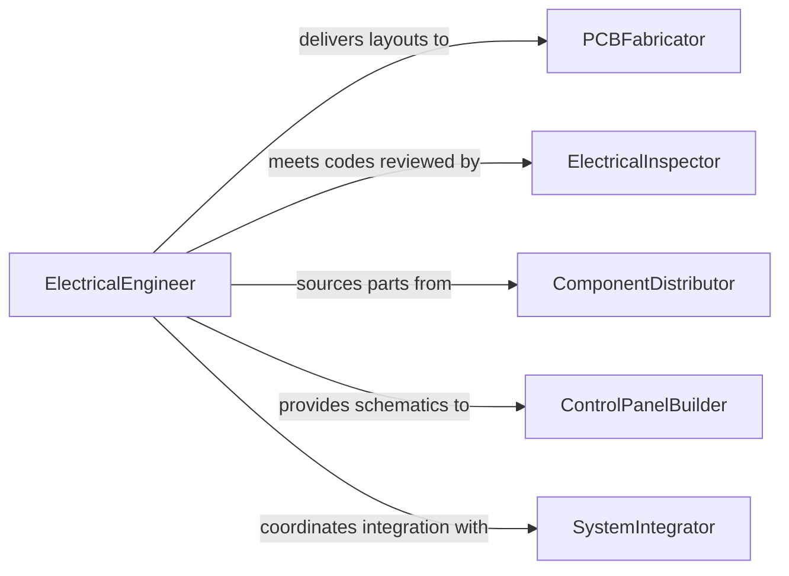

# Create Electrical Schematics

> Business-as-Code definition for creating electrical schematics. Models the lifecycle from circuit design requirements through schematic drafting, simulation, review, and release for fabrication or installation.

## Overview

Creating electrical schematics involves producing standardized diagrams that represent circuits, wiring layouts, control logic, and power distribution systems using recognized symbols and conventions. These schematics document the electrical connections between components such as resistors, capacitors, transformers, relays, PLCs, and motors, serving as the authoritative reference for manufacturing, installation, troubleshooting, and regulatory compliance across industries including electronics, building systems, and industrial automation.

## Actors

| Actor | Description |
|-------|-------------|
| PCBFabricator | Manufactures printed circuit boards using schematic-derived layout files |
| ElectricalInspector | Reviews schematics and installations for National Electrical Code compliance |
| ComponentDistributor | Supplies electronic components whose specifications are referenced in schematics |
| ControlPanelBuilder | Assembles control panels and wiring harnesses from schematic documentation |
| SystemIntegrator | Combines electrical subsystems into a complete working installation |

## Roles

| Role | Description |
|------|-------------|
| ElectricalEngineer | Designs circuits and specifies electrical system requirements |
| SchematicDrafter | Produces standardized electrical schematic drawings using EDA tools |
| CircuitSimulationAnalyst | Validates circuit behavior through simulation before physical implementation |
| ComplianceReviewer | Ensures schematics meet applicable electrical codes and safety standards |

## Entities

| Entity | Description |
|--------|-------------|
| Schematic | A diagram representing electrical circuits using standardized symbols and connections |
| CircuitDesign | A functional specification defining the electrical behavior of a circuit |
| ComponentLibrary | A database of electrical component symbols, footprints, and specifications |
| WiringDiagram | A connection-level drawing showing physical wire routing and terminal assignments |
| SimulationResult | Output from a circuit simulation validating expected electrical behavior |
| DesignRuleCheck | An automated verification confirming schematic adherence to design constraints |

## Actions

| Action | Description |
|--------|-------------|
| defineCircuit | Specify the functional requirements and topology of an electrical circuit |
| createSchematic | Draft an electrical schematic diagram using standardized symbols |
| selectComponents | Choose specific components from the library matching circuit requirements |
| simulateCircuit | Run electrical simulation to validate circuit behavior and performance |
| runDesignCheck | Execute automated design rule checks for errors and standards compliance |
| reviewSchematic | Submit the schematic for engineering and compliance review |
| releaseSchematic | Authorize the final schematic for fabrication or installation |

## Events

| Event | Description |
|-------|-------------|
| circuitDefined | Functional requirements and topology of a circuit have been specified |
| schematicCreated | An electrical schematic diagram has been drafted |
| componentsSelected | Specific components have been chosen for the circuit design |
| circuitSimulated | Electrical simulation has been completed with results recorded |
| designCheckPassed | Automated design rule checks have confirmed standards compliance |
| schematicReviewed | Engineering and compliance review of a schematic has been completed |
| schematicReleased | A final schematic has been authorized for fabrication or installation |

## Searches

| Search | Description |
|--------|-------------|
| findSchematics | List schematics by project, circuit type, or revision status |
| getComponents | Search the component library by part number, manufacturer, or specification |
| getSimulationResults | Retrieve simulation outcomes by circuit, parameter, or pass/fail status |
| getWiringDiagrams | Find wiring diagrams by panel, system, or installation location |

## Entity Relationships



## State Diagram



## Workflow



## Actor Relationships



## Usage

### Calling Actions

```typescript
import { createElectricalSchematics } from '@headlessly/create-electrical-schematics'

const eSchematic = createElectricalSchematics()

// Define a motor control circuit
const circuit = await eSchematic.defineCircuit({
  name: 'Variable Speed Motor Drive',
  type: 'power-control',
  voltage: '480V 3-phase',
  load: '50HP induction motor',
  controlLogic: 'PLC-based with VFD'
})

// Create the schematic
const schematic = await eSchematic.createSchematic({
  circuitId: circuit.id,
  standard: 'IEC 61082',
  sheets: ['power-distribution', 'control-logic', 'interlock-wiring'],
  tool: 'AutoCAD Electrical'
})

// Simulate and validate
const simulation = await eSchematic.simulateCircuit({
  schematicId: schematic.id,
  parameters: ['voltage-drop', 'short-circuit-current', 'harmonic-distortion'],
  tool: 'ETAP'
})

// Release for panel fabrication
await eSchematic.releaseSchematic({
  schematicId: schematic.id,
  approvedBy: 'senior-electrical-engineer',
  distributeTo: ['panel-builder', 'installation-contractor']
})
```

### Event-Driven Automation

```typescript
// Notify panel builder when schematics are released
eSchematic.schematicReleased(async ({ schematicId, circuitName, revision }) => {
  await notify({
    to: 'control-panel-shop',
    message: `Schematic ${schematicId} for "${circuitName}" rev ${revision} released for fabrication`
  })
})

// Auto-run design checks after simulation passes
eSchematic.circuitSimulated(async ({ schematicId, outcome }) => {
  if (outcome === 'passed') {
    await eSchematic.runDesignCheck({ schematicId })
  }
})
```
