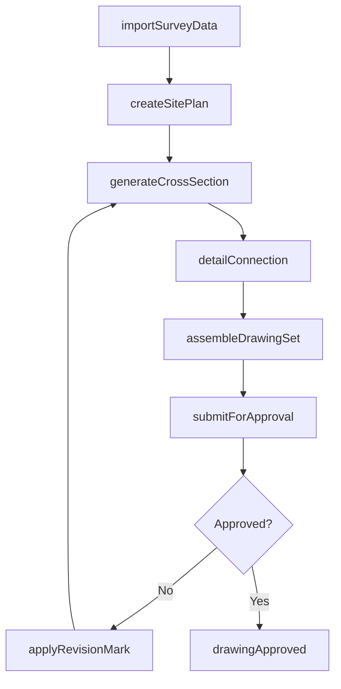
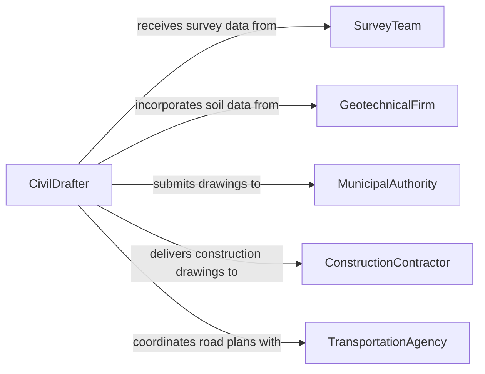

# Create Graphical Representations Civil Structures

> Business-as-Code definition for creating graphical representations of civil structures. Models the drafting lifecycle from survey data intake through structural drawing production and engineering review.

## Overview

Creating graphical representations of civil structures involves producing technical drawings, blueprints, 3D models, and renderings of roads, bridges, dams, buildings, and other infrastructure. This definition provides actions for each stage of the civil drafting process, from interpreting survey and geotechnical data through generating construction-ready drawings that meet engineering codes and regulatory standards.

## Actors

| Actor | Description |
|-------|-------------|
| MunicipalAuthority | Issues permits and reviews civil structure drawings for code compliance |
| GeotechnicalFirm | Provides subsurface investigation data for foundation design graphics |
| SurveyTeam | Supplies topographic and boundary survey data for site drawings |
| ConstructionContractor | Consumes construction drawings for field execution |
| TransportationAgency | Reviews road and bridge drawings for public infrastructure projects |

## Roles

| Role | Description |
|------|-------------|
| CivilDrafter | Produces technical drawings and CAD models of civil structures |
| StructuralEngineer | Defines load calculations and structural parameters depicted in drawings |
| ProjectEngineer | Oversees drawing deliverables and coordinates interdisciplinary reviews |
| CADManager | Maintains drawing standards, templates, and layer conventions |

## Entities

| Entity | Description |
|--------|-------------|
| StructuralDrawing | A technical drawing depicting structural elements such as beams, columns, and foundations |
| SitePlan | A plan view showing the placement of structures on a surveyed parcel |
| CrossSection | A sectional view through a structure showing internal composition and dimensions |
| DetailSheet | A close-up drawing of specific connections, joints, or reinforcement patterns |
| DrawingSet | A collection of related sheets comprising a complete civil submittal package |
| RevisionMark | A tracked change annotation on a drawing indicating modifications |

## Actions

| Action | Description |
|--------|-------------|
| importSurveyData | Load topographic and geotechnical survey data into the drawing environment |
| createSitePlan | Draft a site plan showing structure placement, grading, and utilities |
| generateCrossSection | Produce cross-sectional views of structures at specified cut lines |
| detailConnection | Create detailed drawings of structural connections and reinforcement |
| assembleDrawingSet | Compile individual sheets into a numbered and indexed drawing set |
| applyRevisionMark | Add revision clouds and delta annotations to modified areas |
| submitForApproval | Route the drawing set to engineers and authorities for review |

## Events

| Event | Description |
|-------|-------------|
| surveyDataImported | Survey data has been loaded into the drawing environment |
| sitePlanCreated | A site plan drawing has been completed |
| crossSectionGenerated | A cross-sectional view has been produced |
| drawingSetAssembled | A complete drawing set has been compiled |
| revisionApplied | A revision mark has been applied to a drawing |
| approvalSubmitted | The drawing set has been submitted for engineering review |
| drawingApproved | The drawing set has received formal approval |

## Searches

| Search | Description |
|--------|-------------|
| findDrawings | List structural drawings by project, structure type, or status |
| getRevisionHistory | Retrieve the revision log for a specific drawing or drawing set |
| getDrawingSets | Find assembled drawing sets by project or submittal phase |
| findDetailSheets | Locate detail sheets by connection type or structural element |

## Workflow



## Actor Relationships



## Usage

### Calling Actions

```typescript
import { createGraphicalRepresentationsCivilStructures } from '@headlessly/create-graphical-representations-civil-structures'

const drawings = createGraphicalRepresentationsCivilStructures()

// Import survey data for a bridge project
const survey = await drawings.importSurveyData({
  projectId: 'bridge-sr47-overpass',
  dataSource: 'topographic-survey-2026-01',
  coordinateSystem: 'NAD83'
})

// Create site plan
const sitePlan = await drawings.createSitePlan({
  projectId: 'bridge-sr47-overpass',
  surveyDataId: survey.id,
  scale: '1:200'
})

// Assemble the full drawing set
const drawingSet = await drawings.assembleDrawingSet({
  projectId: 'bridge-sr47-overpass',
  sheets: [sitePlan.id],
  titleBlock: { client: 'State DOT', projectName: 'SR-47 Overpass Replacement' }
})
```

### Event-Driven Automation

```typescript
// Notify the construction team when drawings are approved
drawings.drawingApproved(async ({ drawingSetId, projectId }) => {
  await notify({
    to: 'construction-team',
    message: `Drawing set ${drawingSetId} for ${projectId} has been approved for construction`
  })
})

// Auto-log revision history when changes are applied
drawings.revisionApplied(async ({ drawingId, revisionNumber, description }) => {
  await auditLog.record({
    entity: 'drawing',
    entityId: drawingId,
    action: 'revision',
    detail: `Rev ${revisionNumber}: ${description}`
  })
})
```
