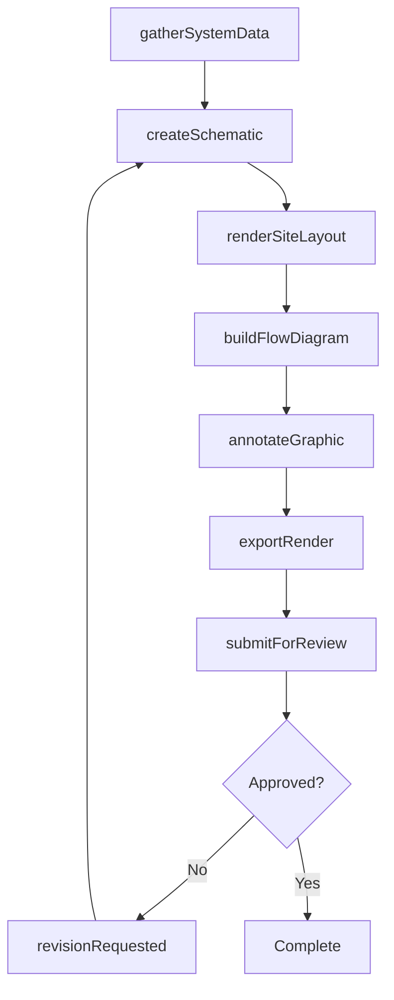
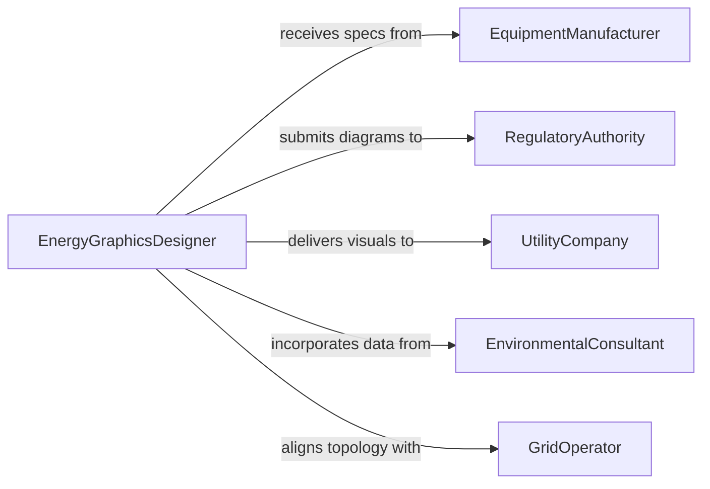

# Create Graphical Representations Energy Production

> Business-as-Code definition for creating graphical representations of energy production systems. Models the visualization lifecycle from data gathering through schematic rendering and stakeholder review.

## Overview

Creating graphical representations of energy production systems involves designing schematics, diagrams, flow charts, and visual models that depict power generation infrastructure such as solar arrays, wind farms, hydroelectric plants, and grid distribution networks. This definition exposes actions for drafting, rendering, and publishing technical visualizations used in engineering documentation, regulatory submissions, and stakeholder presentations.

## Actors

| Actor | Description |
|-------|-------------|
| UtilityCompany | Commissions energy system diagrams for planning and compliance |
| RegulatoryAuthority | Reviews visual documentation for permit and safety compliance |
| EquipmentManufacturer | Provides technical specifications for components depicted in diagrams |
| EnvironmentalConsultant | Supplies environmental impact data shown in site layout graphics |
| GridOperator | Provides interconnection and distribution topology requirements |

## Roles

| Role | Description |
|------|-------------|
| EnergyGraphicsDesigner | Creates and renders energy system schematics and diagrams |
| SystemsEngineer | Defines technical parameters and layout constraints for visualizations |
| ProjectManager | Coordinates visualization deliverables and review cycles |
| QualityReviewer | Validates accuracy of graphical representations against engineering data |

## Entities

| Entity | Description |
|--------|-------------|
| Schematic | A technical diagram of an energy production system or subsystem |
| ComponentSymbol | A standardized graphical symbol representing equipment such as turbines or inverters |
| SiteLayout | A geographic or spatial depiction of energy facility placement |
| FlowDiagram | A process flow showing energy generation, conversion, and distribution paths |
| DesignSpecification | Technical parameters that constrain the graphical representation |
| RenderOutput | The final exported visual artifact in a specified format |

## Actions

| Action | Description |
|--------|-------------|
| gatherSystemData | Collect technical specifications and site data for the energy system |
| createSchematic | Draft a new schematic diagram from engineering specifications |
| renderSiteLayout | Generate a spatial layout of energy production facilities |
| buildFlowDiagram | Construct a process flow diagram for energy generation and distribution |
| annotateGraphic | Add labels, legends, and technical notes to a visual representation |
| exportRender | Export the graphical representation in a target format such as PDF or DWG |
| submitForReview | Send the completed graphic to stakeholders for review and approval |

## Events

| Event | Description |
|-------|-------------|
| systemDataGathered | Technical and site data collection is complete |
| schematicCreated | A new schematic diagram has been drafted |
| siteLayoutRendered | A spatial layout rendering has been generated |
| graphicAnnotated | Labels and technical notes have been applied to the graphic |
| renderExported | The final visual artifact has been exported |
| reviewSubmitted | The graphic has been submitted for stakeholder review |
| revisionRequested | A reviewer has requested changes to the graphic |

## Searches

| Search | Description |
|--------|-------------|
| findSchematics | List schematics by energy type, project, or status |
| getComponentSymbols | Retrieve standardized symbols for a given equipment category |
| getSiteLayouts | Find site layout renderings by location or project |
| getReviewHistory | Retrieve review comments and revision history for a graphic |

## Workflow



## Actor Relationships



## Usage

### Calling Actions

```typescript
import { createGraphicalRepresentationsEnergyProduction } from '@headlessly/create-graphical-representations-energy-production'

const graphics = createGraphicalRepresentationsEnergyProduction()

// Gather system data for a solar farm project
const data = await graphics.gatherSystemData({
  projectId: 'solar-farm-west-42',
  energyType: 'solar',
  capacity: { value: 150, unit: 'MW' }
})

// Create the schematic diagram
const schematic = await graphics.createSchematic({
  projectId: 'solar-farm-west-42',
  systemData: data.id,
  diagramType: 'single-line',
  scale: '1:500'
})

// Export the final render
await graphics.exportRender({
  schematicId: schematic.id,
  format: 'PDF',
  resolution: 300
})
```

### Event-Driven Automation

```typescript
// Notify reviewers when a schematic is ready
graphics.renderExported(async ({ schematicId, projectId, format }) => {
  await notify({
    to: 'engineering-review-board',
    message: `Schematic ${schematicId} for project ${projectId} exported as ${format} and ready for review`
  })
})

// Trigger revision workflow on reviewer feedback
graphics.revisionRequested(async ({ schematicId, comments }) => {
  await graphics.createSchematic({
    revisionOf: schematicId,
    changeNotes: comments
  })
})
```
