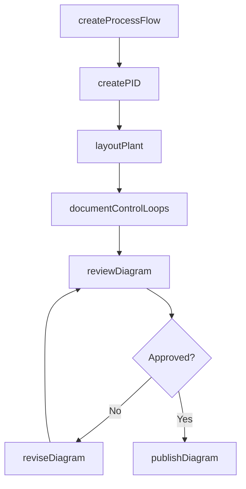
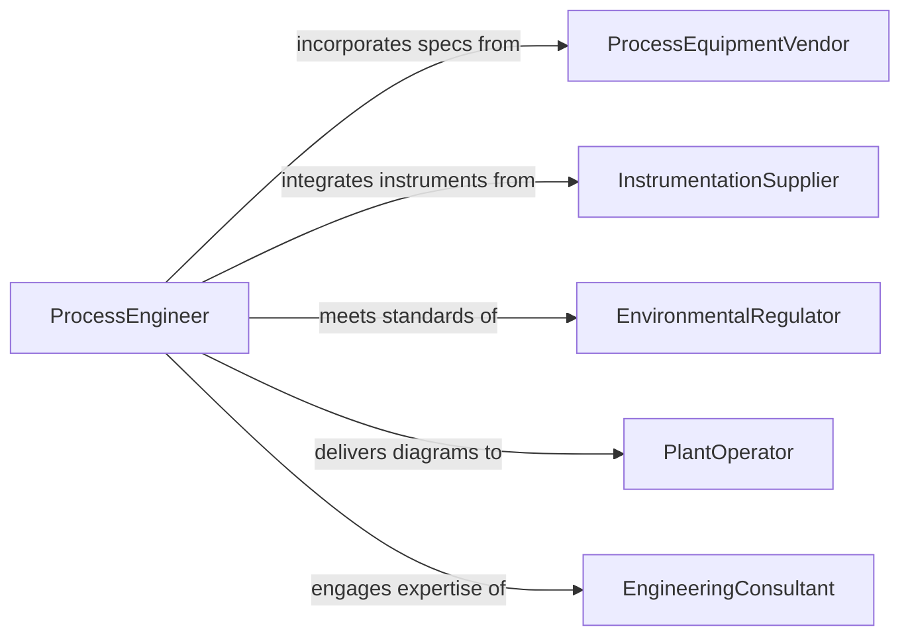

# Create Graphical Representations Industrial Production

> Business-as-Code definition for creating graphical representations of industrial production systems. Models the lifecycle from process analysis through diagram creation, validation, and publication for manufacturing and process engineering.

## Overview

Creating graphical representations of industrial production systems involves producing process flow diagrams (PFDs), piping and instrumentation diagrams (P&IDs), plant layouts, and control system schematics that document how raw materials move through transformation stages to become finished products. These visual representations enable process engineers, operators, and maintenance teams to understand system configurations, identify bottlenecks, plan modifications, and maintain regulatory compliance across chemical, pharmaceutical, food processing, and discrete manufacturing environments.

## Actors

| Actor | Description |
|-------|-------------|
| ProcessEquipmentVendor | Supplies reactors, conveyors, and other production equipment with technical specifications |
| InstrumentationSupplier | Provides sensors, controllers, and actuators integrated into production diagrams |
| EnvironmentalRegulator | Enforces emissions, waste, and safety standards that impact system design |
| PlantOperator | Uses production diagrams for daily operations and troubleshooting |
| EngineeringConsultant | Provides specialized process design expertise for complex production systems |

## Roles

| Role | Description |
|------|-------------|
| ProcessEngineer | Designs production system layouts and specifies process parameters |
| IndustrialDrafter | Creates detailed technical diagrams of production systems using CAD tools |
| ControlSystemsEngineer | Documents automation and instrumentation within production diagrams |
| ProductionManager | Reviews diagrams for operational feasibility and workflow optimization |

## Entities

| Entity | Description |
|--------|-------------|
| ProcessFlowDiagram | A high-level schematic showing major equipment and material flow through a production system |
| PipingInstrumentationDiagram | A detailed diagram showing piping, valves, instruments, and control loops |
| PlantLayout | A scaled drawing showing physical arrangement of equipment within a facility |
| EquipmentSpecSheet | Technical parameters for a piece of production equipment referenced in diagrams |
| ControlLoopDiagram | A schematic showing sensor-controller-actuator relationships in process automation |
| DiagramRevision | A version-controlled update to a production system diagram |

## Actions

| Action | Description |
|--------|-------------|
| createProcessFlow | Produce a process flow diagram showing material transformation stages |
| createPID | Draft a piping and instrumentation diagram with detailed control elements |
| layoutPlant | Design the physical arrangement of equipment within a facility space |
| documentControlLoops | Map sensor, controller, and actuator relationships for automation systems |
| reviewDiagram | Submit a production system diagram for engineering and safety review |
| reviseDiagram | Update an existing diagram to reflect process or equipment changes |
| publishDiagram | Release a finalized diagram for operations and maintenance use |

## Events

| Event | Description |
|-------|-------------|
| processFlowCreated | A process flow diagram has been produced |
| pidCreated | A piping and instrumentation diagram has been drafted |
| plantLayoutCompleted | A facility equipment arrangement has been designed |
| controlLoopsDocumented | Automation control loop schematics have been mapped |
| diagramReviewed | An engineering and safety review of a diagram has been completed |
| diagramRevised | An existing production system diagram has been updated |
| diagramPublished | A finalized diagram has been released for operational use |

## Searches

| Search | Description |
|--------|-------------|
| findDiagrams | List production system diagrams by type, plant, or process area |
| getEquipmentSpecs | Retrieve equipment specification sheets by tag number or vendor |
| getRevisionHistory | List diagram revisions by document number, author, or date range |
| getControlLoops | Find control loop diagrams by instrument tag or process variable |

## Workflow



## Actor Relationships



## Usage

### Calling Actions

```typescript
import { createGraphicalRepresentationsIndustrialProduction } from '@headlessly/create-graphical-representations-industrial-production'

const productionDesign = createGraphicalRepresentationsIndustrialProduction()

// Create a process flow diagram for a chemical plant
const pfd = await productionDesign.createProcessFlow({
  plantId: 'chemical-plant-west',
  processArea: 'ethylene-cracking',
  stages: ['feedstock-preheat', 'cracking-furnace', 'quench', 'compression', 'fractionation']
})

// Create a detailed P&ID
const pid = await productionDesign.createPID({
  processFlowId: pfd.id,
  section: 'quench-tower',
  instruments: ['TI-201', 'FCV-202', 'LT-203', 'PIC-204'],
  lineSpecifications: ['6-inch-SS316-150lb']
})

// Document control loops
await productionDesign.documentControlLoops({
  pidId: pid.id,
  loops: [
    { tag: 'TIC-201', type: 'temperature', sensor: 'TI-201', controller: 'DCS-TC201', actuator: 'TCV-201' }
  ]
})
```

### Event-Driven Automation

```typescript
// Notify operations when diagrams are published
productionDesign.diagramPublished(async ({ diagramId, type, processArea }) => {
  await notify({
    to: 'plant-operations',
    message: `Updated ${type} for ${processArea} published as ${diagramId}`
  })
})

// Auto-flag P&IDs for review when process flow changes
productionDesign.processFlowCreated(async ({ processFlowId, processArea }) => {
  const relatedPIDs = await productionDesign.findDiagrams({
    type: 'pid',
    processArea,
    status: 'published'
  })
  for (const pid of relatedPIDs) {
    await productionDesign.reviewDiagram({ diagramId: pid.id, reason: 'process-flow-update' })
  }
})
```
