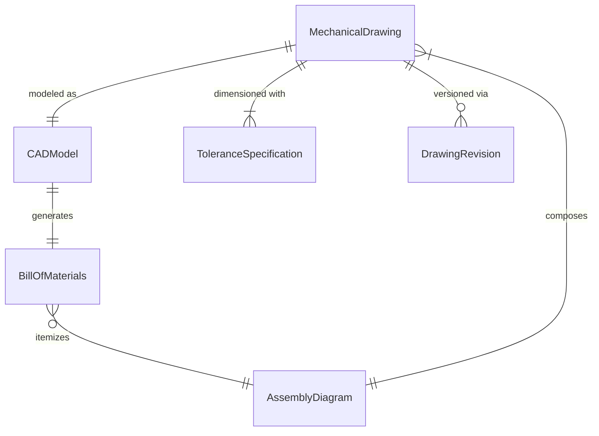
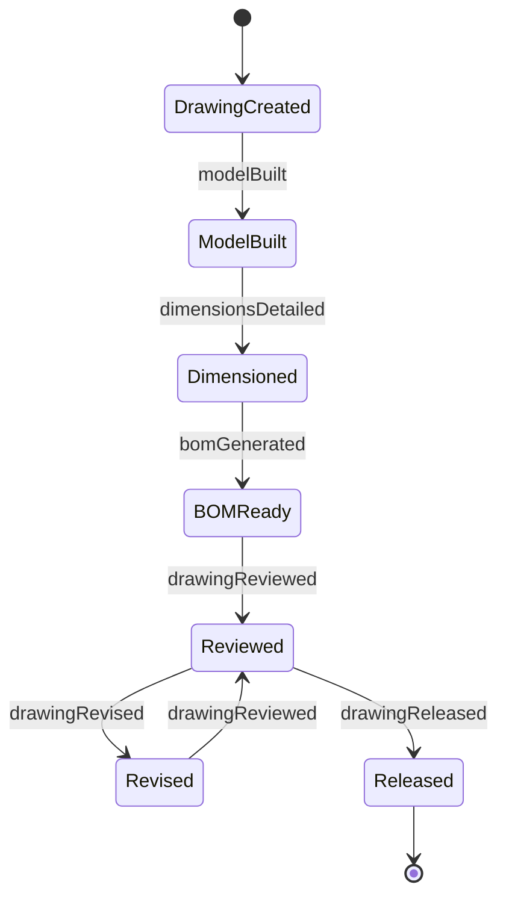
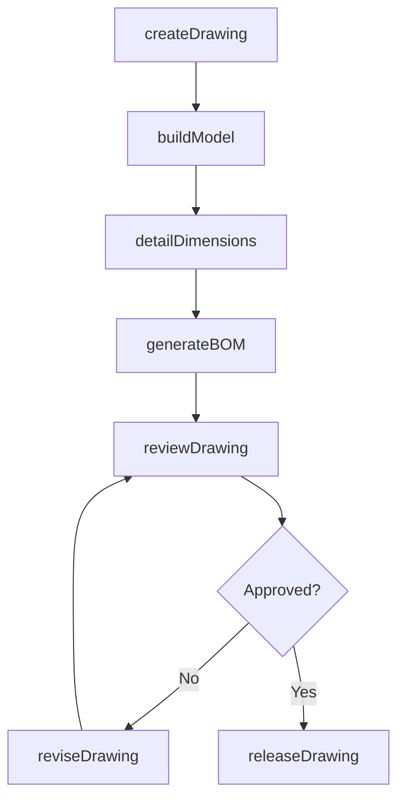
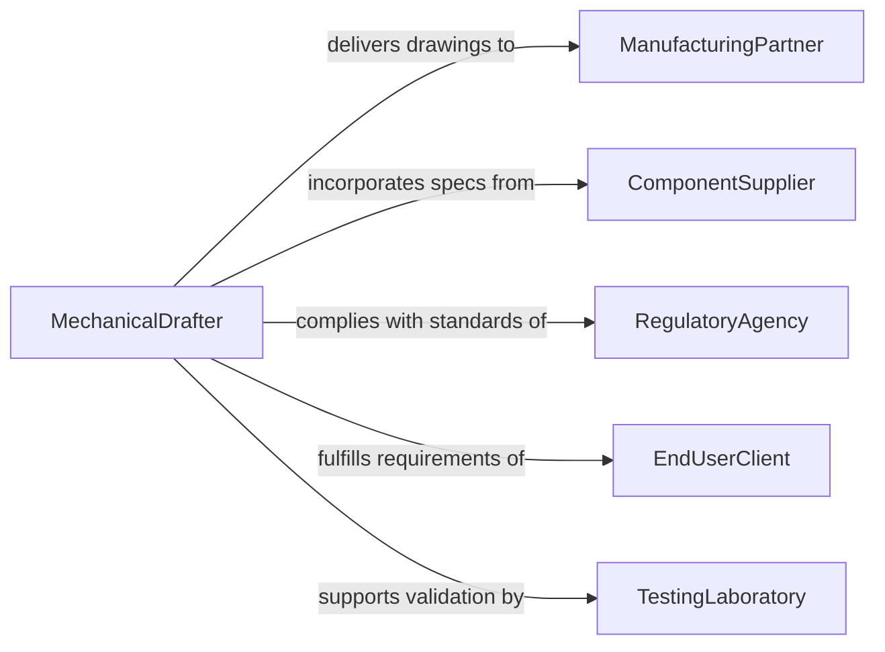

# Create Graphical Representations Mechanical Equipment

> Business-as-Code definition for creating graphical representations of mechanical equipment. Models the lifecycle from design specification through drafting, detailing, review, and release of mechanical drawings and 3D models.

## Overview

Creating graphical representations of mechanical equipment involves producing technical drawings, 3D models, assembly diagrams, and exploded views that communicate the design, dimensions, tolerances, and material specifications of mechanical components and systems. This work uses CAD software to translate engineering requirements into manufacturing-ready documentation, supporting fabrication, installation, maintenance, and regulatory compliance across industries such as manufacturing, energy, and transportation.

## Actors

| Actor | Description |
|-------|-------------|
| ManufacturingPartner | Fabricates components based on released mechanical drawings |
| ComponentSupplier | Provides off-the-shelf parts whose specifications must be incorporated into designs |
| RegulatoryAgency | Enforces mechanical design standards such as ASME and ISO requirements |
| EndUserClient | Specifies equipment requirements and approves final design outputs |
| TestingLaboratory | Validates that fabricated components meet design specifications |

## Roles

| Role | Description |
|------|-------------|
| MechanicalDrafter | Creates detailed technical drawings and 3D models of mechanical equipment |
| DesignEngineer | Specifies equipment requirements and validates design integrity |
| CADManager | Maintains drawing standards, templates, and version control systems |
| QualityReviewer | Inspects drawings for dimensional accuracy and standards compliance |

## Entities

| Entity | Description |
|--------|-------------|
| MechanicalDrawing | A 2D technical drawing with dimensions, tolerances, and material callouts |
| CADModel | A 3D parametric model representing a mechanical component or assembly |
| BillOfMaterials | A structured list of parts, quantities, and specifications for an assembly |
| DrawingRevision | A version-controlled update to a mechanical drawing with change notes |
| ToleranceSpecification | Dimensional and geometric tolerances applied to a component feature |
| AssemblyDiagram | A drawing showing how individual components fit together in a mechanical system |

## Actions

| Action | Description |
|--------|-------------|
| createDrawing | Produce a new mechanical drawing from engineering specifications |
| buildModel | Construct a 3D parametric CAD model of a component or assembly |
| detailDimensions | Add dimensions, tolerances, and annotations to a drawing |
| generateBOM | Produce a bill of materials from an assembly model |
| reviewDrawing | Submit a drawing for quality and standards compliance review |
| reviseDrawing | Update an existing drawing with design changes and revision notes |
| releaseDrawing | Approve and distribute a drawing for manufacturing or procurement |

## Events

| Event | Description |
|-------|-------------|
| drawingCreated | A new mechanical drawing has been produced |
| modelBuilt | A 3D CAD model has been constructed |
| dimensionsDetailed | Dimensions and tolerances have been applied to a drawing |
| bomGenerated | A bill of materials has been produced from an assembly model |
| drawingReviewed | A quality and compliance review of a drawing has been completed |
| drawingRevised | An existing drawing has been updated with design changes |
| drawingReleased | A drawing has been approved and distributed for manufacturing |

## Searches

| Search | Description |
|--------|-------------|
| findDrawings | List mechanical drawings by equipment type, project, or revision status |
| getModels | Retrieve CAD models by component name, material, or assembly |
| getBOMEntries | Search bill of materials entries by part number or supplier |
| getRevisionHistory | Retrieve drawing revision history by document number or date range |

## Entity Relationships



## State Diagram



## Workflow



## Actor Relationships



## Usage

### Calling Actions

```typescript
import { createGraphicalRepresentationsMechanicalEquipment } from '@headlessly/create-graphical-representations-mechanical-equipment'

const mechDesign = createGraphicalRepresentationsMechanicalEquipment()

// Create a drawing for a hydraulic pump assembly
const drawing = await mechDesign.createDrawing({
  equipmentType: 'hydraulic-pump',
  projectId: 'proj-industrial-press-2026',
  specifications: {
    flowRate: '45 GPM',
    pressure: '3000 PSI',
    material: 'cast-iron-ASTM-A48'
  }
})

// Build a 3D model and generate BOM
const model = await mechDesign.buildModel({
  drawingId: drawing.id,
  software: 'SolidWorks',
  modelType: 'parametric-assembly'
})

await mechDesign.generateBOM({
  modelId: model.id,
  includeSubassemblies: true
})
```

### Event-Driven Automation

```typescript
// Notify manufacturing when drawings are released
mechDesign.drawingReleased(async ({ drawingId, equipmentType, revision }) => {
  await notify({
    to: 'manufacturing-engineering',
    message: `Drawing ${drawingId} rev ${revision} for ${equipmentType} released for fabrication`
  })
})

// Trigger BOM update when a drawing is revised
mechDesign.drawingRevised(async ({ drawingId, changes }) => {
  if (changes.affectsBOM) {
    await mechDesign.generateBOM({ drawingId, regenerate: true })
  }
})
```
