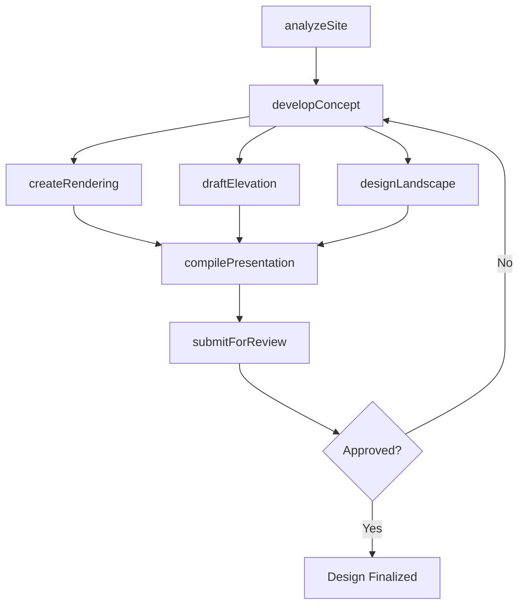
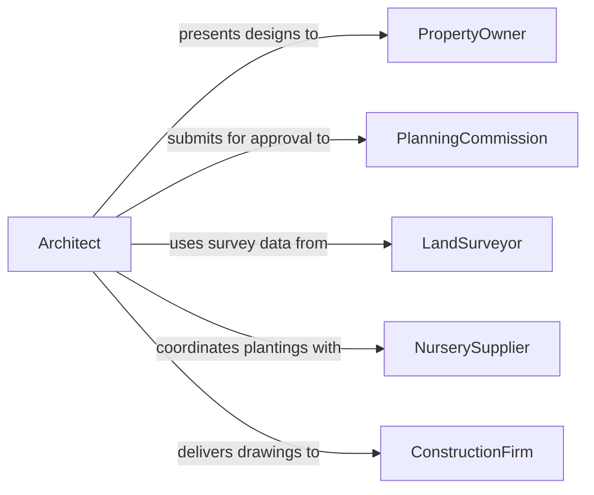

# Create Graphical Representations Structures Landscapes

> Business-as-Code definition for creating graphical representations of structures or landscapes. Models the design lifecycle from site analysis through concept visualization, detailed drafting, and client presentation of architectural and landscape drawings.

## Overview

Creating graphical representations of structures or landscapes involves producing architectural renderings, elevation drawings, site plans, landscape designs, and 3D visualization models that depict buildings, terrain, plantings, hardscapes, and spatial relationships. These representations support design communication between architects, landscape architects, planners, clients, and regulatory bodies, enabling stakeholders to evaluate aesthetics, spatial functionality, environmental integration, and zoning compliance before construction begins.

## Actors

| Actor | Description |
|-------|-------------|
| PropertyOwner | Commissions structural or landscape design and approves visual representations |
| PlanningCommission | Reviews design submissions for zoning, setback, and aesthetic compliance |
| LandSurveyor | Provides topographic data and boundary information for accurate site drawings |
| NurserySupplier | Provides plant species data and availability for landscape design specifications |
| ConstructionFirm | Uses structural and landscape drawings to execute site development |

## Roles

| Role | Description |
|------|-------------|
| Architect | Designs building structures and produces architectural drawings and renderings |
| LandscapeArchitect | Designs outdoor spaces including plantings, grading, and hardscape elements |
| VisualizationSpecialist | Creates photorealistic 3D renderings and walkthroughs from design models |
| DraftingTechnician | Produces detailed technical drawings from design concepts |

## Entities

| Entity | Description |
|--------|-------------|
| ArchitecturalRendering | A photorealistic image depicting a proposed building or structure |
| LandscapePlan | A scaled drawing showing plantings, grading, irrigation, and hardscape layouts |
| ElevationDrawing | A flat representation of a building facade showing height and material details |
| SitePlan | A plan-view drawing showing building placement, access, and site features |
| ThreeDModel | A digital model enabling spatial exploration of a proposed structure or landscape |
| DesignPresentation | A compiled set of renderings and drawings for client or regulatory review |

## Actions

| Action | Description |
|--------|-------------|
| analyzeSite | Evaluate topography, vegetation, and existing conditions for design context |
| developConcept | Produce initial sketches and massing studies for stakeholder feedback |
| createRendering | Generate photorealistic images of proposed structures or landscapes |
| draftElevation | Produce elevation drawings showing facade details and material specifications |
| designLandscape | Create a landscape plan with plantings, grading, and hardscape elements |
| compilePresentation | Assemble renderings and drawings into a cohesive design presentation |
| submitForReview | Deliver design representations to clients or regulatory bodies for approval |

## Events

| Event | Description |
|-------|-------------|
| siteAnalyzed | Topographic and site condition data has been evaluated |
| conceptDeveloped | Initial design sketches and massing studies have been produced |
| renderingCreated | A photorealistic image of a proposed design has been generated |
| elevationDrafted | A facade elevation drawing has been completed |
| landscapeDesigned | A landscape plan with plantings and hardscape has been created |
| presentationCompiled | A design presentation package has been assembled |
| designSubmitted | Design representations have been delivered for review or approval |

## Searches

| Search | Description |
|--------|-------------|
| findRenderings | List architectural or landscape renderings by project, view type, or status |
| getSitePlans | Retrieve site plans by project location, zoning district, or revision |
| getLandscapePlans | Find landscape designs by plant palette, project phase, or designer |
| getPresentations | List design presentations by client, submission date, or review outcome |

## Workflow



## Actor Relationships



## Usage

### Calling Actions

```typescript
import { createGraphicalRepresentationsStructuresLandscapes } from '@headlessly/create-graphical-representations-structures-landscapes'

const structureDesign = createGraphicalRepresentationsStructuresLandscapes()

// Analyze the project site
const site = await structureDesign.analyzeSite({
  projectId: 'riverfront-mixed-use',
  location: { lat: 39.7612, lng: -86.1580 },
  surveyData: 'topo-survey-2026-01.dwg',
  existingConditions: ['mature-oak-grove', 'grade-change-12ft', 'flood-plain-adjacent']
})

// Create a photorealistic rendering
const rendering = await structureDesign.createRendering({
  projectId: 'riverfront-mixed-use',
  viewType: 'aerial-perspective',
  timeOfDay: 'golden-hour',
  includeContext: ['surrounding-buildings', 'river', 'pedestrian-bridge']
})

// Design the landscape plan
const landscape = await structureDesign.designLandscape({
  projectId: 'riverfront-mixed-use',
  elements: {
    plantings: ['native-prairie-mix', 'river-birch', 'switchgrass'],
    hardscape: ['permeable-pavers', 'limestone-retaining-walls'],
    irrigation: 'drip-system-zone-based'
  }
})
```

### Event-Driven Automation

```typescript
// Auto-compile presentation when all views are ready
structureDesign.renderingCreated(async ({ projectId }) => {
  const renderings = await structureDesign.findRenderings({ projectId, status: 'completed' })
  const elevations = await structureDesign.getSitePlans({ projectId })
  if (renderings.length >= 3 && elevations.length >= 1) {
    await structureDesign.compilePresentation({ projectId })
  }
})

// Notify planning commission upon submission
structureDesign.designSubmitted(async ({ projectId, submittedTo }) => {
  await notify({
    to: submittedTo,
    message: `Design submission for project ${projectId} is ready for review`
  })
})
```
