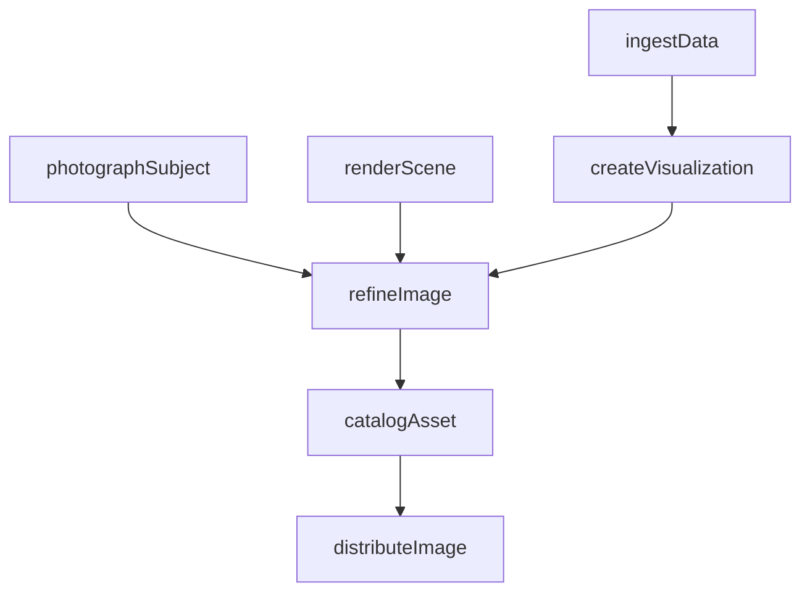
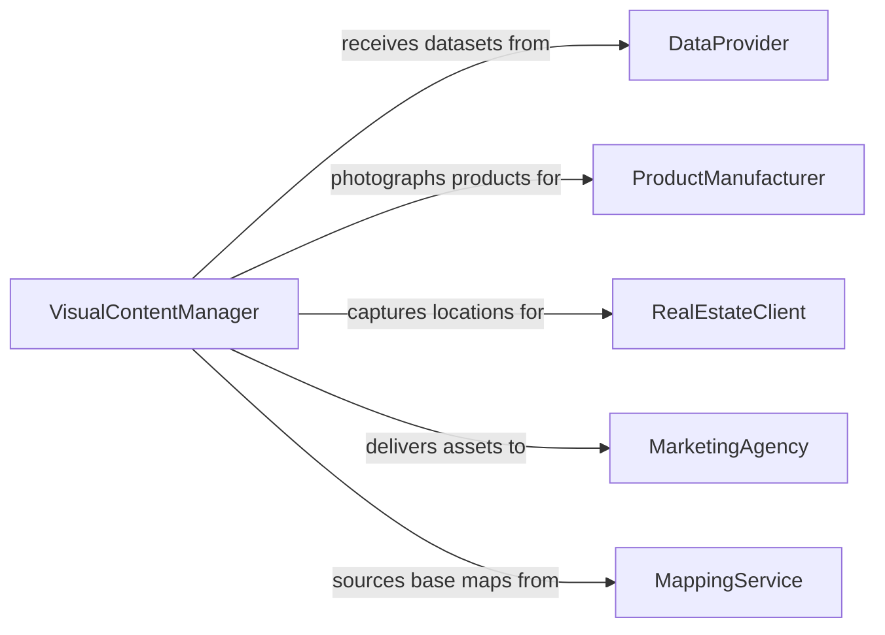

# Create Images Data Locations Products

> Business-as-Code definition for creating images of data, locations, or products. Models the lifecycle from data collection and subject preparation through visualization creation, refinement, and distribution.

## Overview

Creating images of data, locations, or products involves transforming raw datasets into charts, maps, and infographics, photographing or rendering physical locations and environments, and producing product imagery for catalogs, e-commerce, and marketing collateral. This work combines data visualization, cartography, photography, and 3D rendering to produce accurate, compelling visual representations that inform decision-making, support sales, and communicate complex information to diverse audiences.

## Actors

| Actor | Description |
|-------|-------------|
| DataProvider | Supplies datasets, metrics, and analytics requiring visual representation |
| ProductManufacturer | Provides physical products and specifications for visual documentation |
| RealEstateClient | Commissions location photography and virtual tours for property marketing |
| MarketingAgency | Requests visual assets for advertising campaigns and digital channels |
| MappingService | Provides geospatial data and base maps for location visualization |

## Roles

| Role | Description |
|------|-------------|
| DataVisualizationDesigner | Transforms datasets into charts, dashboards, and infographics |
| ProductPhotographer | Captures and edits professional imagery of physical products |
| CartographicDesigner | Creates maps and location-based visual representations |
| VisualContentManager | Coordinates production schedules and manages the visual asset library |

## Entities

| Entity | Description |
|--------|-------------|
| DataVisualization | A chart, graph, or infographic representing structured data |
| LocationImage | A photograph, rendering, or map depicting a physical place |
| ProductImage | A professional photograph or 3D render of a product |
| VisualAssetLibrary | A managed collection of completed images organized by category |
| RenderingProject | A 3D visualization project with scene, lighting, and camera configurations |

## Actions

| Action | Description |
|--------|-------------|
| ingestData | Import and prepare datasets for visual representation |
| createVisualization | Produce a chart, map, or infographic from prepared data |
| photographSubject | Capture professional imagery of a product or location |
| renderScene | Generate a 3D rendered image from a modeling project |
| refineImage | Edit, retouch, or enhance a visual asset for final quality |
| catalogAsset | Add a completed image to the visual asset library with metadata |
| distributeImage | Deliver images to clients or publish to designated channels |

## Events

| Event | Description |
|-------|-------------|
| dataIngested | A dataset has been imported and prepared for visualization |
| visualizationCreated | A data chart, map, or infographic has been produced |
| subjectPhotographed | Professional imagery of a product or location has been captured |
| sceneRendered | A 3D rendered image has been generated |
| imageRefined | A visual asset has been edited and finalized |
| assetCataloged | A completed image has been added to the asset library |
| imageDistributed | An image has been delivered to a client or published to a channel |

## Searches

| Search | Description |
|--------|-------------|
| findImages | List images by type, subject, project, or creation date |
| getVisualizations | Retrieve data visualizations by dataset, chart type, or campaign |
| getProductImages | Find product images by SKU, category, or photography session |
| getLocationImages | Search location images by address, coordinates, or property listing |

## Workflow



## Actor Relationships



## Usage

### Calling Actions

```typescript
import { createImagesDataLocationsProducts } from '@headlessly/create-images-data-locations-products'

const imaging = createImagesDataLocationsProducts()

// Create a data visualization
const viz = await imaging.createVisualization({
  datasetId: 'quarterly-sales-2026-q1',
  chartType: 'stacked-bar',
  dimensions: { width: 1200, height: 800 },
  labels: { x: 'Region', y: 'Revenue ($M)' }
})

// Photograph a product line
const photos = await imaging.photographSubject({
  subjectType: 'product',
  sku: 'WDG-4500',
  angles: ['front', 'side', 'detail', 'lifestyle'],
  background: 'white-seamless',
  lighting: 'studio-softbox'
})

// Catalog and distribute
await imaging.catalogAsset({
  assetId: photos.id,
  tags: ['product', 'widget', 'catalog-2026'],
  category: 'product-photography'
})

await imaging.distributeImage({
  assetId: photos.id,
  channels: ['e-commerce-platform', 'product-catalog', 'social-media']
})
```

### Event-Driven Automation

```typescript
// Auto-distribute when images are cataloged
imaging.assetCataloged(async ({ assetId, category, tags }) => {
  if (tags.includes('e-commerce')) {
    await imaging.distributeImage({
      assetId,
      channels: ['shopify-storefront', 'amazon-listing']
    })
  }
})

// Notify marketing when new data visualizations are ready
imaging.visualizationCreated(async ({ visualizationId, datasetId }) => {
  await notify({
    to: 'marketing-analytics',
    message: `New visualization from dataset ${datasetId} ready for review`
  })
})
```
