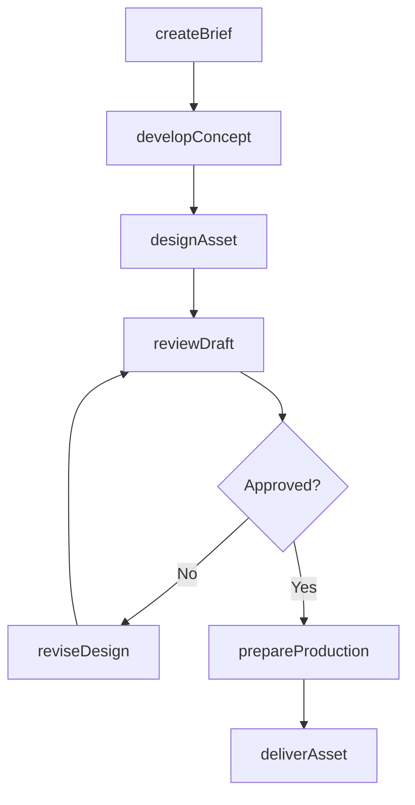
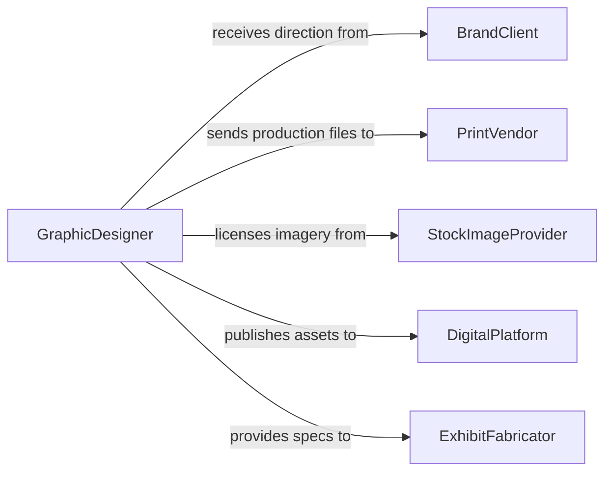

# Create Images Visual Displays

> Business-as-Code definition for creating images or other visual displays. Models the creative production lifecycle from concept development through design, review, and delivery of visual assets for communication and marketing purposes.

## Overview

Creating images and visual displays involves producing photographs, illustrations, infographics, digital graphics, signage, and exhibit materials that communicate information, tell stories, or promote products and services. This work spans graphic design, photography, data visualization, and exhibit design, requiring an understanding of visual communication principles, brand guidelines, audience needs, and production specifications for both digital and physical media.

## Actors

| Actor | Description |
|-------|-------------|
| BrandClient | Commissions visual assets and provides brand guidelines and creative direction |
| PrintVendor | Produces physical versions of visual designs including signage and large-format prints |
| StockImageProvider | Licenses photography and illustration assets for incorporation into designs |
| DigitalPlatform | Hosts and distributes visual content through websites and social media channels |
| ExhibitFabricator | Constructs physical display installations from design specifications |

## Roles

| Role | Description |
|------|-------------|
| GraphicDesigner | Conceptualizes and produces visual assets using design software |
| CreativeDirector | Sets the overall visual direction and approves final creative outputs |
| Photographer | Captures original imagery for use in visual communications |
| ProductionArtist | Prepares final design files for print or digital distribution |

## Entities

| Entity | Description |
|--------|-------------|
| VisualAsset | A completed image, graphic, or display piece ready for use |
| CreativeBrief | A document outlining project objectives, audience, and visual requirements |
| DesignDraft | A work-in-progress version of a visual asset submitted for feedback |
| BrandGuideline | A specification document defining approved colors, typography, and imagery styles |
| ProductionFile | A final-format file prepared for print or digital output |

## Actions

| Action | Description |
|--------|-------------|
| createBrief | Define project objectives, audience, dimensions, and visual requirements |
| developConcept | Produce initial sketches, mood boards, or layout options for review |
| designAsset | Create the visual asset using design software and source materials |
| reviewDraft | Submit a design draft for creative director and client feedback |
| reviseDesign | Incorporate feedback and refine the visual asset |
| prepareProduction | Export final files in required formats and resolutions for output |
| deliverAsset | Distribute the completed visual asset to the client or publishing platform |

## Events

| Event | Description |
|-------|-------------|
| briefCreated | A creative brief defining visual project requirements has been documented |
| conceptDeveloped | Initial visual concepts have been produced for stakeholder review |
| assetDesigned | A visual asset has been created from the approved concept |
| draftReviewed | Stakeholder feedback on a design draft has been received |
| designRevised | A visual asset has been updated based on review feedback |
| productionPrepared | Final production files have been exported for output |
| assetDelivered | A completed visual asset has been distributed to the client or platform |

## Searches

| Search | Description |
|--------|-------------|
| findAssets | List visual assets by project, type, status, or date range |
| getBriefs | Retrieve creative briefs by client, campaign, or objective |
| getDrafts | Find design drafts by project, designer, or review status |
| getProductionFiles | Locate final production files by format, dimensions, or delivery date |

## Workflow



## Actor Relationships



## Usage

### Calling Actions

```typescript
import { createImagesVisualDisplays } from '@headlessly/create-images-visual-displays'

const visualDesign = createImagesVisualDisplays()

// Create a creative brief
const brief = await visualDesign.createBrief({
  client: 'Acme Corporation',
  project: 'Q2 Product Launch Campaign',
  deliverables: ['hero-banner', 'social-media-set', 'trade-show-backdrop'],
  dimensions: { heroBanner: '1920x1080', socialMedia: '1080x1080', backdrop: '10ft x 8ft' },
  brandGuidelines: 'acme-brand-guide-v3'
})

// Design the hero banner asset
const asset = await visualDesign.designAsset({
  briefId: brief.id,
  deliverable: 'hero-banner',
  tools: ['Adobe Photoshop', 'Adobe Illustrator'],
  sourceImages: ['product-photography-set-a']
})

// Prepare production files for all formats
await visualDesign.prepareProduction({
  assetId: asset.id,
  formats: [
    { type: 'web', format: 'PNG', resolution: '72dpi' },
    { type: 'print', format: 'PDF', resolution: '300dpi', colorSpace: 'CMYK' }
  ]
})
```

### Event-Driven Automation

```typescript
// Notify client when assets are delivered
visualDesign.assetDelivered(async ({ assetId, project, deliverable }) => {
  await notify({
    to: 'client-stakeholders',
    message: `Visual asset "${deliverable}" for ${project} has been delivered`
  })
})

// Auto-create production files when design is approved
visualDesign.draftReviewed(async ({ assetId, decision, feedback }) => {
  if (decision === 'approved') {
    await visualDesign.prepareProduction({
      assetId,
      formats: [{ type: 'web', format: 'PNG' }, { type: 'print', format: 'PDF' }]
    })
  }
})
```
