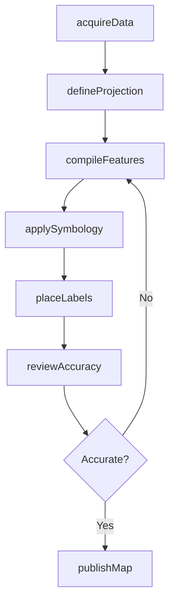
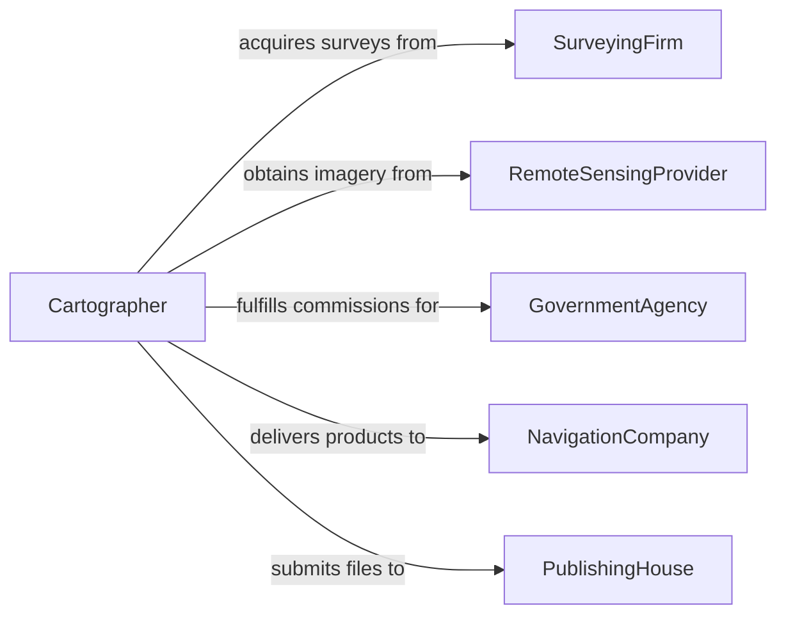

# Create Maps

> Business-as-Code definition for creating maps including topographic, thematic, cadastral, navigational, and digital cartographic products from survey data, aerial imagery, and geospatial databases.

## Overview

Map creation involves transforming geospatial data from surveys, remote sensing, and GIS databases into accurate, readable cartographic products. This definition models the workflow from data acquisition and geodetic referencing through symbolization, labeling, quality assurance, and publication across print and digital formats.

## Actors

| Actor | Description |
|-------|-------------|
| SurveyingFirm | Provides ground-truth measurements and control points |
| RemoteSensingProvider | Supplies satellite imagery and aerial photography |
| GovernmentAgency | Commissions official maps and provides authoritative datasets |
| NavigationCompany | Consumes maps for routing and wayfinding products |
| PublishingHouse | Prints and distributes physical cartographic products |
| DataLicensor | Provides licensed geospatial datasets for incorporation |

## Roles

| Role | Description |
|------|-------------|
| Cartographer | Designs and produces map products from geospatial data |
| GISAnalyst | Processes and analyzes spatial data for map layers |
| GeodeticSpecialist | Establishes coordinate systems and datum references |
| MapEditor | Reviews cartographic output for accuracy and readability |

## Entities

| Entity | Description |
|--------|-------------|
| MapProject | A cartographic production effort with defined scope and extent |
| SpatialDataset | Georeferenced data layer used as source material |
| CoordinateSystem | Geodetic reference frame and projection parameters |
| MapSymbology | Visual encoding rules for features, colors, and patterns |
| MapSheet | A single page or tile within a map series |
| LabelPlacement | Text positioning rules for feature names and annotations |
| MapRevision | Version-controlled update to a published map |

## Actions

| Action | Description |
|--------|-------------|
| acquireData | Gather source datasets including imagery, surveys, and GIS layers |
| defineProjection | Select the coordinate system and map projection |
| compileFeatures | Integrate and harmonize features from multiple data sources |
| applySymbology | Assign visual styles, colors, and patterns to feature classes |
| placeLabels | Position text annotations for geographic features |
| reviewAccuracy | Verify positional accuracy and feature completeness |
| publishMap | Export the final cartographic product for distribution |

## Events

| Event | Description |
|-------|-------------|
| dataAcquired | Source geospatial datasets have been gathered |
| projectionDefined | Coordinate system and projection have been selected |
| featuresCompiled | Data layers have been integrated and harmonized |
| symbologyApplied | Visual styles have been assigned to feature classes |
| labelsPlaced | Text annotations have been positioned |
| accuracyReviewed | Positional and feature accuracy verification is complete |
| mapPublished | Final cartographic product has been released |

## Searches

| Search | Description |
|--------|-------------|
| findMaps | Search map products by extent, scale, or theme |
| getDataSources | Retrieve source datasets used in a map project |
| listRevisions | Enumerate version history for a map sheet |
| findByExtent | Search maps covering a specific geographic bounding box |

## Workflow



## Actor Relationships



## Usage

### Calling Actions

```typescript
import { createMaps } from '@headlessly/create-maps'

const maps = createMaps()

// Acquire source data
const data = await maps.acquireData({
  extent: { north: 40.92, south: 40.70, east: -73.85, west: -74.05 },
  sources: ['usgs-dem', 'tiger-roads', 'osm-buildings'],
  resolution: 10,
  unit: 'meters'
})

// Define projection and compile features
const projection = await maps.defineProjection({
  projectId: data.projectId,
  crs: 'EPSG:32618',
  datum: 'WGS84',
  scale: 25000
})

// Apply symbology
await maps.applySymbology({
  projectId: data.projectId,
  theme: 'topographic',
  featureStyles: [
    { layer: 'contours', interval: 10, color: '#8B4513' },
    { layer: 'roads', classification: 'functional-class', lineWeights: [0.8, 0.5, 0.3] },
    { layer: 'water-bodies', fill: '#4A90D9', outline: '#2C5F8A' }
  ]
})
```

### Event-Driven Automation

```typescript
// Notify stakeholders when map is published
maps.mapPublished(async ({ projectId, format, extent }) => {
  await notify({
    to: 'geospatial-team',
    message: `Map ${projectId} published in ${format} covering extent ${extent.north}N to ${extent.south}S`
  })
})

// Auto-place labels after symbology is applied
maps.symbologyApplied(async ({ projectId }) => {
  await maps.placeLabels({
    projectId,
    algorithm: 'conflict-resolution',
    priority: ['cities', 'rivers', 'peaks', 'roads'],
    minFontSize: 6,
    maxOverlap: 0
  })
})
```
