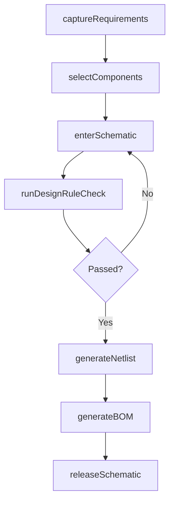
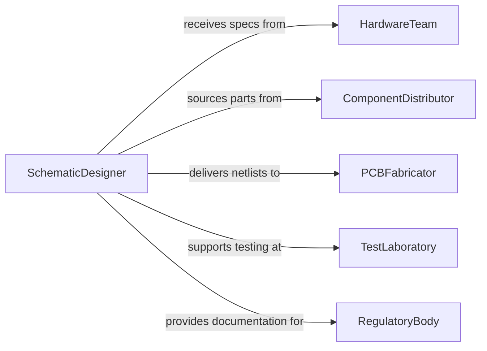

# Create Schematic Drawings for Electronics

> Business-as-Code definition for creating electronic schematic drawings including circuit diagrams, wiring schematics, PCB layouts, and block diagrams used in the design and manufacture of electronic systems.

## Overview

Electronic schematic creation involves translating circuit design requirements into standardized graphical representations that document component selection, interconnections, signal paths, and power distribution. This definition models the process from requirements capture through schematic entry, design rule checking, netlist generation, and release for PCB layout or manufacturing.

## Actors

| Actor | Description |
|-------|-------------|
| HardwareTeam | Engineering group requesting circuit designs |
| ComponentDistributor | Supplier providing electronic parts and datasheets |
| PCBFabricator | Manufacturer producing printed circuit boards from schematics |
| TestLaboratory | Facility validating circuit performance against specifications |
| RegulatoryBody | Agency certifying electromagnetic compatibility and safety |
| ContractManufacturer | Assembly house building electronic products from schematics |

## Roles

| Role | Description |
|------|-------------|
| SchematicDesigner | Creates circuit diagrams using EDA tools |
| CircuitEngineer | Defines circuit topology, component values, and signal integrity |
| DesignReviewer | Validates schematics for correctness and standards compliance |
| LibraryManager | Maintains component symbol and footprint libraries |

## Entities

| Entity | Description |
|--------|-------------|
| Schematic | Complete circuit diagram for a design or subsystem |
| ComponentSymbol | Standardized graphical representation of an electronic part |
| Netlist | Machine-readable list of component connections |
| DesignRuleSet | Validation criteria for electrical and drafting correctness |
| BillOfMaterials | List of components with part numbers, values, and quantities |
| SchematicSheet | Individual page within a multi-sheet schematic set |
| RevisionHistory | Change log tracking schematic modifications |

## Actions

| Action | Description |
|--------|-------------|
| captureRequirements | Gather electrical specifications and functional requirements |
| selectComponents | Choose parts based on specifications, availability, and cost |
| enterSchematic | Draw the circuit diagram using EDA software |
| runDesignRuleCheck | Validate the schematic against electrical and drafting rules |
| generateNetlist | Export the machine-readable connectivity description |
| generateBOM | Produce the bill of materials from the schematic |
| releaseSchematic | Approve and distribute the schematic for downstream use |

## Events

| Event | Description |
|-------|-------------|
| requirementsCaptured | Electrical specifications have been gathered |
| componentsSelected | Parts have been chosen for the design |
| schematicEntered | Circuit diagram has been drawn in EDA software |
| designRuleCheckPassed | Schematic has passed electrical and drafting validation |
| netlistGenerated | Machine-readable connectivity has been exported |
| bomGenerated | Bill of materials has been produced |
| schematicReleased | Approved schematic has been distributed |

## Searches

| Search | Description |
|--------|-------------|
| findSchematics | Search circuit diagrams by project, subsystem, or revision |
| getComponentUsage | Retrieve parts used across schematics |
| listDesignRuleViolations | Enumerate rule check failures for a schematic |
| getBOM | Retrieve bill of materials for a specific design |
| findByComponent | Search schematics containing a specific part number |

## Workflow



## Actor Relationships



## Usage

### Calling Actions

```typescript
import { createSchematicDrawingsElectronics } from '@headlessly/create-schematic-drawings-electronics'

const schematics = createSchematicDrawingsElectronics()

// Capture requirements
const req = await schematics.captureRequirements({
  project: 'motor-controller-v2',
  specifications: {
    inputVoltage: { min: 12, max: 48, unit: 'VDC' },
    outputCurrent: { max: 30, unit: 'A' },
    pwmFrequency: { value: 20, unit: 'kHz' },
    protections: ['overcurrent', 'overvoltage', 'thermal-shutdown']
  },
  standards: ['IPC-2612', 'IEEE-315']
})

// Select components
const parts = await schematics.selectComponents({
  requirementsId: req.id,
  components: [
    { type: 'MOSFET', package: 'TO-247', rdsOn: 0.004, unit: 'ohm' },
    { type: 'gate-driver', channels: 3, deadTime: 100, unit: 'ns' },
    { type: 'current-sensor', range: 50, unit: 'A', output: 'analog' }
  ],
  preferredSuppliers: ['Infineon', 'Texas-Instruments']
})

// Enter schematic and run checks
const sch = await schematics.enterSchematic({
  requirementsId: req.id,
  sheets: ['power-stage', 'gate-drive', 'control-logic', 'protection'],
  tool: 'KiCad'
})

await schematics.runDesignRuleCheck({ schematicId: sch.id })
```

### Event-Driven Automation

```typescript
// Auto-generate BOM after netlist is ready
schematics.netlistGenerated(async ({ schematicId }) => {
  await schematics.generateBOM({
    schematicId,
    format: 'csv',
    includeAlternates: true
  })
})

// Notify PCB team when schematic is released
schematics.schematicReleased(async ({ schematicId, project }) => {
  await notify({
    to: 'pcb-layout-team',
    message: `Schematic for ${project} released - netlist ${schematicId} ready for board layout`
  })
})
```
