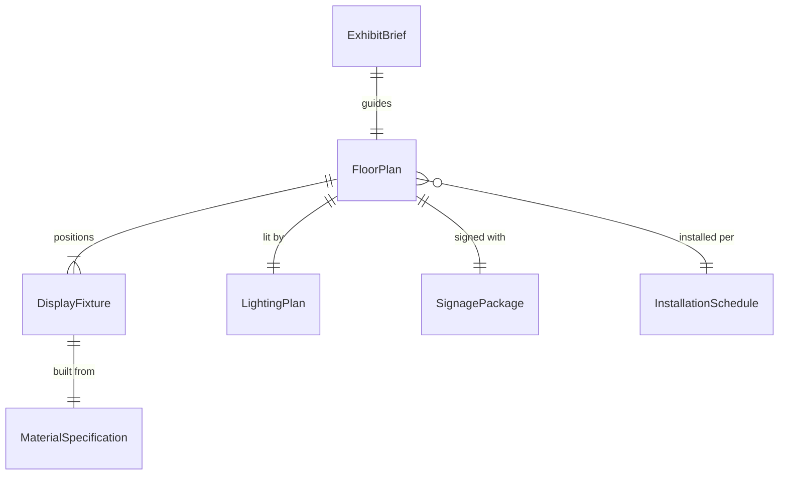
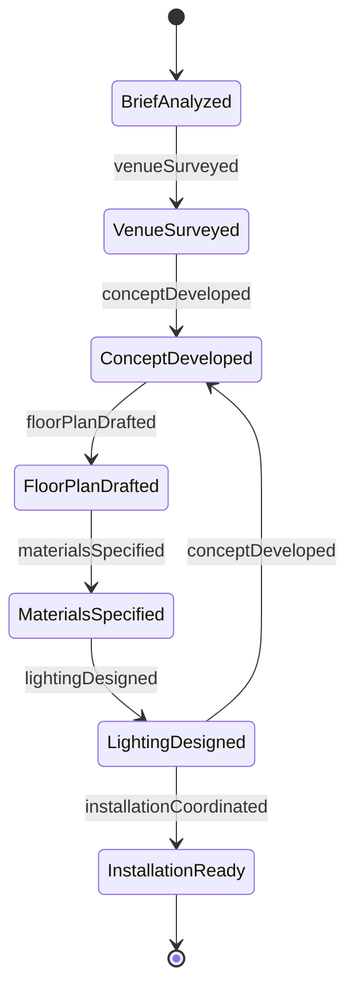
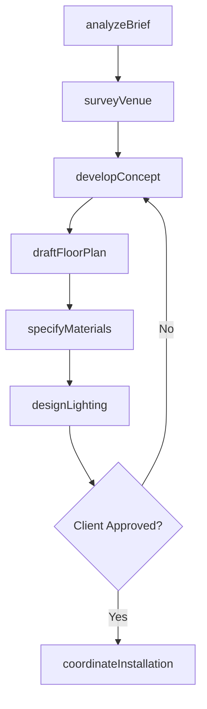
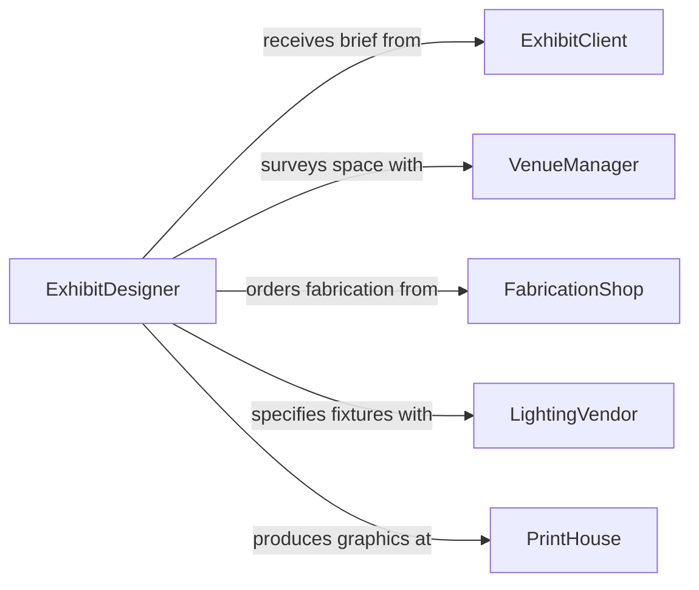

# Design Layout of Art or Product Exhibits

> Business-as-Code definition for designing the layout of art exhibitions, product displays, trade show booths, and promotional materials including spatial planning, traffic flow, lighting design, and visual merchandising.

## Overview

Exhibit and display layout design involves creating spatial arrangements that guide visitor flow, highlight key pieces or products, and communicate brand narratives within gallery, retail, museum, and trade show environments. This definition models the process from creative brief through space analysis, concept development, material specification, fabrication coordination, and installation planning.

## Actors

| Actor | Description |
|-------|-------------|
| ExhibitClient | Gallery, museum, brand, or retailer commissioning the display |
| VenueManager | Facility operator providing space specifications and constraints |
| FabricationShop | Workshop building custom display fixtures and structures |
| LightingVendor | Supplier of architectural and accent lighting systems |
| ShippingLogistics | Carrier transporting exhibit materials to and from venues |
| PrintHouse | Producer of large-format graphics and signage |

## Roles

| Role | Description |
|------|-------------|
| ExhibitDesigner | Creates spatial layouts and visual concepts for displays |
| GraphicDesigner | Develops signage, panels, and promotional materials |
| ProjectManager | Coordinates timelines, budgets, and vendor relationships |
| InstallationLead | Oversees physical setup and teardown of exhibits |

## Entities

| Entity | Description |
|--------|-------------|
| ExhibitBrief | Client requirements including theme, audience, and objectives |
| FloorPlan | Scaled spatial layout showing fixture placement and traffic flow |
| DisplayFixture | Custom or modular structure for mounting or presenting items |
| LightingPlan | Specification of light positions, types, and intensity levels |
| SignagePackage | Collection of wayfinding, informational, and branding graphics |
| InstallationSchedule | Timeline for setup, run, and teardown of the exhibit |
| MaterialSpecification | List of finishes, substrates, and hardware for fabrication |

## Actions

| Action | Description |
|--------|-------------|
| analyzeBrief | Review client objectives, audience, and venue constraints |
| surveyVenue | Measure and document the physical space and infrastructure |
| developConcept | Create initial design concepts with mood boards and sketches |
| draftFloorPlan | Produce scaled spatial layouts with fixture placement |
| specifyMaterials | Select finishes, substrates, and hardware for fabrication |
| designLighting | Plan fixture positions, color temperatures, and intensity |
| coordinateInstallation | Schedule and manage physical setup activities |

## Events

| Event | Description |
|-------|-------------|
| briefAnalyzed | Client objectives and venue constraints have been reviewed |
| venueSurveyed | Physical space has been measured and documented |
| conceptDeveloped | Initial design concepts have been created |
| floorPlanDrafted | Scaled spatial layout has been produced |
| materialsSpecified | Finishes and hardware have been selected |
| lightingDesigned | Lighting plan has been finalized |
| installationCoordinated | Setup schedule and logistics have been arranged |

## Searches

| Search | Description |
|--------|-------------|
| findExhibits | Search exhibit projects by client, venue, or theme |
| getFloorPlans | Retrieve spatial layouts for a specific venue or project |
| listFixtures | Enumerate display fixtures by type, size, or availability |
| getInstallationSchedule | Look up setup and teardown timelines |

## Entity Relationships



## State Diagram



## Workflow



## Actor Relationships



## Usage

### Calling Actions

```typescript
import { designLayoutArtProductExhibits } from '@headlessly/design-layout-art-product-exhibits'

const exhibits = designLayoutArtProductExhibits()

// Analyze client brief
const brief = await exhibits.analyzeBrief({
  client: 'metropolitan-gallery',
  theme: 'contemporary-sculpture-retrospective',
  audience: 'art-enthusiasts',
  pieceCount: 42,
  venueType: 'gallery',
  duration: { weeks: 12 }
})

// Survey venue
const venue = await exhibits.surveyVenue({
  briefId: brief.id,
  dimensions: { length: 30, width: 18, height: 5.5, unit: 'meters' },
  infrastructure: {
    loadCapacity: 500,
    unit: 'kg/sqm',
    powerOutlets: 24,
    ceilingGrid: true
  }
})

// Draft floor plan
await exhibits.draftFloorPlan({
  briefId: brief.id,
  venueId: venue.id,
  zones: [
    { name: 'entry-statement', area: 25, pieces: 3 },
    { name: 'main-gallery', area: 280, pieces: 28 },
    { name: 'intimate-alcove', area: 45, pieces: 8 },
    { name: 'interactive-space', area: 60, pieces: 3 }
  ],
  circulationWidth: 2.4
})
```

### Event-Driven Automation

```typescript
// Notify fabrication shop when materials are specified
exhibits.materialsSpecified(async ({ projectId, fixtureCount }) => {
  await notify({
    to: 'fabrication-shop',
    message: `Material specs for ${projectId} ready - ${fixtureCount} fixtures to fabricate`
  })
})

// Auto-design lighting after floor plan is drafted
exhibits.floorPlanDrafted(async ({ projectId, zoneCount }) => {
  await exhibits.designLighting({
    projectId,
    approach: 'accent-plus-ambient',
    colorTemperature: 3000,
    cri: 95,
    zones: zoneCount
  })
})
```
