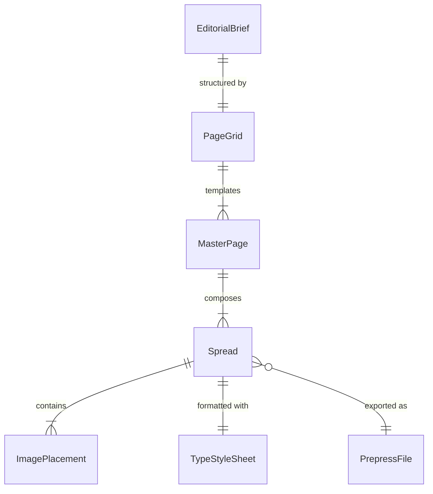
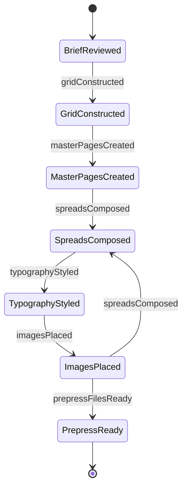
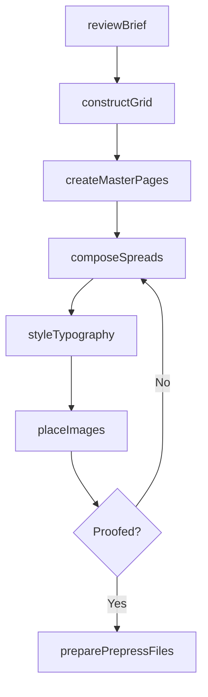
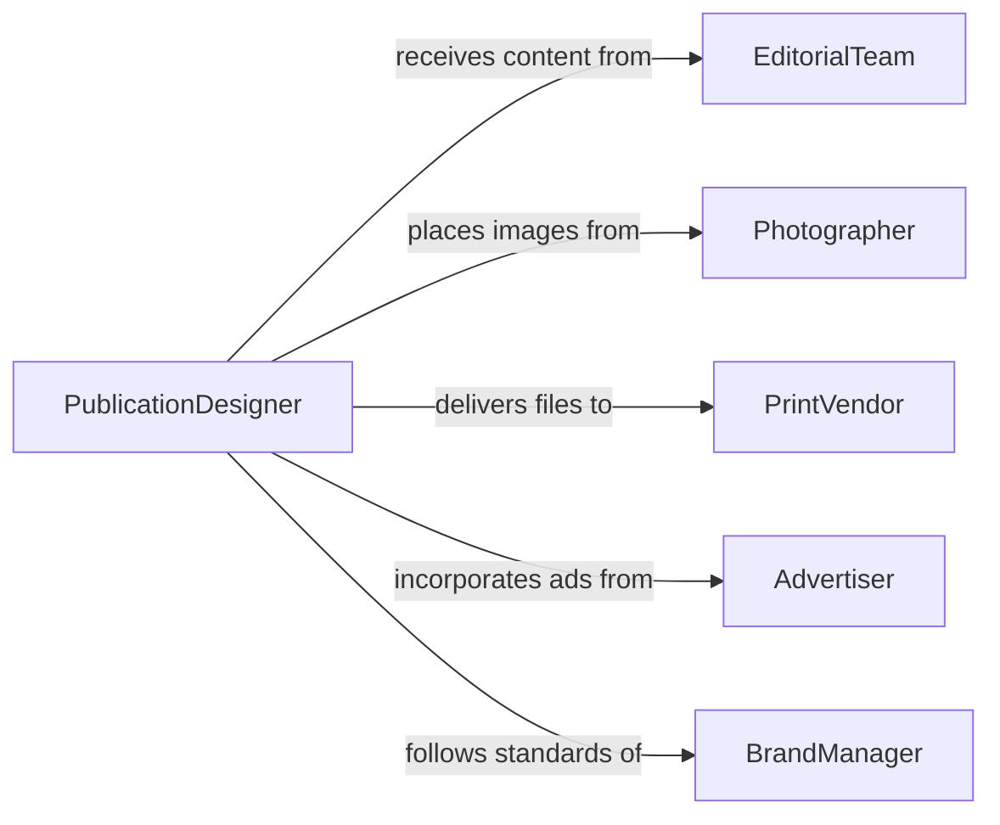

# Design Layouts for Print Publications

> Business-as-Code definition for designing page layouts for print publications including books, magazines, newspapers, catalogs, brochures, and annual reports with typography, image placement, and production-ready output.

## Overview

Print publication layout design involves arranging text, images, and graphical elements on pages to achieve readability, visual hierarchy, and brand consistency while meeting press production requirements. This definition models the workflow from editorial brief and content inventory through grid construction, typographic styling, image placement, proofing, and prepress file preparation.

## Actors

| Actor | Description |
|-------|-------------|
| EditorialTeam | Content producers providing copy, headlines, and captions |
| Photographer | Supplier of images and photo assets for publication |
| PrintVendor | Commercial press producing the final printed publication |
| Advertiser | Client providing ad creative for placement within the publication |
| DistributionPartner | Organization handling fulfillment and circulation |
| BrandManager | Stakeholder enforcing visual identity standards |

## Roles

| Role | Description |
|------|-------------|
| PublicationDesigner | Creates page layouts and establishes the visual system |
| Typographer | Selects and refines typeface usage and text composition |
| ProductionArtist | Prepares final files for prepress and print output |
| ArtDirector | Oversees visual quality and creative direction |

## Entities

| Entity | Description |
|--------|-------------|
| EditorialBrief | Content plan specifying article lineup, page count, and deadlines |
| PageGrid | Underlying column and margin structure for layout consistency |
| MasterPage | Template defining repeating elements like headers and folios |
| Spread | Two facing pages designed as a visual unit |
| TypeStyleSheet | Defined hierarchy of fonts, sizes, leading, and paragraph rules |
| ImagePlacement | Positioned and cropped photograph or illustration on the page |
| PrepressFile | Production-ready output with bleeds, crop marks, and color profiles |

## Actions

| Action | Description |
|--------|-------------|
| reviewBrief | Analyze content plan, page count, and production specifications |
| constructGrid | Define column structure, margins, and baseline grid |
| createMasterPages | Build templates for recurring page elements |
| composeSpreads | Lay out text and images across facing page pairs |
| styleTypography | Apply typeface selections, sizes, and paragraph formatting |
| placeImages | Position, crop, and color-correct photographs and illustrations |
| preparePrepressFiles | Export production-ready files with bleeds and color profiles |

## Events

| Event | Description |
|-------|-------------|
| briefReviewed | Content plan and production specs have been analyzed |
| gridConstructed | Column structure and baseline grid have been defined |
| masterPagesCreated | Recurring page templates have been built |
| spreadsComposed | Text and images have been laid out across pages |
| typographyStyled | Typeface selections and formatting have been applied |
| imagesPlaced | Photographs and illustrations have been positioned |
| prepressFilesReady | Production-ready output has been exported |

## Searches

| Search | Description |
|--------|-------------|
| findPublications | Search layout projects by title, issue, or date |
| getSpreads | Retrieve page spreads for a specific publication |
| listMasterPages | Enumerate templates used in a publication |
| getPrepressStatus | Check production file readiness for a publication |

## Entity Relationships



## State Diagram



## Workflow



## Actor Relationships



## Usage

### Calling Actions

```typescript
import { designLayoutsPrintPublications } from '@headlessly/design-layouts-print-publications'

const publications = designLayoutsPrintPublications()

// Review editorial brief
const brief = await publications.reviewBrief({
  publication: 'quarterly-design-review',
  issue: 'Spring-2026',
  pageCount: 96,
  trim: { width: 210, height: 280, unit: 'mm' },
  colorProfile: 'FOGRA39',
  binding: 'perfect-bound'
})

// Construct page grid
const grid = await publications.constructGrid({
  briefId: brief.id,
  columns: 5,
  gutter: 4.5,
  margins: { top: 18, bottom: 22, inside: 20, outside: 15 },
  baselineGrid: 12,
  unit: 'pt'
})

// Compose spreads
await publications.composeSpreads({
  briefId: brief.id,
  gridId: grid.id,
  spreads: [
    { pages: [4, 5], type: 'feature-opener', headline: true, fullBleedImage: true },
    { pages: [6, 7], type: 'body-text', columns: 3, pullQuote: true },
    { pages: [8, 9], type: 'photo-essay', imageCount: 6, captioned: true }
  ]
})
```

### Event-Driven Automation

```typescript
// Notify print vendor when prepress files are ready
publications.prepressFilesReady(async ({ publicationId, issue, pageCount }) => {
  await notify({
    to: 'print-vendor',
    message: `Prepress files for ${issue} ready - ${pageCount} pages - awaiting press proof`
  })
})

// Auto-style typography after spreads are composed
publications.spreadsComposed(async ({ publicationId, spreadCount }) => {
  await publications.styleTypography({
    publicationId,
    stylesheet: 'quarterly-design-review-v3',
    openTypeFeatures: ['ligatures', 'oldstyle-figures', 'small-caps']
  })
})
```
