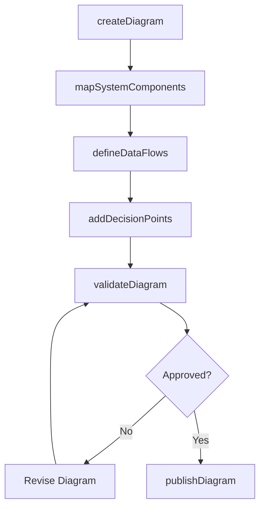
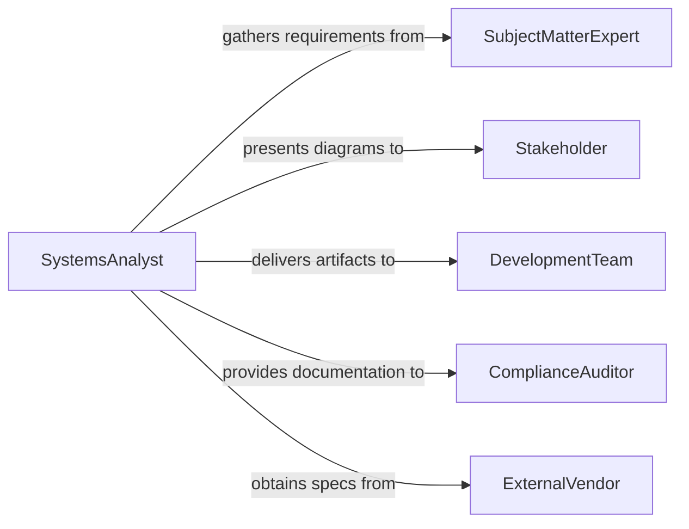

# Develop Diagrams Flow Charts System

> Business-as-Code definition for developing diagrams and flow charts of system operation. Models the process of creating visual representations of system architectures, data flows, and operational workflows.

## Overview

Developing diagrams and flow charts of system operation involves analyzing system components, processes, and data flows to produce clear visual documentation. This includes creating architecture diagrams, sequence diagrams, process flow charts, and network topology maps that communicate how systems function. These artifacts serve as critical references for engineering teams, stakeholders, and auditors throughout a system's lifecycle.

## Actors

| Actor | Description |
|-------|-------------|
| SubjectMatterExpert | Provides domain knowledge about system behavior and business rules |
| Stakeholder | Reviews diagrams for accuracy and completeness from a business perspective |
| DevelopmentTeam | Consumes diagrams as implementation and maintenance references |
| ComplianceAuditor | Uses diagrams to verify system architecture meets regulatory requirements |
| ExternalVendor | Supplies integration specifications and interface documentation |

## Roles

| Role | Description |
|------|-------------|
| SystemsAnalyst | Gathers requirements and creates system operation diagrams |
| TechnicalArchitect | Designs and validates high-level architecture diagrams |
| DocumentationLead | Maintains standards and version control for all diagram assets |
| DiagramReviewer | Validates accuracy, consistency, and completeness of produced diagrams |

## Entities

| Entity | Description |
|--------|-------------|
| Diagram | A visual representation of system components and their relationships |
| FlowChart | A sequential process chart showing operational steps and decision points |
| SystemComponent | An individual module, service, or subsystem depicted in diagrams |
| DataFlow | A directional path representing information movement between components |
| DiagramTemplate | A reusable layout pattern for consistent diagram creation |
| RevisionHistory | A log of changes made to diagrams over time |

## Actions

| Action | Description |
|--------|-------------|
| createDiagram | Initialize a new diagram from a template or blank canvas |
| mapSystemComponents | Identify and place system components within the diagram |
| defineDataFlows | Draw connections showing data movement between components |
| addDecisionPoints | Insert branching logic nodes into flow charts |
| validateDiagram | Check diagram for completeness and accuracy against system specs |
| publishDiagram | Release the finalized diagram for team consumption |
| archiveDiagram | Move superseded diagrams to historical storage |

## Events

| Event | Description |
|-------|-------------|
| diagramCreated | A new diagram has been initialized |
| componentsMappped | System components have been placed in the diagram |
| dataFlowsDefined | Data flow connections have been established |
| diagramValidated | Diagram has passed accuracy and completeness review |
| diagramPublished | Diagram has been released to the team |
| diagramRevised | An existing diagram has been updated with changes |
| diagramArchived | A superseded diagram has been moved to archive |

## Searches

| Search | Description |
|--------|-------------|
| findDiagrams | List diagrams by system, type, author, or date range |
| getSystemComponents | Retrieve components depicted in a specific diagram |
| getRevisionHistory | Fetch the change log for a particular diagram |
| findDiagramsByComponent | Locate all diagrams that reference a given system component |

## Workflow



## Actor Relationships



## Usage

### Calling Actions

```typescript
import { developDiagramsFlowChartsSystem } from '@headlessly/develop-diagrams-flow-charts-system'

const diagrams = developDiagramsFlowChartsSystem()

// Create a new system architecture diagram
const diagram = await diagrams.createDiagram({
  name: 'Payment Processing Architecture',
  type: 'architecture',
  template: 'microservices-topology',
  system: 'payment-platform'
})

// Map system components onto the diagram
await diagrams.mapSystemComponents({
  diagramId: diagram.id,
  components: [
    { name: 'API Gateway', type: 'service', position: { x: 100, y: 50 } },
    { name: 'Payment Engine', type: 'service', position: { x: 300, y: 50 } },
    { name: 'Transaction Database', type: 'datastore', position: { x: 300, y: 200 } }
  ]
})

// Validate the completed diagram
const validation = await diagrams.validateDiagram({
  diagramId: diagram.id,
  rules: ['completeness', 'naming-conventions', 'connectivity']
})
```

### Event-Driven Automation

```typescript
// Notify team when a diagram is published
diagrams.diagramPublished(async ({ diagramId, name, author }) => {
  await notify({
    to: 'engineering-team',
    message: `New diagram published: ${name} by ${author}`
  })
})

// Trigger re-validation when a diagram is revised
diagrams.diagramRevised(async ({ diagramId }) => {
  await diagrams.validateDiagram({
    diagramId,
    rules: ['completeness', 'connectivity']
  })
})
```
