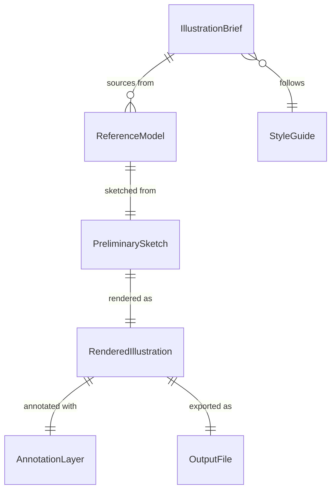
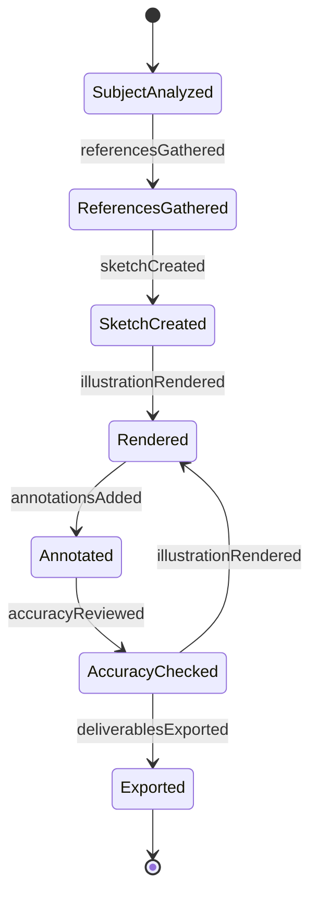
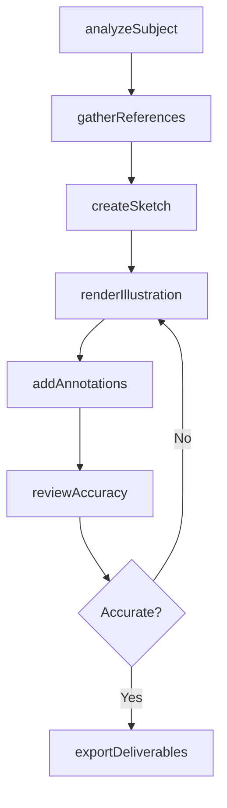
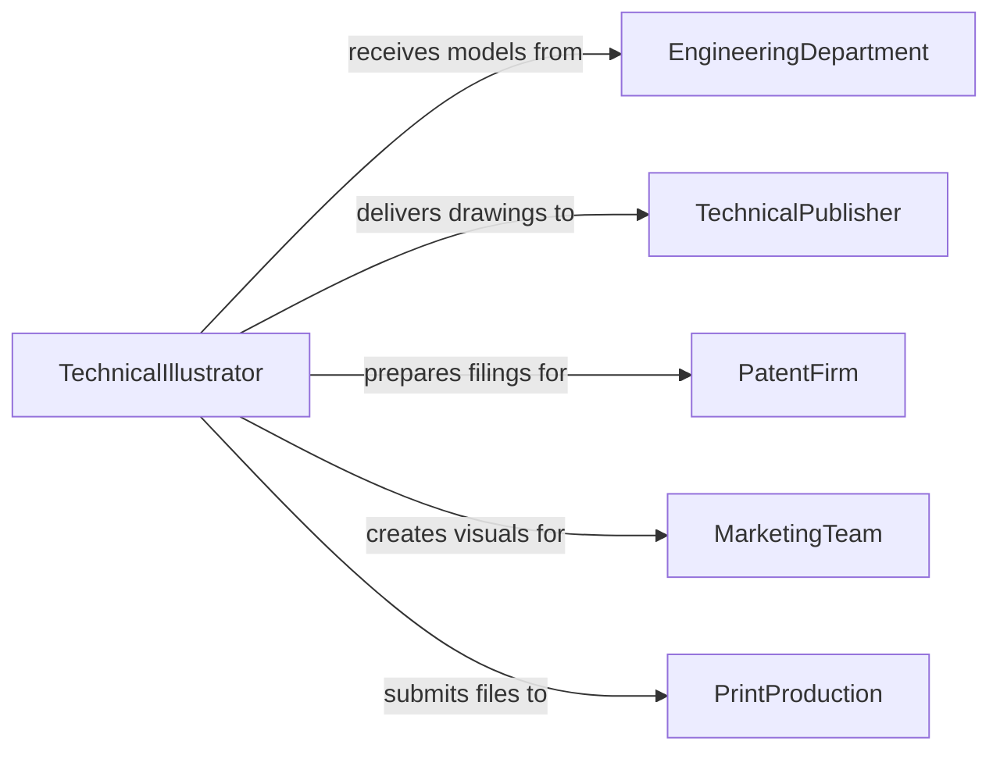

# Draw Detailed or Technical Illustrations

> Business-as-Code definition for drawing detailed and technical illustrations including cutaway views, exploded assemblies, instructional diagrams, and precision renderings used in manuals, patents, catalogs, and engineering documentation.

## Overview

Technical illustration involves creating precise, visually clear drawings that communicate complex mechanical, architectural, or scientific information to both technical and non-technical audiences. This definition models the process from subject analysis and reference gathering through sketching, rendering, annotation, and delivery in formats suitable for print, digital, and interactive media.

## Actors

| Actor | Description |
|-------|-------------|
| EngineeringDepartment | Team providing CAD models and specifications for illustration |
| TechnicalPublisher | Organization producing manuals, guides, and documentation |
| PatentFirm | Law office requiring precise drawings for patent filings |
| MarketingTeam | Department using illustrations for catalogs and collateral |
| PrintProduction | Facility producing final printed materials |
| TranslationService | Agency localizing annotated illustrations for international use |

## Roles

| Role | Description |
|------|-------------|
| TechnicalIllustrator | Creates precise rendered drawings from CAD data or specifications |
| ArtDirector | Guides visual style and ensures consistency across illustrations |
| SubjectMatterExpert | Provides domain knowledge for accuracy verification |
| ProductionArtist | Prepares final files for output in required formats |

## Entities

| Entity | Description |
|--------|-------------|
| IllustrationBrief | Requirements document specifying subject, view, and purpose |
| ReferenceModel | CAD file, photograph, or physical object used as source material |
| PreliminarySketch | Initial line drawing establishing composition and perspective |
| RenderedIllustration | Finished drawing with shading, color, and detail |
| AnnotationLayer | Callouts, labels, and dimensional notes overlaid on the drawing |
| OutputFile | Final deliverable in specified format and resolution |
| StyleGuide | Standards for line weights, colors, fonts, and rendering technique |

## Actions

| Action | Description |
|--------|-------------|
| analyzeSubject | Study the object or system to determine illustration approach |
| gatherReferences | Collect CAD models, photos, and specifications as source material |
| createSketch | Draw preliminary compositions establishing view and perspective |
| renderIllustration | Produce the finished drawing with full detail and shading |
| addAnnotations | Apply callouts, labels, and dimensional references |
| reviewAccuracy | Verify technical correctness with subject matter experts |
| exportDeliverables | Output final files in required formats and resolutions |

## Events

| Event | Description |
|-------|-------------|
| subjectAnalyzed | Illustration approach and view have been determined |
| referencesGathered | Source materials have been collected |
| sketchCreated | Preliminary composition has been drawn |
| illustrationRendered | Finished drawing with full detail is complete |
| annotationsAdded | Callouts and labels have been applied |
| accuracyReviewed | Technical correctness has been verified |
| deliverablesExported | Final files have been output for production |

## Searches

| Search | Description |
|--------|-------------|
| findIllustrations | Search drawings by subject, project, or type |
| getReferences | Retrieve source materials linked to an illustration |
| listPendingReviews | Enumerate illustrations awaiting accuracy verification |
| getOutputFormats | Look up deliverable specifications for a project |

## Entity Relationships



## State Diagram



## Workflow



## Actor Relationships



## Usage

### Calling Actions

```typescript
import { drawDetailedTechnicalIllustrations } from '@headlessly/draw-detailed-technical-illustrations'

const illustrations = drawDetailedTechnicalIllustrations()

// Analyze the subject
const analysis = await illustrations.analyzeSubject({
  subject: 'turbofan-engine-LP-compressor',
  purpose: 'maintenance-manual',
  views: ['cutaway-cross-section', 'exploded-assembly'],
  audience: 'aircraft-maintenance-technician'
})

// Gather reference materials
const refs = await illustrations.gatherReferences({
  analysisId: analysis.id,
  sources: [
    { type: 'CAD-model', format: 'STEP', path: 'engine-assembly-v4.stp' },
    { type: 'photograph', count: 12, angles: ['front', 'rear', 'section'] },
    { type: 'specification', document: 'CMM-72-00-00' }
  ]
})

// Render the illustration
const drawing = await illustrations.renderIllustration({
  analysisId: analysis.id,
  referencesId: refs.id,
  technique: 'vector-with-gradient-shading',
  resolution: 600,
  unit: 'dpi',
  colorMode: 'CMYK'
})

// Add annotations
await illustrations.addAnnotations({
  illustrationId: drawing.id,
  callouts: [
    { item: 1, label: 'Fan Blade Assembly', leaderStyle: 'bent' },
    { item: 2, label: 'LP Compressor Rotor', leaderStyle: 'bent' },
    { item: 3, label: 'Stator Vane Ring', leaderStyle: 'straight' }
  ],
  font: 'Helvetica',
  minSize: 8
})
```

### Event-Driven Automation

```typescript
// Notify publisher when deliverables are ready
illustrations.deliverablesExported(async ({ projectId, formats }) => {
  await notify({
    to: 'technical-publications',
    message: `Illustrations for ${projectId} exported in ${formats.join(', ')} - ready for manual integration`
  })
})

// Auto-add annotations after rendering is complete
illustrations.illustrationRendered(async ({ illustrationId, subject }) => {
  await notify({
    to: 'subject-matter-expert',
    message: `Illustration of ${subject} rendered - callouts and labels needed`
  })
})
```
