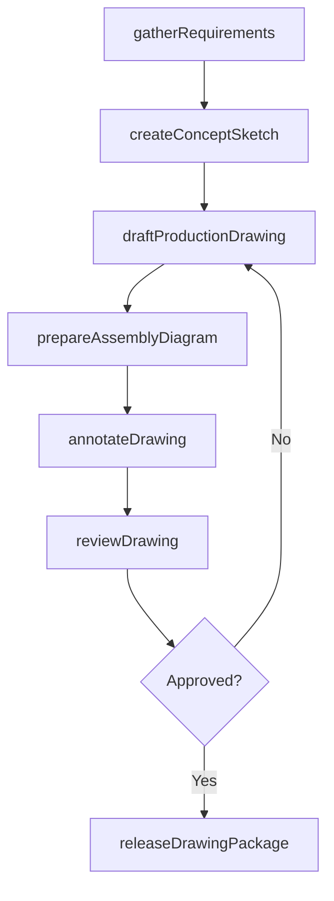
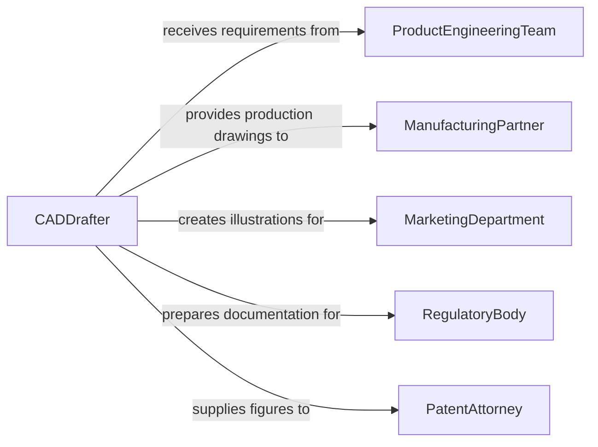

# Prepare Drawings or Diagrams of Products or Services

> Business-as-Code definition for preparing technical drawings and diagrams of products or services including concept sketches, assembly drawings, exploded views, service flow diagrams, and dimensioned production drawings.

## Overview

Preparing product and service drawings involves translating design requirements into precise visual documentation that communicates geometry, materials, tolerances, and assembly sequences to manufacturing, marketing, and service teams. This definition models the process from requirements gathering through drafting, annotation, review, and release to downstream stakeholders.

## Actors

| Actor | Description |
|-------|-------------|
| ProductEngineeringTeam | Department requesting drawings for new or revised products |
| ManufacturingPartner | Contract fabricator consuming production drawings |
| MarketingDepartment | Team using product illustrations for catalogs and collateral |
| RegulatoryBody | Agency requiring technical documentation for compliance |
| PatentAttorney | Legal counsel using drawings for intellectual property filings |

## Roles

| Role | Description |
|------|-------------|
| CADDrafter | Creates precise 2D and 3D technical drawings |
| ProductDesigner | Defines the visual and functional intent of the product |
| DrawingChecker | Reviews drawings for accuracy, standards, and completeness |
| DocumentController | Manages drawing revisions and release workflows |

## Entities

| Entity | Description |
|--------|-------------|
| DesignRequirement | Specification defining what the drawing must communicate |
| ConceptSketch | Initial freehand or rough digital visualization |
| ProductionDrawing | Fully dimensioned and toleranced manufacturing document |
| AssemblyDiagram | Exploded or sequential view showing component relationships |
| ServiceFlowDiagram | Visual representation of service delivery steps |
| DrawingRevision | Version-controlled update to an existing drawing |
| ReleasePackage | Approved set of drawings distributed to stakeholders |

## Actions

| Action | Description |
|--------|-------------|
| gatherRequirements | Collect specifications and intent for the drawing |
| createConceptSketch | Produce initial visualization of the product or service |
| draftProductionDrawing | Create dimensioned, toleranced manufacturing documentation |
| prepareAssemblyDiagram | Illustrate component relationships and assembly sequence |
| annotateDrawing | Add dimensions, notes, materials, and finish callouts |
| reviewDrawing | Check accuracy against requirements and drafting standards |
| releaseDrawingPackage | Approve and distribute drawings to downstream teams |

## Events

| Event | Description |
|-------|-------------|
| requirementsGathered | Drawing specifications and intent have been collected |
| conceptSketchCreated | Initial product visualization is complete |
| productionDrawingDrafted | Manufacturing documentation has been created |
| assemblyDiagramPrepared | Component relationship illustration is ready |
| drawingAnnotated | Dimensions and callouts have been applied |
| drawingReviewed | Accuracy check against standards is complete |
| drawingPackageReleased | Approved drawings have been distributed |

## Searches

| Search | Description |
|--------|-------------|
| findDrawings | Search drawings by product, revision, or status |
| getRevisionHistory | Retrieve version history for a specific drawing |
| listPendingReviews | Enumerate drawings awaiting accuracy check |
| getReleasedPackages | Look up approved drawing sets by project or date |

## Workflow



## Actor Relationships



## Usage

### Calling Actions

```typescript
import { prepareDrawingsDiagramsProductsServices } from '@headlessly/prepare-drawings-diagrams-products-services'

const drawings = prepareDrawingsDiagramsProductsServices()

// Gather drawing requirements
const req = await drawings.gatherRequirements({
  product: 'hydraulic-actuator-assembly',
  drawingTypes: ['production-drawing', 'assembly-diagram', 'exploded-view'],
  standard: 'ASME-Y14.5-2018',
  scale: '1:2'
})

// Draft production drawing
const drawing = await drawings.draftProductionDrawing({
  requirementId: req.id,
  software: 'SolidWorks',
  views: ['front', 'right-side', 'section-A-A', 'detail-B'],
  toleranceClass: 'medium-precision'
})

// Annotate with GD&T
await drawings.annotateDrawing({
  drawingId: drawing.id,
  annotations: [
    { type: 'dimension', feature: 'bore-diameter', value: 50.00, tolerance: 0.025, unit: 'mm' },
    { type: 'surface-finish', feature: 'sealing-face', ra: 0.8, unit: 'micrometers' },
    { type: 'material', spec: 'AISI-4140-steel', condition: 'quenched-and-tempered' }
  ]
})
```

### Event-Driven Automation

```typescript
// Notify manufacturing when drawings are released
drawings.drawingPackageReleased(async ({ productId, drawingCount }) => {
  await notify({
    to: 'manufacturing-partner',
    message: `${drawingCount} production drawings released for ${productId} - ready for fabrication review`
  })
})

// Auto-flag drawings pending review beyond deadline
drawings.drawingAnnotated(async ({ drawingId, annotatedAt }) => {
  await notify({
    to: 'drawing-checker',
    message: `Drawing ${drawingId} annotated and ready for review`
  })
})
```
