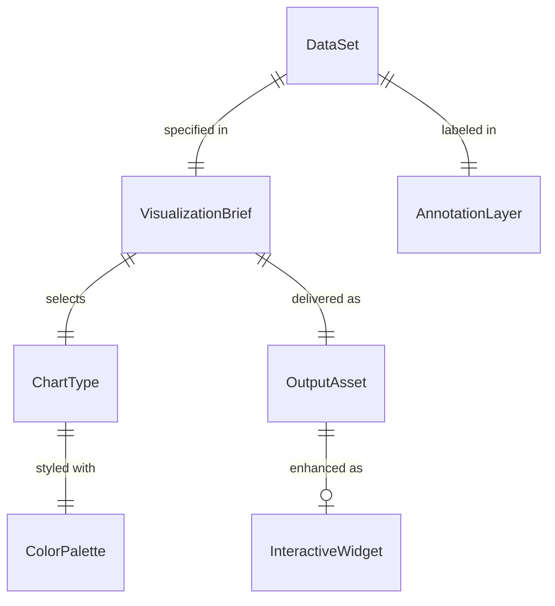
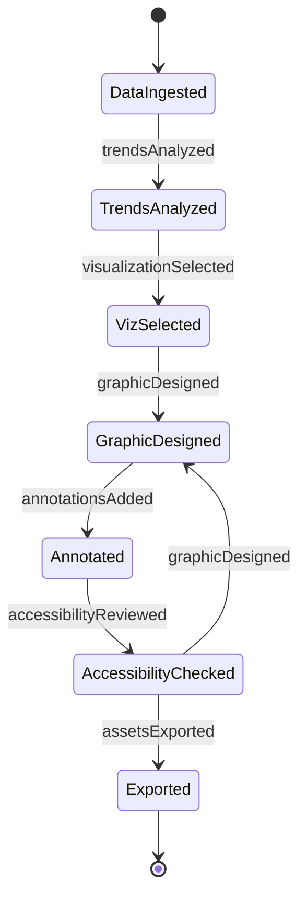
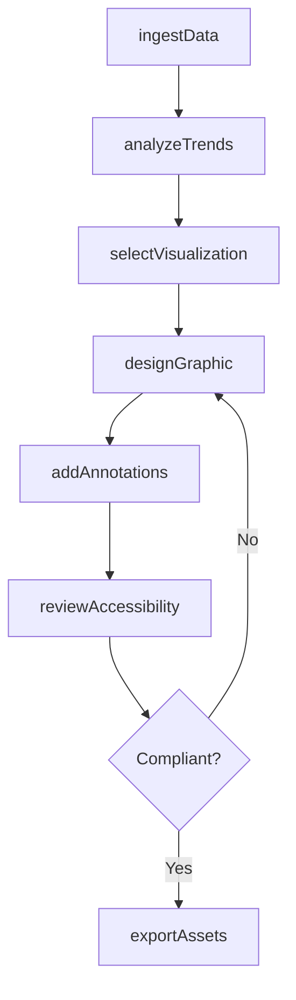
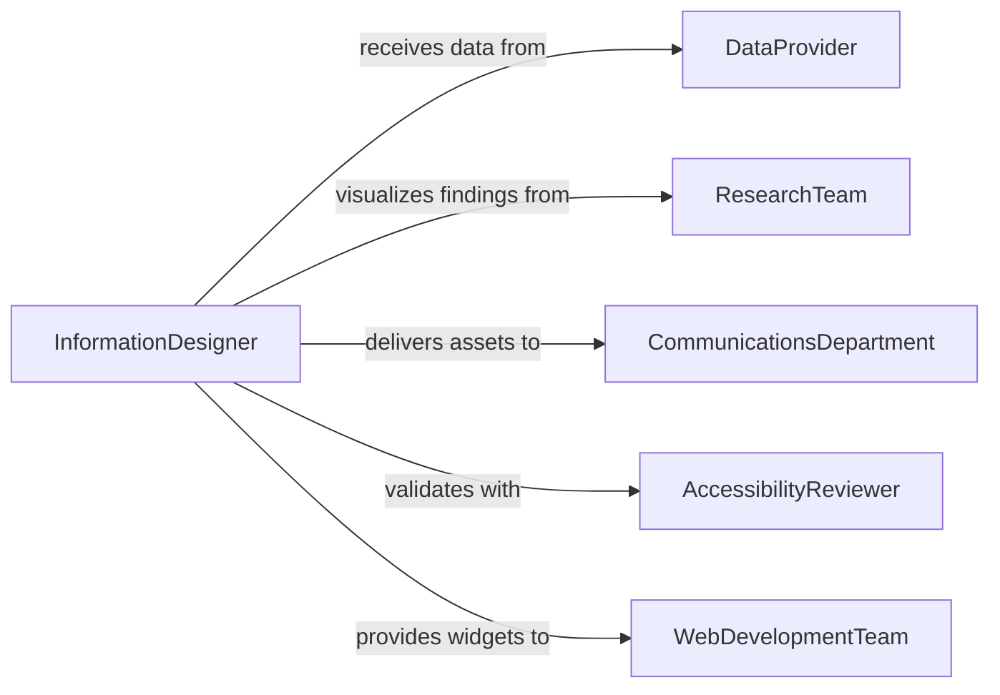

# Prepare Graphics or Other Visual Representations of Information

> Business-as-Code definition for preparing infographics, data visualizations, charts, diagrams, and other visual representations that communicate quantitative and qualitative information to diverse audiences.

## Overview

Preparing visual representations of information involves transforming raw data, research findings, and complex concepts into clear, accurate, and engaging graphical formats. This definition models the workflow from data intake and analysis through visualization design, rendering, accessibility review, and delivery across print, web, and presentation formats.

## Actors

| Actor | Description |
|-------|-------------|
| DataProvider | Department or system supplying raw data for visualization |
| ResearchTeam | Analysts providing findings and insights to be illustrated |
| CommunicationsDepartment | Team distributing visual content to audiences |
| AccessibilityReviewer | Specialist ensuring visual content meets accessibility standards |
| WebDevelopmentTeam | Engineers implementing interactive visualizations online |
| PrintProduction | Facility producing high-resolution printed graphics |

## Roles

| Role | Description |
|------|-------------|
| InformationDesigner | Translates data into visual formats and graphical narratives |
| DataVisualizationSpecialist | Creates charts, maps, and interactive visual analytics |
| GraphicDesigner | Produces polished visual assets for publication |
| ContentStrategist | Guides the narrative structure and messaging of visual content |

## Entities

| Entity | Description |
|--------|-------------|
| DataSet | Structured information to be visualized |
| VisualizationBrief | Requirements specifying data, audience, and delivery format |
| ChartType | Selected graphical format such as bar, line, scatter, or treemap |
| ColorPalette | Defined set of colors ensuring readability and brand alignment |
| AnnotationLayer | Explanatory labels, callouts, and legends on the graphic |
| OutputAsset | Final graphic file in specified format and resolution |
| InteractiveWidget | Web-based visualization with filtering and drill-down features |

## Actions

| Action | Description |
|--------|-------------|
| ingestData | Import and validate the source dataset for visualization |
| analyzeTrends | Identify patterns, outliers, and key takeaways in the data |
| selectVisualization | Choose the optimal chart type for the data and audience |
| designGraphic | Create the visual layout with color, typography, and hierarchy |
| addAnnotations | Apply labels, legends, callouts, and source citations |
| reviewAccessibility | Verify color contrast, alt text, and screen reader compatibility |
| exportAssets | Deliver final files in required formats for all channels |

## Events

| Event | Description |
|-------|-------------|
| dataIngested | Source dataset has been imported and validated |
| trendsAnalyzed | Key patterns and takeaways have been identified |
| visualizationSelected | Chart type has been chosen |
| graphicDesigned | Visual layout has been created |
| annotationsAdded | Labels, legends, and citations have been applied |
| accessibilityReviewed | Accessibility compliance has been verified |
| assetsExported | Final graphic files have been delivered |

## Searches

| Search | Description |
|--------|-------------|
| findGraphics | Search visual assets by topic, dataset, or project |
| getDataSources | Retrieve source datasets linked to a graphic |
| listChartTypes | Enumerate visualization formats used across projects |
| getAccessibilityStatus | Check compliance status for a graphic asset |

## Entity Relationships



## State Diagram



## Workflow



## Actor Relationships



## Usage

### Calling Actions

```typescript
import { prepareGraphicsVisualRepresentationsInformation } from '@headlessly/prepare-graphics-visual-representations-information'

const graphics = prepareGraphicsVisualRepresentationsInformation()

// Ingest data
const data = await graphics.ingestData({
  source: 'quarterly-revenue-by-region',
  format: 'csv',
  columns: ['region', 'quarter', 'revenue', 'growth_pct'],
  records: 48,
  validation: ['no-nulls', 'numeric-range-check']
})

// Select visualization
const viz = await graphics.selectVisualization({
  datasetId: data.id,
  audience: 'executive-leadership',
  message: 'regional-growth-comparison',
  chartType: 'grouped-bar-with-trend-line',
  dimensions: { width: 1200, height: 800, unit: 'px' }
})

// Design and annotate the graphic
const graphic = await graphics.designGraphic({
  visualizationId: viz.id,
  palette: 'corporate-brand-v2',
  typography: 'Inter',
  background: 'white',
  gridLines: true
})

await graphics.addAnnotations({
  graphicId: graphic.id,
  title: 'Regional Revenue Growth Q1-Q4 2025',
  subtitle: 'Year-over-year percentage change by quarter',
  source: 'Finance Department - Consolidated P&L',
  legend: true,
  callouts: [{ region: 'APAC', quarter: 'Q3', note: 'New market entry' }]
})
```

### Event-Driven Automation

```typescript
// Notify communications when assets are exported
graphics.assetsExported(async ({ projectId, formats }) => {
  await notify({
    to: 'communications',
    message: `Visual assets for ${projectId} exported in ${formats.join(', ')} - ready for distribution`
  })
})

// Auto-review accessibility after annotations are added
graphics.annotationsAdded(async ({ graphicId }) => {
  await graphics.reviewAccessibility({
    graphicId,
    checks: ['color-contrast-WCAG-AA', 'alt-text', 'pattern-fills-for-colorblind'],
    standard: 'WCAG-2.1'
  })
})
```
