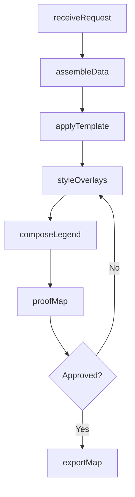
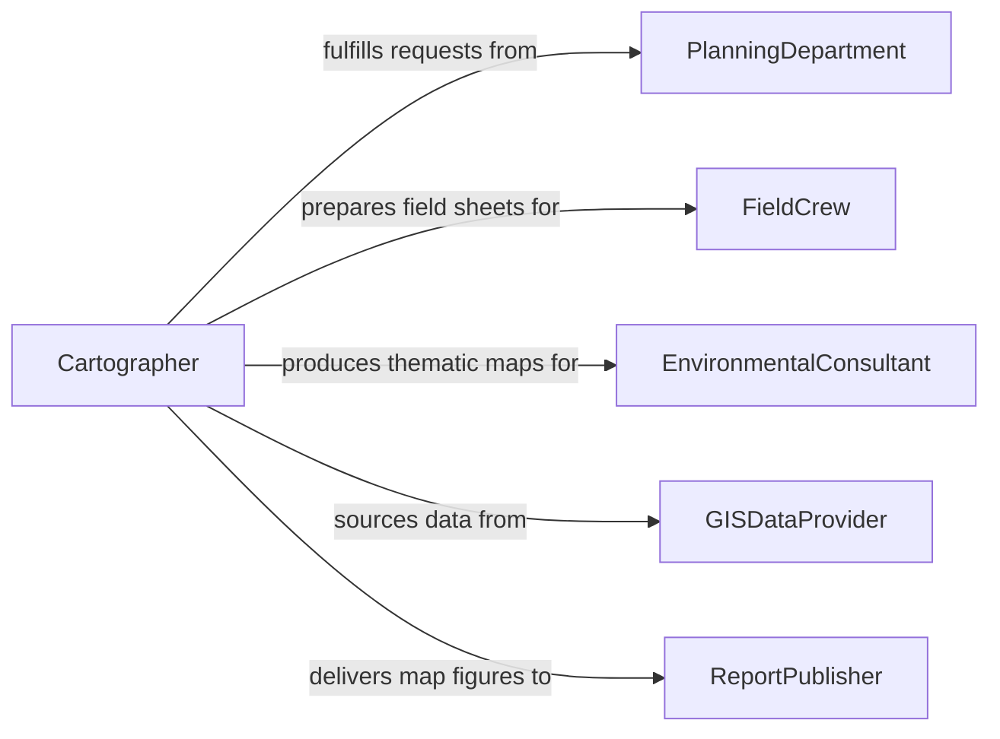

# Prepare Maps

> Business-as-Code definition for preparing maps from existing geospatial data including thematic overlays, route planning maps, site plans, and reference cartography for reports, presentations, and field use.

## Overview

Map preparation involves assembling, styling, and annotating geospatial data into finished cartographic products tailored to specific audiences and use cases. Unlike map creation which focuses on original data capture, map preparation emphasizes composing existing datasets into clear, purpose-driven outputs such as planning maps, reference atlases, field sheets, and thematic displays for environmental, demographic, or infrastructure analysis.

## Actors

| Actor | Description |
|-------|-------------|
| PlanningDepartment | Agency requesting maps for zoning, land use, or infrastructure projects |
| FieldCrew | Personnel using maps for navigation and data collection in the field |
| EnvironmentalConsultant | Specialist requiring thematic maps for impact assessments |
| MunicipalGovernment | Local authority commissioning public reference maps |
| GISDataProvider | Organization supplying authoritative geospatial datasets |
| ReportPublisher | Team incorporating maps into documents and presentations |

## Roles

| Role | Description |
|------|-------------|
| Cartographer | Assembles and styles geospatial data into finished maps |
| GISTechnician | Processes and prepares spatial data layers for cartographic use |
| MapReviewer | Verifies accuracy, legibility, and compliance with standards |
| ProjectCoordinator | Manages map production schedules and client requirements |

## Entities

| Entity | Description |
|--------|-------------|
| MapRequest | Specification of the map purpose, extent, scale, and deliverables |
| DataLayer | Individual geospatial dataset included in the map composition |
| MapTemplate | Predefined layout with title block, legend, scale bar, and north arrow |
| ThematicOverlay | Styled data layer highlighting a specific variable or classification |
| LegendSpecification | Key explaining symbols, colors, and classifications used |
| ExportProfile | Output settings including format, resolution, and color mode |
| FieldSheet | Map formatted for outdoor or site-based use |

## Actions

| Action | Description |
|--------|-------------|
| receiveRequest | Accept and review the map production request |
| assembleData | Gather and load required geospatial data layers |
| applyTemplate | Set up the map layout with standard cartographic elements |
| styleOverlays | Apply thematic styling to data layers based on purpose |
| composeLegend | Build the legend explaining all map symbols and classifications |
| proofMap | Review the assembled map for accuracy and readability |
| exportMap | Produce final output in requested format and resolution |

## Events

| Event | Description |
|-------|-------------|
| requestReceived | Map production request has been accepted |
| dataAssembled | Required geospatial layers have been loaded |
| templateApplied | Layout with standard cartographic elements has been set up |
| overlaysStyled | Thematic data layers have been visually configured |
| legendComposed | Symbol key and classification legend have been built |
| mapProofed | Accuracy and readability review is complete |
| mapExported | Final cartographic output has been produced |

## Searches

| Search | Description |
|--------|-------------|
| findMapRequests | Search requests by client, theme, or status |
| getDataLayers | Retrieve spatial datasets used in a map |
| listTemplates | Enumerate available map layout templates |
| getExportHistory | Look up previously exported maps by project or extent |

## Workflow



## Actor Relationships



## Usage

### Calling Actions

```typescript
import { prepareMaps } from '@headlessly/prepare-maps'

const maps = prepareMaps()

// Receive a map request
const request = await maps.receiveRequest({
  client: 'county-planning-department',
  purpose: 'zoning-variance-hearing',
  extent: { parcelId: 'APN-1234-567-890', buffer: 500, unit: 'meters' },
  scale: 2400,
  deliverables: ['11x17-PDF', 'GIS-web-map']
})

// Assemble data layers
const data = await maps.assembleData({
  requestId: request.id,
  layers: [
    { name: 'parcels', source: 'county-assessor', vintage: '2025' },
    { name: 'zoning', source: 'planning-gis', vintage: '2025' },
    { name: 'aerial-imagery', source: 'nearmap', resolution: 7.5, unit: 'cm' },
    { name: 'flood-zones', source: 'fema-nfhl', vintage: '2024' }
  ]
})

// Style thematic overlays
await maps.styleOverlays({
  requestId: request.id,
  overlays: [
    { layer: 'zoning', style: 'categorical', field: 'zone_code', transparency: 40 },
    { layer: 'flood-zones', style: 'hatched', pattern: 'diagonal-lines', color: '#3366CC' },
    { layer: 'parcels', style: 'outline', highlight: 'subject-parcel', color: '#FF0000', weight: 2 }
  ]
})
```

### Event-Driven Automation

```typescript
// Notify client when map is exported
maps.mapExported(async ({ requestId, client, format }) => {
  await notify({
    to: client,
    message: `Map for request ${requestId} exported in ${format} - ready for download`
  })
})

// Auto-compose legend after overlays are styled
maps.overlaysStyled(async ({ requestId, layerCount }) => {
  await maps.composeLegend({
    requestId,
    position: 'lower-right',
    columns: layerCount > 4 ? 2 : 1,
    includeScaleBar: true,
    includeNorthArrow: true
  })
})
```
