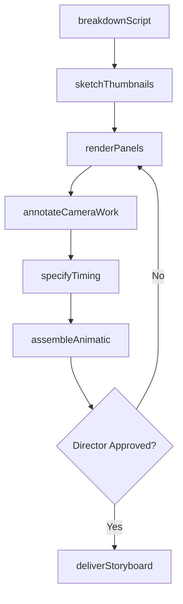
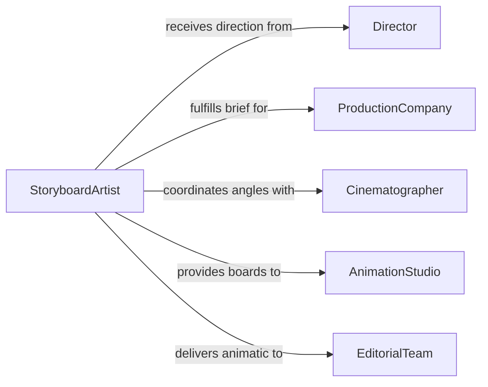

# Prepare Production Storyboards

> Business-as-Code definition for preparing production storyboards used in film, television, animation, advertising, and interactive media to plan visual sequences, camera angles, transitions, and timing before production begins.

## Overview

Production storyboarding involves translating scripts, creative briefs, and directorial vision into sequential visual panels that communicate shot composition, camera movement, character blocking, and scene transitions. This definition models the workflow from script breakdown through thumbnail sketching, panel rendering, timing annotation, revision, and delivery to production teams.

## Actors

| Actor | Description |
|-------|-------------|
| Director | Creative lead defining shot composition and visual storytelling |
| ProductionCompany | Organization commissioning the storyboard for pre-production |
| Cinematographer | Director of photography contributing camera angle and movement input |
| AnimationStudio | Facility using storyboards as the basis for animated sequences |
| AdvertisingAgency | Client requiring storyboards for commercial production |
| EditorialTeam | Post-production editors using boards for assembly planning |

## Roles

| Role | Description |
|------|-------------|
| StoryboardArtist | Draws sequential panels illustrating the visual narrative |
| ArtDirector | Guides the visual style and ensures narrative clarity |
| Animatic Editor | Assembles storyboard panels into timed motion sequences |
| ScriptSupervisor | Verifies storyboard coverage matches the shooting script |

## Entities

| Entity | Description |
|--------|-------------|
| ScriptBreakdown | Scene-by-scene analysis identifying shots and visual requirements |
| ThumbnailSequence | Rough miniature sketches establishing shot flow and pacing |
| StoryboardPanel | Individual frame illustrating shot composition and action |
| CameraNote | Annotation specifying lens, angle, movement, and framing |
| TimingSheet | Duration and transition specifications for each panel |
| Animatic | Video assembly of panels with timing and scratch audio |
| RevisionSet | Updated panels incorporating feedback from creative review |

## Actions

| Action | Description |
|--------|-------------|
| breakdownScript | Analyze the script to identify scenes, shots, and visual beats |
| sketchThumbnails | Create rough miniature sketches to establish shot sequence |
| renderPanels | Draw finished storyboard frames with detail and shading |
| annotateCameraWork | Add lens, angle, movement, and framing notes to panels |
| specifyTiming | Define duration and transition type for each panel |
| assembleAnimatic | Compile panels into a timed video with scratch audio |
| deliverStoryboard | Release the approved storyboard package to production |

## Events

| Event | Description |
|-------|-------------|
| scriptBrokenDown | Scene and shot analysis is complete |
| thumbnailsSketched | Rough shot sequence has been established |
| panelsRendered | Finished storyboard frames have been drawn |
| cameraWorkAnnotated | Lens and movement notes have been added |
| timingSpecified | Panel durations and transitions have been defined |
| animaticAssembled | Timed video assembly of panels is complete |
| storyboardDelivered | Approved storyboard package has been released |

## Searches

| Search | Description |
|--------|-------------|
| findStoryboards | Search boards by production, scene, or sequence |
| getPanels | Retrieve individual frames for a specific scene |
| listRevisions | Enumerate revision sets for a storyboard sequence |
| getAnimatic | Look up the timed video assembly for a production |

## Workflow



## Actor Relationships



## Usage

### Calling Actions

```typescript
import { prepareProductionStoryboards } from '@headlessly/prepare-production-storyboards'

const storyboards = prepareProductionStoryboards()

// Break down the script
const breakdown = await storyboards.breakdownScript({
  production: 'signal-lost',
  medium: 'feature-film',
  scenes: [
    { number: 42, location: 'INT-CONTROL-ROOM', pages: 3.5, shotEstimate: 18 },
    { number: 43, location: 'EXT-LAUNCH-PAD-NIGHT', pages: 2, shotEstimate: 12 }
  ]
})

// Render panels
const panels = await storyboards.renderPanels({
  breakdownId: breakdown.id,
  scene: 42,
  panels: [
    { shot: 1, description: 'Wide establishing - control room with monitors', action: 'static' },
    { shot: 2, description: 'OTS protagonist watching countdown', action: 'slow-push-in' },
    { shot: 3, description: 'CU protagonist face - tension', action: 'static-handheld' }
  ],
  style: 'detailed-grayscale',
  aspectRatio: '2.39:1'
})

// Annotate camera work
await storyboards.annotateCameraWork({
  panelSetId: panels.id,
  annotations: [
    { panel: 1, lens: '18mm', angle: 'low', movement: 'none', framing: 'wide' },
    { panel: 2, lens: '50mm', angle: 'eye-level', movement: 'dolly-in', speed: 'slow' },
    { panel: 3, lens: '85mm', angle: 'eye-level', movement: 'handheld-subtle', framing: 'close-up' }
  ]
})
```

### Event-Driven Automation

```typescript
// Notify editorial when animatic is assembled
storyboards.animaticAssembled(async ({ productionId, scene, duration }) => {
  await notify({
    to: 'editorial',
    message: `Animatic for scene ${scene} of ${productionId} assembled - ${duration}s runtime - ready for review`
  })
})

// Auto-assemble animatic after timing is specified
storyboards.timingSpecified(async ({ panelSetId, panelCount }) => {
  await storyboards.assembleAnimatic({
    panelSetId,
    scratchAudio: true,
    transitionDefaults: 'cut',
    outputFormat: 'ProRes-422'
  })
})
```
