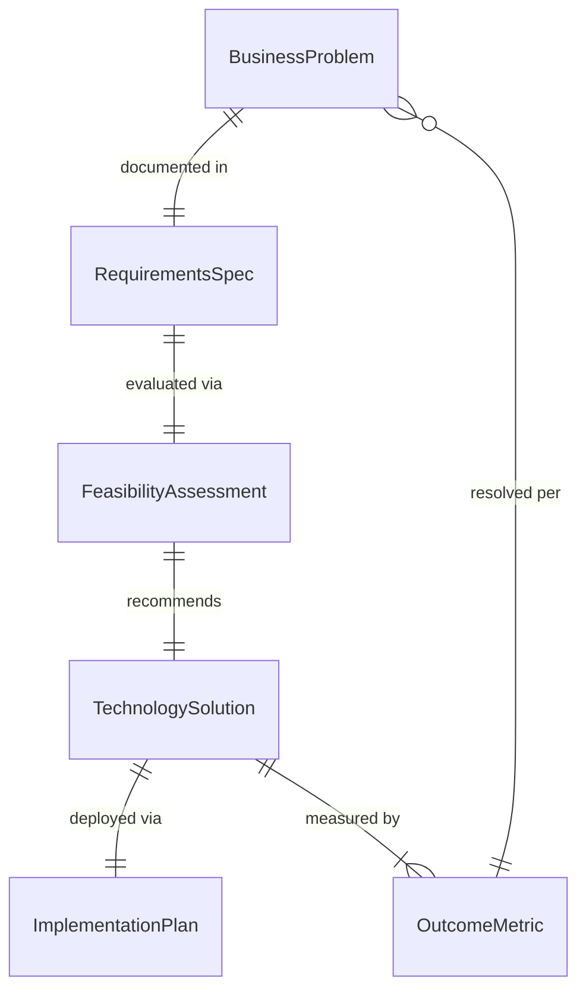
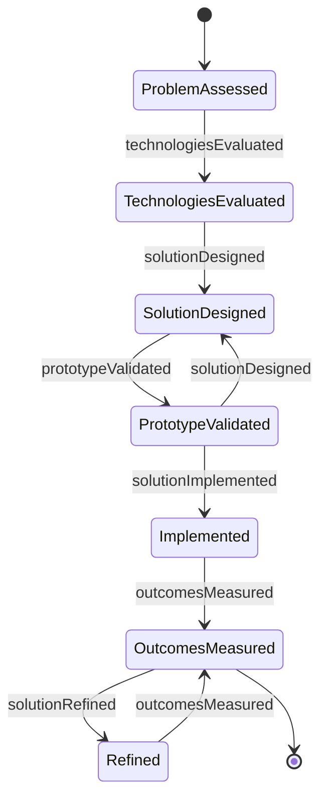
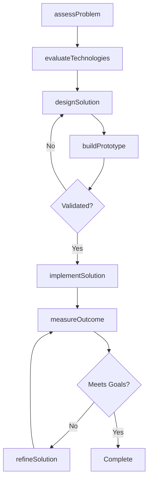
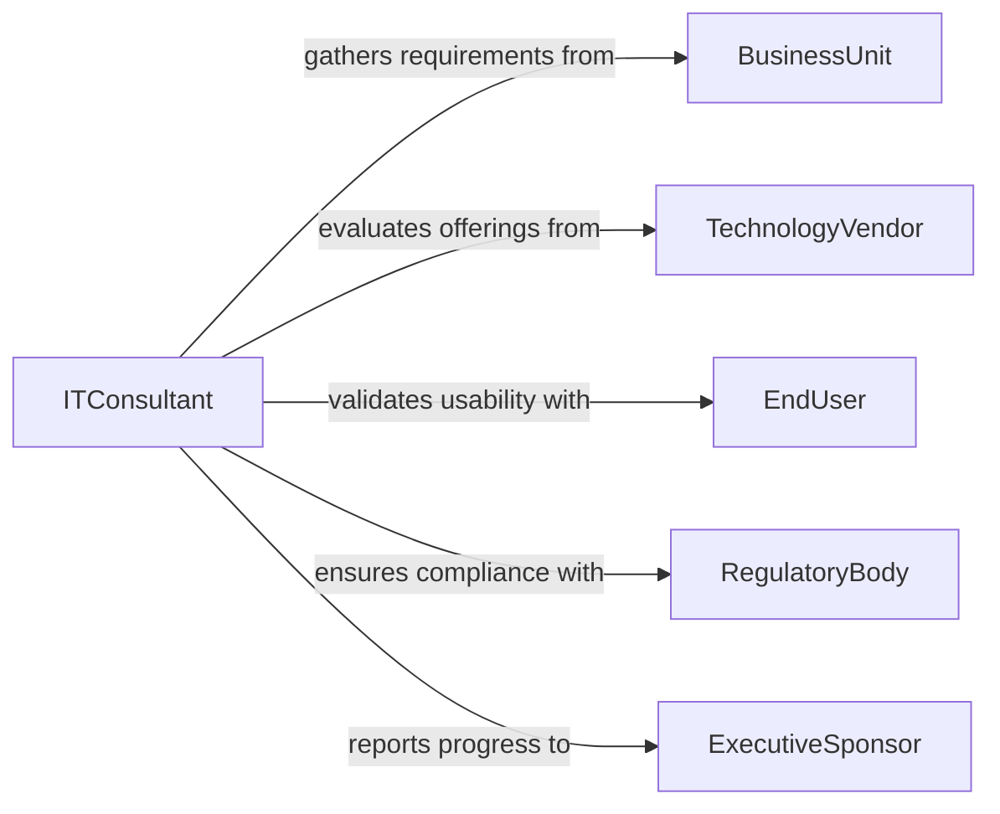

# Apply Information Technology Solve Business

> Business-as-Code definition for applying information technology to solve business or other applied problems. Models the process of analyzing business challenges and selecting, configuring, or building IT solutions to address them.

## Overview

Applying information technology to solve business problems involves assessing organizational challenges, evaluating available technologies, and implementing solutions that improve efficiency, reduce costs, or enable new capabilities. This encompasses activities from requirements gathering and technology selection through solution design, implementation, and validation. The process bridges the gap between business needs and technical capabilities.

## Actors

| Actor | Description |
|-------|-------------|
| BusinessUnit | Identifies operational problems and articulates solution requirements |
| TechnologyVendor | Provides software, hardware, or cloud services for solution implementation |
| EndUser | Uses the implemented solution in daily operations |
| RegulatoryBody | Sets compliance standards that IT solutions must satisfy |
| ExecutiveSponsor | Authorizes funding and strategic alignment for IT initiatives |

## Roles

| Role | Description |
|------|-------------|
| ITConsultant | Analyzes business problems and recommends technology solutions |
| SolutionsArchitect | Designs technical architectures that address business requirements |
| ProjectManager | Coordinates implementation timelines, resources, and deliverables |
| BusinessAnalyst | Translates business needs into technical specifications |

## Entities

| Entity | Description |
|--------|-------------|
| BusinessProblem | A documented challenge or inefficiency requiring an IT solution |
| TechnologySolution | A proposed or implemented IT system addressing a business problem |
| RequirementsSpec | A formal specification of functional and non-functional requirements |
| FeasibilityAssessment | An evaluation of technical viability, cost, and risk for a solution |
| ImplementationPlan | A phased plan for deploying the technology solution |
| OutcomeMetric | A measurable indicator tracking solution effectiveness |

## Actions

| Action | Description |
|--------|-------------|
| assessProblem | Analyze and document a business problem requiring IT intervention |
| evaluateTechnologies | Compare available technologies against solution requirements |
| designSolution | Create a technical architecture and implementation blueprint |
| buildPrototype | Develop a proof-of-concept to validate the proposed approach |
| implementSolution | Deploy the technology solution into production environments |
| measureOutcome | Evaluate solution effectiveness against defined success metrics |
| refineSolution | Iterate on the deployed solution based on performance data |

## Events

| Event | Description |
|-------|-------------|
| problemAssessed | A business problem has been formally analyzed and documented |
| technologiesEvaluated | Technology options have been compared and a selection made |
| solutionDesigned | A technical architecture has been completed |
| prototypeValidated | A proof-of-concept has been successfully demonstrated |
| solutionImplemented | The technology solution has been deployed to production |
| outcomesMeasured | Solution effectiveness metrics have been collected and reviewed |
| solutionRefined | The deployed solution has been updated based on feedback |

## Searches

| Search | Description |
|--------|-------------|
| findProblems | List business problems by department, priority, or status |
| getSolutions | Retrieve technology solutions by type, status, or business area |
| getOutcomeMetrics | Fetch performance metrics for implemented solutions |
| findTechnologies | Search evaluated technologies by capability or vendor |

## Entity Relationships



## State Diagram



## Workflow



## Actor Relationships



## Usage

### Calling Actions

```typescript
import { applyInformationTechnologySolveBusiness } from '@headlessly/apply-information-technology-solve-business'

const itSolutions = applyInformationTechnologySolveBusiness()

// Assess a business problem
const problem = await itSolutions.assessProblem({
  title: 'Manual Invoice Processing Bottleneck',
  department: 'Accounts Payable',
  impact: 'high',
  description: 'Manual data entry of 500+ invoices per week causing delays and errors'
})

// Evaluate technology options
const evaluation = await itSolutions.evaluateTechnologies({
  problemId: problem.id,
  candidates: [
    { name: 'OCR Invoice Automation', vendor: 'DocuProcess', cost: 45000 },
    { name: 'RPA Bot for AP', vendor: 'AutomateNow', cost: 62000 }
  ],
  criteria: ['accuracy', 'integrationEase', 'totalCostOfOwnership']
})

// Design the selected solution
const solution = await itSolutions.designSolution({
  problemId: problem.id,
  technologyId: evaluation.recommendedId,
  architecture: 'cloud-native',
  integrations: ['SAP', 'SharePoint']
})
```

### Event-Driven Automation

```typescript
// Notify stakeholders when a solution is deployed
itSolutions.solutionImplemented(async ({ solutionId, problemId, department }) => {
  await notify({
    to: department,
    message: `IT solution deployed for problem ${problemId}. Training sessions will be scheduled.`
  })
})

// Auto-schedule review when outcomes are measured
itSolutions.outcomesMeasured(async ({ solutionId, metrics }) => {
  if (metrics.satisfactionScore < 3.5) {
    await itSolutions.refineSolution({
      solutionId,
      reason: 'User satisfaction below threshold'
    })
  }
})
```
