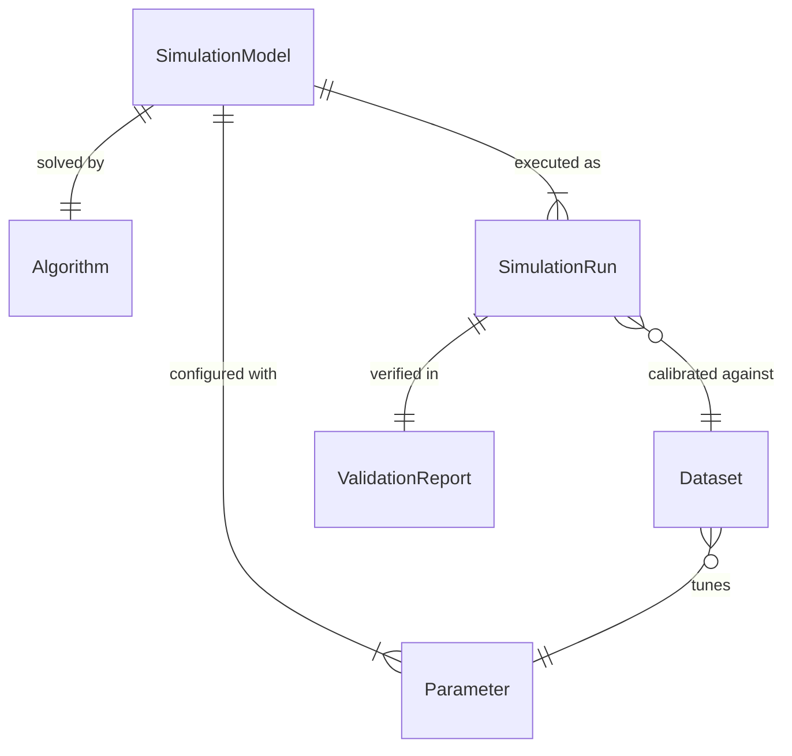
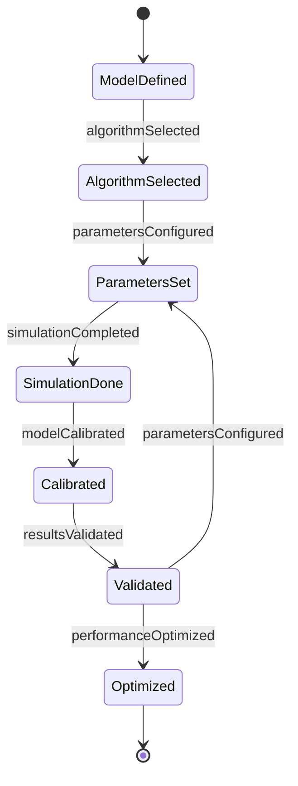
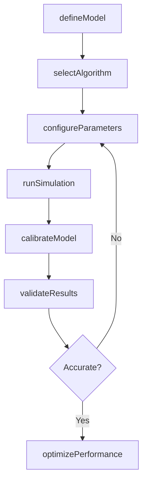
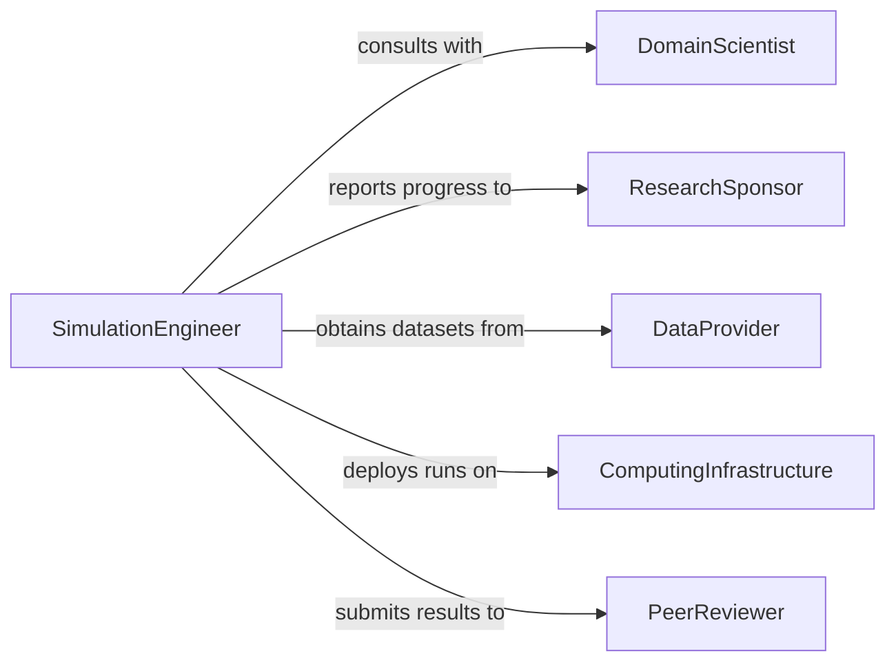

# Design Computer Modeling Simulation Programs

> Business-as-Code definition for designing computer modeling or simulation programs. Models the process of creating computational tools that replicate real-world systems, processes, or phenomena for analysis and prediction.

## Overview

Designing computer modeling and simulation programs involves defining mathematical models, selecting simulation algorithms, and building software that replicates physical, financial, or operational systems. These programs enable organizations to test hypotheses, predict outcomes, and optimize processes without real-world experimentation. The design process spans from domain analysis and model formulation through implementation, calibration, and validation against known data.

## Actors

| Actor | Description |
|-------|-------------|
| DomainScientist | Provides subject-matter expertise on the system being modeled |
| ResearchSponsor | Funds the simulation project and defines strategic objectives |
| DataProvider | Supplies empirical datasets for model calibration and validation |
| ComputingInfrastructure | Provides high-performance computing resources for simulation execution |
| PeerReviewer | Evaluates model accuracy and methodology rigor |

## Roles

| Role | Description |
|------|-------------|
| SimulationEngineer | Designs algorithms and implements the simulation codebase |
| ModelArchitect | Defines the mathematical framework and system abstractions |
| ValidationAnalyst | Calibrates models against empirical data and assesses accuracy |
| ProjectLead | Coordinates the simulation design effort across disciplines |

## Entities

| Entity | Description |
|--------|-------------|
| SimulationModel | A mathematical representation of a real-world system or process |
| Algorithm | A computational procedure used to advance the simulation state |
| Parameter | A configurable variable within the model affecting simulation behavior |
| Dataset | Empirical data used for model calibration or validation |
| SimulationRun | A single execution of the model with a specific parameter set |
| ValidationReport | A document comparing simulation outputs to observed data |

## Actions

| Action | Description |
|--------|-------------|
| defineModel | Specify the mathematical framework and governing equations |
| selectAlgorithm | Choose appropriate numerical methods and solvers |
| configureParameters | Set initial conditions and tunable model variables |
| runSimulation | Execute the simulation with a given configuration |
| calibrateModel | Adjust parameters to minimize deviation from empirical data |
| validateResults | Compare simulation outputs to observed or expected outcomes |
| optimizePerformance | Improve computational efficiency of the simulation program |

## Events

| Event | Description |
|-------|-------------|
| modelDefined | The mathematical model framework has been established |
| algorithmSelected | Numerical methods and solvers have been chosen |
| parametersConfigured | Model parameters and initial conditions have been set |
| simulationCompleted | A simulation run has finished execution |
| modelCalibrated | Model parameters have been tuned against empirical data |
| resultsValidated | Simulation outputs have been verified against known outcomes |
| performanceOptimized | Simulation execution time has been improved |

## Searches

| Search | Description |
|--------|-------------|
| findModels | List simulation models by domain, status, or creation date |
| getSimulationRuns | Retrieve execution history for a specific model |
| getValidationResults | Fetch accuracy metrics and comparison reports |
| findParameters | Search model parameters by sensitivity or range |

## Entity Relationships



## State Diagram



## Workflow



## Actor Relationships



## Usage

### Calling Actions

```typescript
import { designComputerModelingSimulationPrograms } from '@headlessly/design-computer-modeling-simulation-programs'

const simulations = designComputerModelingSimulationPrograms()

// Define a new fluid dynamics model
const model = await simulations.defineModel({
  name: 'Coastal Erosion Predictor',
  domain: 'geophysics',
  equations: ['navier-stokes', 'sediment-transport'],
  dimensions: 3
})

// Configure parameters for a simulation run
await simulations.configureParameters({
  modelId: model.id,
  parameters: {
    waveHeight: 2.5,
    tidalRange: 1.8,
    sedimentDensity: 2650,
    timeStep: 0.01,
    duration: 86400
  }
})

// Run the simulation
const run = await simulations.runSimulation({
  modelId: model.id,
  computeProfile: 'gpu-cluster',
  outputFormat: 'netcdf'
})
```

### Event-Driven Automation

```typescript
// Auto-validate when simulation completes
simulations.simulationCompleted(async ({ modelId, runId, duration }) => {
  await simulations.validateResults({
    runId,
    referenceDataset: 'coastal-survey-2025',
    tolerancePercent: 5
  })
})

// Alert team on successful calibration
simulations.modelCalibrated(async ({ modelId, accuracy }) => {
  if (accuracy > 0.95) {
    await notify({
      to: 'research-team',
      message: `Model ${modelId} calibrated with ${(accuracy * 100).toFixed(1)}% accuracy`
    })
  }
})
```
