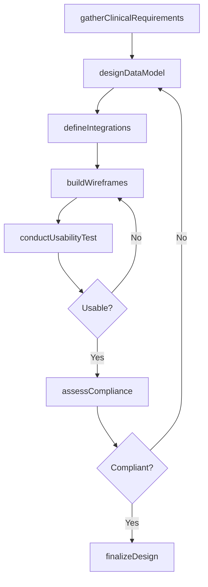
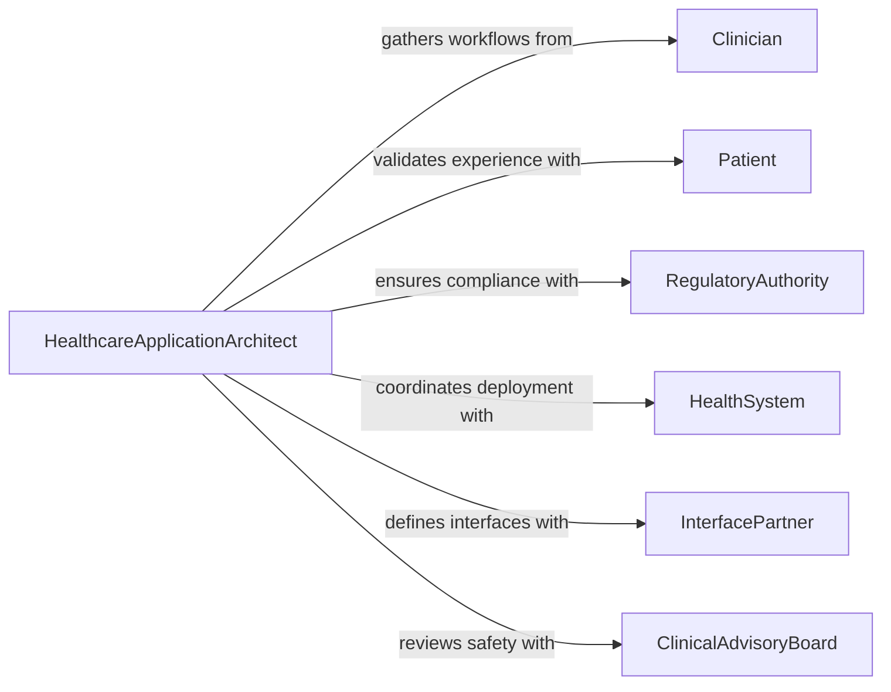

# Design Healthcare-related Software Applications

> Business-as-Code definition for designing healthcare-related software applications. Models the process of creating clinical, administrative, and patient-facing systems that comply with healthcare regulations and interoperability standards.

## Overview

Designing healthcare-related software applications involves creating systems for electronic health records, clinical decision support, telemedicine, patient portals, and medical device integration. These applications must comply with HIPAA, HL7 FHIR, and other regulatory frameworks while maintaining high availability and data integrity. The design process balances clinical workflow requirements, patient safety considerations, and interoperability with existing health information exchanges.

## Actors

| Actor | Description |
|-------|-------------|
| Clinician | Provides clinical workflow requirements and validates usability |
| Patient | Uses patient-facing portals and provides feedback on experience |
| RegulatoryAuthority | Enforces HIPAA, FDA, and other healthcare compliance standards |
| HealthSystem | Operates the IT infrastructure where applications are deployed |
| InterfacePartner | Provides connectivity to labs, pharmacies, and health information exchanges |
| ClinicalAdvisoryBoard | Reviews application designs for patient safety and clinical accuracy |

## Roles

| Role | Description |
|------|-------------|
| HealthcareApplicationArchitect | Designs system architecture meeting clinical and regulatory requirements |
| ClinicalInformaticsSpecialist | Bridges clinical workflows with technical implementation |
| ComplianceEngineer | Ensures designs meet HIPAA, HITECH, and FDA software validation standards |
| UXResearcher | Conducts usability studies with clinicians and patients |

## Entities

| Entity | Description |
|--------|-------------|
| ApplicationSpec | A formal specification for a healthcare software application |
| ClinicalWorkflow | A documented sequence of care delivery steps the software supports |
| DataModel | The schema defining patient, clinical, and administrative data structures |
| ComplianceRequirement | A regulatory or certification standard the application must satisfy |
| IntegrationInterface | A FHIR, HL7v2, or DICOM endpoint for external system connectivity |
| UsabilityStudy | A structured evaluation of the application's clinical user experience |

## Actions

| Action | Description |
|--------|-------------|
| gatherClinicalRequirements | Collect workflow and data needs from clinical stakeholders |
| designDataModel | Create FHIR-compliant data structures for clinical information |
| defineIntegrations | Specify interfaces to EHR systems, labs, and pharmacies |
| buildWireframes | Create interactive prototypes for clinical and patient workflows |
| assessCompliance | Evaluate the design against HIPAA, HITECH, and FDA requirements |
| conductUsabilityTest | Run structured usability sessions with clinical end users |
| finalizeDesign | Approve the application design for development handoff |

## Events

| Event | Description |
|-------|-------------|
| requirementsGathered | Clinical and regulatory requirements have been documented |
| dataModelDesigned | FHIR-compliant data structures have been defined |
| integrationsSpecified | External system interfaces have been documented |
| wireframesCompleted | Interactive prototypes are ready for review |
| complianceAssessed | Regulatory compliance evaluation is complete |
| usabilityTestCompleted | Clinical usability sessions have been conducted and analyzed |
| designFinalized | Application design has been approved for development |

## Searches

| Search | Description |
|--------|-------------|
| findApplicationSpecs | List application specifications by clinical domain or status |
| getComplianceStatus | Retrieve compliance assessment results for a design |
| getIntegrationInterfaces | Fetch defined interfaces for a specific application |
| findUsabilityStudies | Search usability studies by application, date, or participant type |

## Workflow



## Actor Relationships



## Usage

### Calling Actions

```typescript
import { designHealthcareRelatedSoftwareApplications } from '@headlessly/design-healthcare-related-software-applications'

const healthApps = designHealthcareRelatedSoftwareApplications()

// Gather clinical requirements for a telemedicine platform
const requirements = await healthApps.gatherClinicalRequirements({
  applicationName: 'Virtual Visit Platform',
  clinicalDomain: 'primary-care',
  stakeholders: ['physicians', 'nurses', 'patients'],
  regulatoryScope: ['HIPAA', 'HITECH', '21CFR11']
})

// Design FHIR-compliant data model
const dataModel = await healthApps.designDataModel({
  specId: requirements.specId,
  fhirVersion: 'R4',
  resources: ['Patient', 'Encounter', 'Observation', 'Condition'],
  customExtensions: ['telehealth-session', 'consent-preference']
})

// Assess compliance
const compliance = await healthApps.assessCompliance({
  specId: requirements.specId,
  standards: ['HIPAA-Security', 'HIPAA-Privacy', 'ONC-Certification'],
  encryptionLevel: 'AES-256'
})
```

### Event-Driven Automation

```typescript
// Alert compliance team on design changes
healthApps.dataModelDesigned(async ({ specId, fhirResources }) => {
  await notify({
    to: 'compliance-team',
    message: `Data model updated for ${specId}. FHIR resources: ${fhirResources.join(', ')}`
  })
})

// Schedule clinical review when wireframes are ready
healthApps.wireframesCompleted(async ({ specId, applicationName }) => {
  await schedule({
    type: 'usability-session',
    application: applicationName,
    participants: ['clinical-advisory-board'],
    duration: 90
  })
})
```
