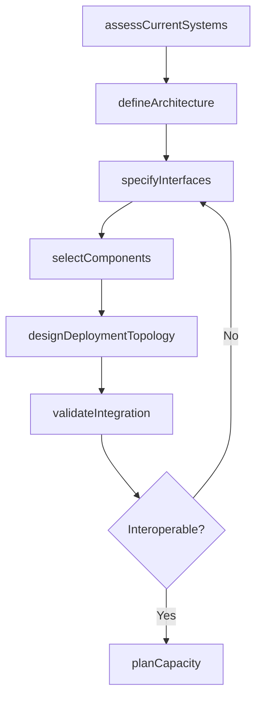
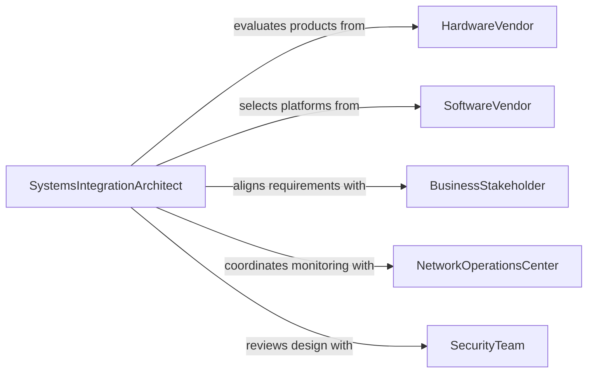

# Design Integrated Computer Systems

> Business-as-Code definition for designing integrated computer systems. Models the process of architecting unified computing environments that connect hardware, software, networks, and data stores into cohesive operational platforms.

## Overview

Designing integrated computer systems involves creating architectures that unify disparate hardware platforms, operating systems, middleware, databases, and application layers into a single coordinated environment. This includes defining system topologies, specifying integration protocols, selecting component technologies, and ensuring interoperability across subsystems. The resulting designs enable organizations to consolidate operations, eliminate data silos, and achieve end-to-end automation.

## Actors

| Actor | Description |
|-------|-------------|
| HardwareVendor | Supplies servers, networking equipment, and storage infrastructure |
| SoftwareVendor | Provides operating systems, middleware, and application platforms |
| BusinessStakeholder | Defines operational requirements and budget constraints for the integrated system |
| NetworkOperationsCenter | Monitors and maintains the production network infrastructure |
| SecurityTeam | Evaluates system designs for vulnerability and compliance risks |

## Roles

| Role | Description |
|------|-------------|
| SystemsIntegrationArchitect | Designs the unified architecture connecting all subsystems |
| InfrastructureEngineer | Specifies hardware, networking, and storage configurations |
| IntegrationSpecialist | Implements middleware, APIs, and data exchange mechanisms |
| QualityAssuranceLead | Validates that the integrated system meets performance and reliability targets |

## Entities

| Entity | Description |
|--------|-------------|
| SystemArchitecture | A blueprint defining components, layers, and their interconnections |
| IntegrationLayer | Middleware or service bus connecting disparate subsystems |
| HardwareSpec | A configuration document for servers, storage, and network equipment |
| InterfaceContract | A formal agreement defining data formats and protocols between systems |
| DeploymentTopology | A map of physical and virtual infrastructure hosting the integrated system |
| CapacityPlan | A projection of resource requirements for current and future workloads |

## Actions

| Action | Description |
|--------|-------------|
| assessCurrentSystems | Inventory existing hardware, software, and integration points |
| defineArchitecture | Create the integrated system blueprint with component relationships |
| specifyInterfaces | Document data exchange protocols and interface contracts |
| selectComponents | Choose hardware, software, and middleware technologies |
| designDeploymentTopology | Map the physical and virtual infrastructure layout |
| validateIntegration | Test end-to-end data flow and system interoperability |
| planCapacity | Project resource needs for scaling the integrated environment |

## Events

| Event | Description |
|-------|-------------|
| currentSystemsAssessed | Existing infrastructure has been inventoried and documented |
| architectureDefined | The integrated system blueprint has been completed |
| interfacesSpecified | Interface contracts and protocols have been documented |
| componentsSelected | Technology selections have been finalized |
| topologyDesigned | Deployment infrastructure layout has been mapped |
| integrationValidated | End-to-end system interoperability has been verified |
| capacityPlanned | Resource projections for the integrated system are complete |

## Searches

| Search | Description |
|--------|-------------|
| findArchitectures | List system architectures by domain, status, or technology stack |
| getInterfaceContracts | Retrieve interface specifications for a given system pair |
| getComponentInventory | Fetch the technology inventory for an integrated system design |
| findCapacityPlans | Search capacity projections by system or time horizon |

## Workflow



## Actor Relationships



## Usage

### Calling Actions

```typescript
import { designIntegratedComputerSystems } from '@headlessly/design-integrated-computer-systems'

const systems = designIntegratedComputerSystems()

// Assess current infrastructure
const assessment = await systems.assessCurrentSystems({
  scope: 'enterprise',
  includeInventory: true,
  departments: ['finance', 'operations', 'engineering']
})

// Define the integrated architecture
const architecture = await systems.defineArchitecture({
  name: 'Unified Enterprise Platform',
  layers: ['presentation', 'application', 'integration', 'data', 'infrastructure'],
  pattern: 'service-oriented',
  assessmentId: assessment.id
})

// Specify integration interfaces
await systems.specifyInterfaces({
  architectureId: architecture.id,
  interfaces: [
    { source: 'ERP', target: 'CRM', protocol: 'REST', format: 'JSON' },
    { source: 'ERP', target: 'DataWarehouse', protocol: 'CDC', format: 'Avro' },
    { source: 'CRM', target: 'MarketingPlatform', protocol: 'Webhook', format: 'JSON' }
  ]
})
```

### Event-Driven Automation

```typescript
// Trigger security review when architecture is defined
systems.architectureDefined(async ({ architectureId, name }) => {
  await notify({
    to: 'security-team',
    message: `Architecture "${name}" ready for security review`
  })
})

// Auto-generate capacity plan when integration is validated
systems.integrationValidated(async ({ architectureId }) => {
  await systems.planCapacity({
    architectureId,
    horizonMonths: 24,
    growthRate: 0.15
  })
})
```
