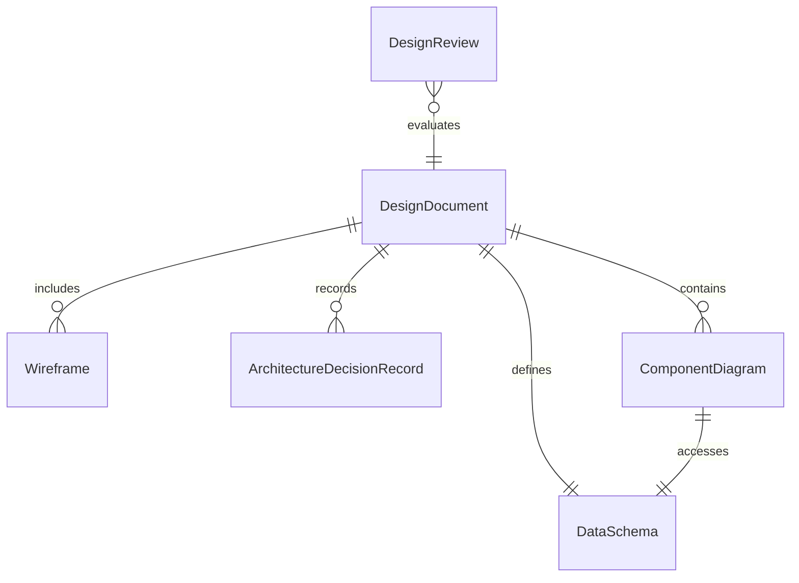
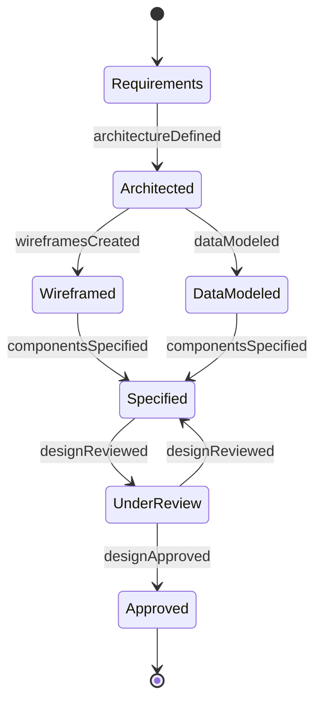
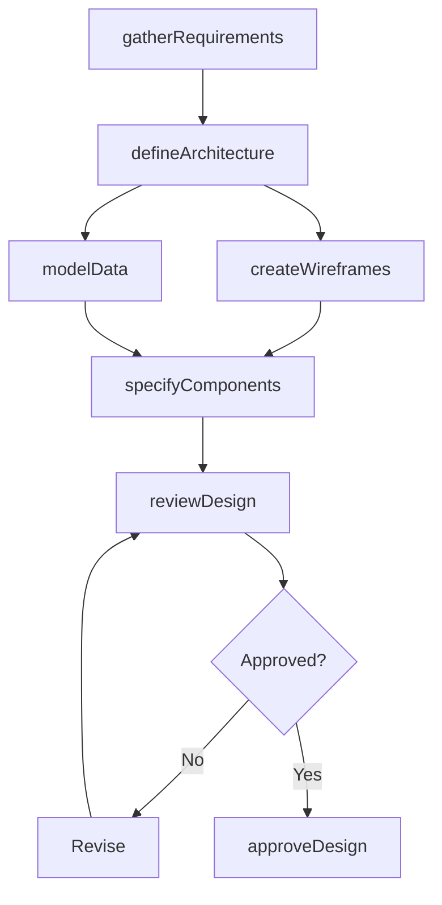
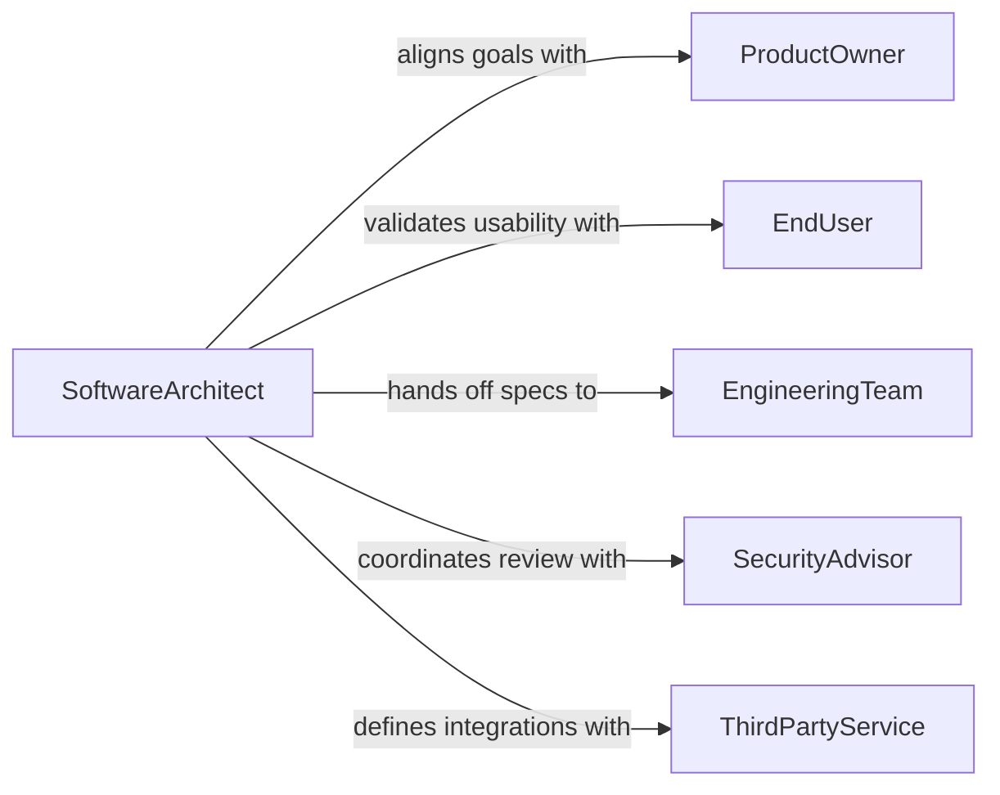

# Design Software Applications

> Business-as-Code definition for designing software applications. Models the full design lifecycle from requirements analysis and architecture definition through interface design, data modeling, and specification approval.

## Overview

Designing software applications involves translating business and user requirements into technical blueprints that guide development teams. This includes defining system architecture, creating data models, specifying user interfaces, establishing security patterns, and documenting integration points. The design process produces artifacts that serve as the authoritative reference for building, testing, and maintaining the application throughout its lifecycle.

## Actors

| Actor | Description |
|-------|-------------|
| ProductOwner | Defines business objectives and prioritizes feature requirements |
| EndUser | Provides usability feedback and validates design against real-world workflows |
| EngineeringTeam | Consumes design specifications to build the application |
| SecurityAdvisor | Reviews designs for vulnerability, authentication, and data protection concerns |
| ThirdPartyService | Provides external APIs and services the application will integrate with |

## Roles

| Role | Description |
|------|-------------|
| SoftwareArchitect | Defines the high-level structure, patterns, and technology stack |
| UXDesigner | Creates wireframes, prototypes, and interaction specifications |
| DataModeler | Designs database schemas, entity relationships, and data access patterns |
| TechnicalWriter | Documents design decisions, patterns, and developer guidelines |

## Entities

| Entity | Description |
|--------|-------------|
| DesignDocument | A comprehensive specification of the application architecture and behavior |
| Wireframe | A visual representation of user interface layout and navigation |
| DataSchema | The database structure defining tables, relationships, and constraints |
| ArchitectureDecisionRecord | A documented rationale for a significant design choice |
| ComponentDiagram | A visual map of application modules and their dependencies |
| DesignReview | A formal evaluation of design artifacts by stakeholders |

## Actions

| Action | Description |
|--------|-------------|
| gatherRequirements | Collect functional and non-functional requirements from stakeholders |
| defineArchitecture | Establish the application structure, patterns, and technology choices |
| createWireframes | Design user interface layouts and interaction flows |
| modelData | Define database schemas, entity relationships, and access patterns |
| specifyComponents | Document application modules, their responsibilities, and interfaces |
| reviewDesign | Conduct formal design reviews with stakeholders and engineering |
| approveDesign | Sign off on the finalized design for development handoff |

## Events

| Event | Description |
|-------|-------------|
| requirementsGathered | Functional and non-functional requirements have been documented |
| architectureDefined | Application structure and technology stack have been established |
| wireframesCreated | User interface designs and interaction flows are complete |
| dataModeled | Database schemas and entity relationships have been defined |
| componentsSpecified | Application modules and their interfaces have been documented |
| designReviewed | Formal design review has been completed with feedback |
| designApproved | Design has been signed off for development |

## Searches

| Search | Description |
|--------|-------------|
| findDesignDocuments | List design documents by application, version, or status |
| getArchitectureDecisions | Retrieve architecture decision records for a project |
| getWireframes | Fetch wireframes by application, screen, or iteration |
| findDesignReviews | Search design reviews by project, reviewer, or outcome |

## Entity Relationships



## State Diagram



## Workflow



## Actor Relationships



## Usage

### Calling Actions

```typescript
import { designSoftwareApplications } from '@headlessly/design-software-applications'

const design = designSoftwareApplications()

// Gather requirements for a new application
const requirements = await design.gatherRequirements({
  projectName: 'Inventory Management System',
  stakeholders: ['warehouse-ops', 'procurement', 'finance'],
  functionalRequirements: ['real-time stock tracking', 'purchase order automation', 'reporting'],
  nonFunctional: { availability: '99.9%', responseTime: '200ms', users: 500 }
})

// Define the application architecture
const architecture = await design.defineArchitecture({
  projectId: requirements.projectId,
  pattern: 'event-driven-microservices',
  stack: { runtime: 'Node.js', database: 'PostgreSQL', cache: 'Redis', queue: 'Kafka' },
  deploymentTarget: 'kubernetes'
})

// Model the data layer
const schema = await design.modelData({
  projectId: requirements.projectId,
  entities: ['Product', 'Warehouse', 'StockLevel', 'PurchaseOrder', 'Supplier'],
  relationships: [
    { from: 'Product', to: 'StockLevel', type: 'one-to-many' },
    { from: 'Warehouse', to: 'StockLevel', type: 'one-to-many' },
    { from: 'PurchaseOrder', to: 'Supplier', type: 'many-to-one' }
  ]
})
```

### Event-Driven Automation

```typescript
// Notify engineering when design is approved
design.designApproved(async ({ projectId, projectName }) => {
  await notify({
    to: 'engineering-team',
    message: `Design approved for ${projectName}. Sprint planning can begin.`
  })
})

// Auto-schedule security review after architecture is defined
design.architectureDefined(async ({ projectId, pattern }) => {
  await schedule({
    type: 'security-review',
    projectId,
    reviewers: ['security-team'],
    deadline: addDays(new Date(), 5)
  })
})
```
