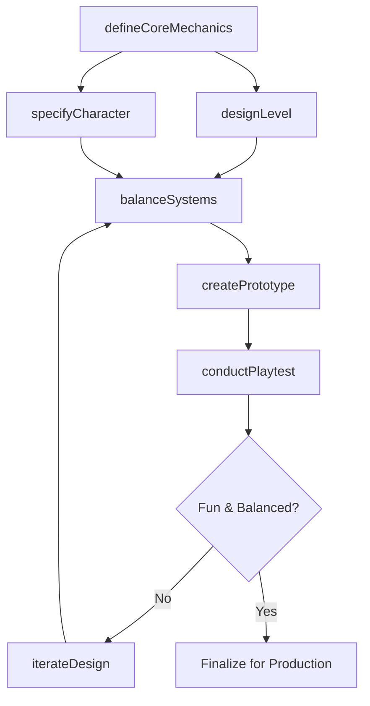
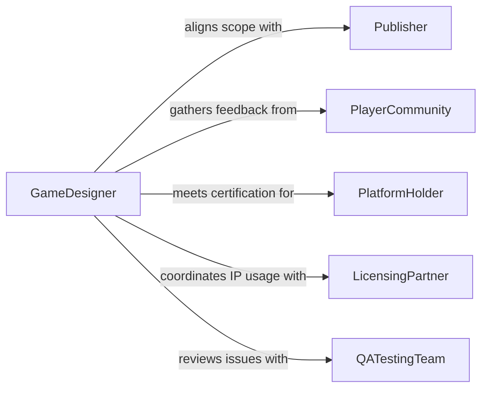

# Design Video Game Features Details

> Business-as-Code definition for designing video game features or details. Models the creative and technical process of defining game mechanics, level layouts, character systems, and interactive experiences.

## Overview

Designing video game features and details involves conceptualizing gameplay mechanics, defining player progression systems, creating level designs, and specifying character abilities and interactions. This process requires balancing creative vision with technical constraints, player psychology, and monetization strategy. Design artifacts include game design documents, feature specifications, balance spreadsheets, and interactive prototypes that guide development across art, engineering, and audio teams.

## Actors

| Actor | Description |
|-------|-------------|
| Publisher | Funds development and defines market positioning and release requirements |
| PlayerCommunity | Provides feedback through playtesting, surveys, and early access programs |
| PlatformHolder | Establishes certification requirements for console and storefront distribution |
| LicensingPartner | Grants rights to use intellectual property, brands, or music in the game |
| QATestingTeam | Identifies design issues through systematic play and regression testing |

## Roles

| Role | Description |
|------|-------------|
| GameDesigner | Defines core mechanics, systems, and feature specifications |
| LevelDesigner | Creates spatial layouts, encounters, and environmental puzzles |
| NarrativeDesigner | Crafts story arcs, dialogue trees, and world-building elements |
| SystemsDesigner | Balances economy, progression, and combat or scoring systems |

## Entities

| Entity | Description |
|--------|-------------|
| GameDesignDocument | A comprehensive specification of all game features and systems |
| GameMechanic | A rule or system governing player interaction and feedback loops |
| LevelLayout | A spatial design defining terrain, objects, and encounter placement |
| CharacterSpec | A definition of a playable or non-playable character's attributes and abilities |
| ProgressionSystem | A framework defining how players advance, unlock content, and grow |
| BalanceSheet | A numerical model tracking tuning values for difficulty and economy |

## Actions

| Action | Description |
|--------|-------------|
| defineCoreMechanics | Establish the fundamental gameplay rules and interaction patterns |
| designLevel | Create spatial layouts with objectives, hazards, and rewards |
| specifyCharacter | Define character attributes, abilities, and progression paths |
| balanceSystems | Tune numerical values for difficulty, economy, and reward pacing |
| createPrototype | Build a playable proof-of-concept to validate design hypotheses |
| conductPlaytest | Run structured play sessions to gather player feedback |
| iterateDesign | Refine features based on playtest data and team review |

## Events

| Event | Description |
|-------|-------------|
| mechanicsDefined | Core gameplay mechanics have been formally specified |
| levelDesigned | A level layout has been completed and documented |
| characterSpecified | A character's attributes and abilities have been defined |
| systemsBalanced | Economy and progression values have been tuned |
| prototypeCreated | A playable proof-of-concept is ready for testing |
| playtestCompleted | A structured play session has been conducted with results |
| designIterated | Feature designs have been updated based on feedback |

## Searches

| Search | Description |
|--------|-------------|
| findFeatures | List game features by type, status, or milestone |
| getLevelLayouts | Retrieve level designs by chapter, difficulty, or theme |
| getBalanceData | Fetch tuning values and metrics for game systems |
| findPlaytestResults | Search playtest session data by feature, date, or cohort |

## Workflow



## Actor Relationships



## Usage

### Calling Actions

```typescript
import { designVideoGameFeaturesDetails } from '@headlessly/design-video-game-features-details'

const gameDesign = designVideoGameFeaturesDetails()

// Define core mechanics for a roguelike RPG
const mechanics = await gameDesign.defineCoreMechanics({
  title: 'Dungeon Ascent',
  genre: 'roguelike-rpg',
  coreSystems: ['procedural-generation', 'permadeath', 'item-crafting'],
  inputScheme: 'controller-and-keyboard'
})

// Specify a playable character class
const character = await gameDesign.specifyCharacter({
  gameId: mechanics.gameId,
  name: 'Shadow Rogue',
  type: 'playable',
  attributes: { health: 80, attack: 12, speed: 9, stealth: 15 },
  abilities: ['backstab', 'smoke-bomb', 'shadow-step', 'poison-blade']
})

// Balance the progression system
await gameDesign.balanceSystems({
  gameId: mechanics.gameId,
  systems: {
    experienceCurve: 'exponential',
    lootDropRate: 0.12,
    difficultyScaling: 1.15,
    goldEconomy: { baseReward: 50, inflationRate: 0.05 }
  }
})
```

### Event-Driven Automation

```typescript
// Schedule playtest when prototype is ready
gameDesign.prototypeCreated(async ({ gameId, featureSet }) => {
  await schedule({
    type: 'playtest-session',
    gameId,
    participants: 12,
    duration: 120,
    features: featureSet
  })
})

// Auto-generate balance report after playtesting
gameDesign.playtestCompleted(async ({ gameId, sessionId, metrics }) => {
  if (metrics.completionRate < 0.6 || metrics.frustrationScore > 7) {
    await gameDesign.iterateDesign({
      gameId,
      reason: 'Difficulty curve too steep based on playtest data',
      adjustments: ['reduce-enemy-health', 'increase-healing-drops']
    })
  }
})
```
