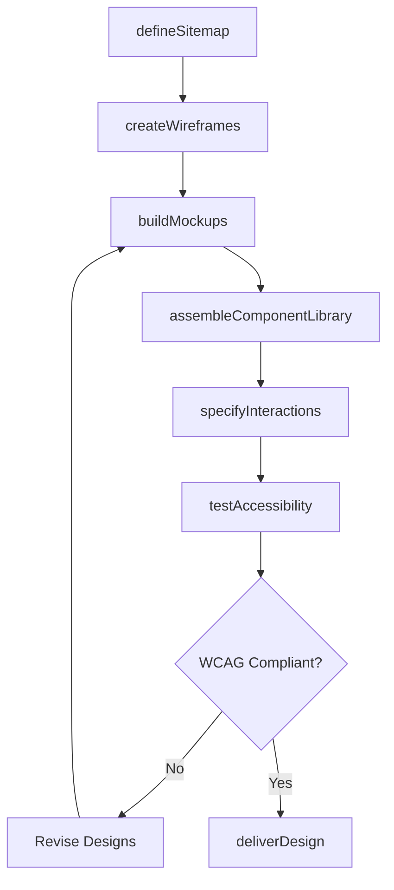
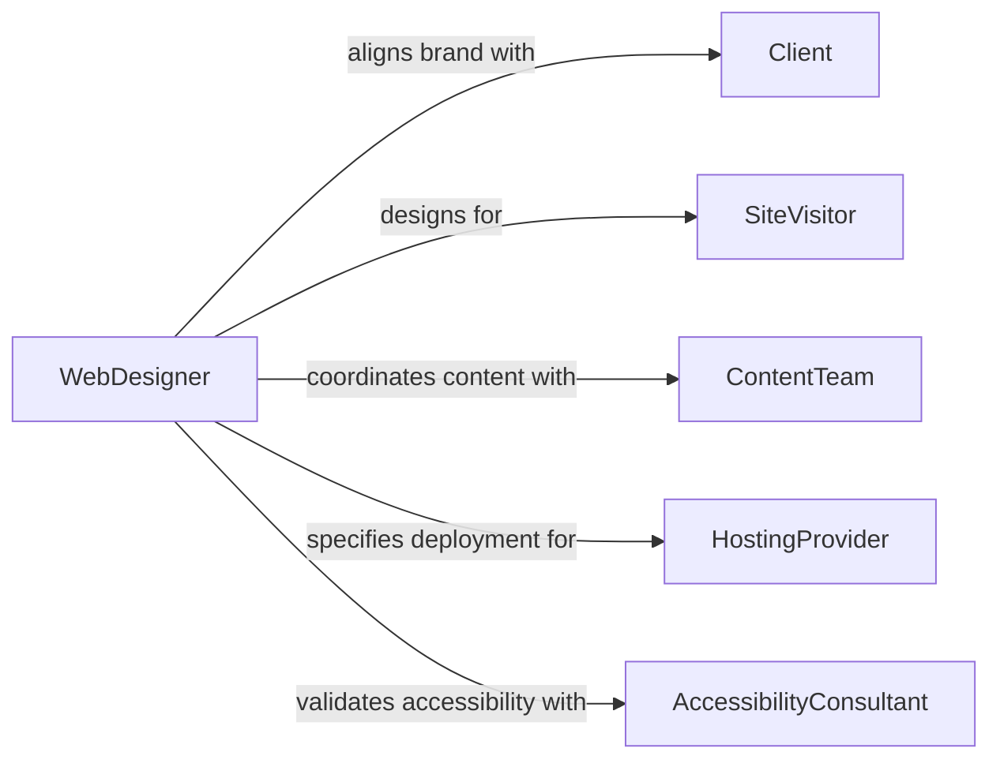

# Design Websites Web Applications

> Business-as-Code definition for designing websites or web applications. Models the process of creating responsive, accessible, and performant web experiences from information architecture through visual design and front-end specification.

## Overview

Designing websites and web applications involves defining information architecture, creating visual layouts, specifying interactive behaviors, and establishing front-end technical standards. This process covers responsive design for multiple devices, accessibility compliance with WCAG guidelines, performance optimization, and integration with back-end services and content management systems. Designs are validated through user research, stakeholder review, and browser compatibility testing before handoff to development.

## Actors

| Actor | Description |
|-------|-------------|
| Client | Commissions the website and defines brand, content, and business goals |
| SiteVisitor | The target audience whose needs and behaviors shape the design |
| ContentTeam | Produces and manages text, images, and media for the site |
| HostingProvider | Supplies the infrastructure for deployment, CDN, and SSL services |
| AccessibilityConsultant | Evaluates designs for WCAG compliance and inclusive experience |

## Roles

| Role | Description |
|------|-------------|
| WebDesigner | Creates visual layouts, component libraries, and interaction patterns |
| InformationArchitect | Defines site structure, navigation, and content hierarchy |
| FrontEndSpecialist | Translates designs into technical specifications for HTML, CSS, and JavaScript |
| UXResearcher | Conducts user testing and analyzes behavioral data to inform design |

## Entities

| Entity | Description |
|--------|-------------|
| Sitemap | A hierarchical map of all pages and their relationships |
| Wireframe | A structural layout defining content placement and navigation flow |
| DesignMockup | A high-fidelity visual representation of a page or screen |
| ComponentLibrary | A reusable set of UI elements with defined styles and behaviors |
| StyleGuide | A document specifying typography, colors, spacing, and brand standards |
| PerformanceBudget | A set of constraints on page weight, load time, and rendering metrics |

## Actions

| Action | Description |
|--------|-------------|
| defineSitemap | Create the hierarchical page structure and navigation paths |
| createWireframes | Design structural layouts for key pages and user flows |
| buildMockups | Produce high-fidelity visual designs from wireframes |
| assembleComponentLibrary | Define reusable UI components with variants and states |
| specifyInteractions | Document animations, transitions, and dynamic behaviors |
| testAccessibility | Evaluate designs against WCAG 2.1 AA standards |
| deliverDesign | Package design assets and specifications for development handoff |

## Events

| Event | Description |
|-------|-------------|
| sitemapDefined | Page hierarchy and navigation structure have been established |
| wireframesCreated | Structural layouts for key pages are complete |
| mockupsBuilt | High-fidelity visual designs have been produced |
| componentLibraryAssembled | Reusable UI components have been defined and documented |
| interactionsSpecified | Animations, transitions, and behaviors have been documented |
| accessibilityTested | WCAG compliance evaluation is complete |
| designDelivered | Design assets and specs have been handed off to development |

## Searches

| Search | Description |
|--------|-------------|
| findDesignAssets | List design files by project, page, or component type |
| getComponentLibrary | Retrieve the component library for a specific project |
| getAccessibilityReport | Fetch WCAG compliance results for a design |
| findMockups | Search mockups by page, device breakpoint, or iteration |

## Workflow



## Actor Relationships



## Usage

### Calling Actions

```typescript
import { designWebsitesWebApplications } from '@headlessly/design-websites-web-applications'

const webDesign = designWebsitesWebApplications()

// Define the site structure
const sitemap = await webDesign.defineSitemap({
  projectName: 'Corporate Rebrand',
  pages: [
    { path: '/', title: 'Home', template: 'hero-landing' },
    { path: '/products', title: 'Products', template: 'product-grid', children: ['product-detail'] },
    { path: '/about', title: 'About Us', template: 'content-page' },
    { path: '/contact', title: 'Contact', template: 'form-page' }
  ],
  navigation: { primary: ['/', '/products', '/about', '/contact'] }
})

// Create wireframes for key pages
const wireframes = await webDesign.createWireframes({
  projectId: sitemap.projectId,
  pages: ['/', '/products'],
  breakpoints: ['mobile-375', 'tablet-768', 'desktop-1440'],
  annotations: true
})

// Test accessibility compliance
const a11y = await webDesign.testAccessibility({
  projectId: sitemap.projectId,
  standard: 'WCAG-2.1-AA',
  scope: ['color-contrast', 'keyboard-navigation', 'screen-reader', 'focus-management']
})
```

### Event-Driven Automation

```typescript
// Notify content team when wireframes are ready
webDesign.wireframesCreated(async ({ projectId, pages }) => {
  await notify({
    to: 'content-team',
    message: `Wireframes ready for content placement: ${pages.join(', ')}`
  })
})

// Auto-generate development tickets when design is delivered
webDesign.designDelivered(async ({ projectId, projectName, pages }) => {
  for (const page of pages) {
    await createTicket({
      project: projectName,
      title: `Implement ${page} from design specs`,
      type: 'development',
      priority: 'medium'
    })
  }
})
```
