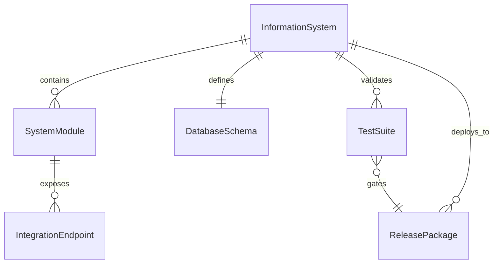
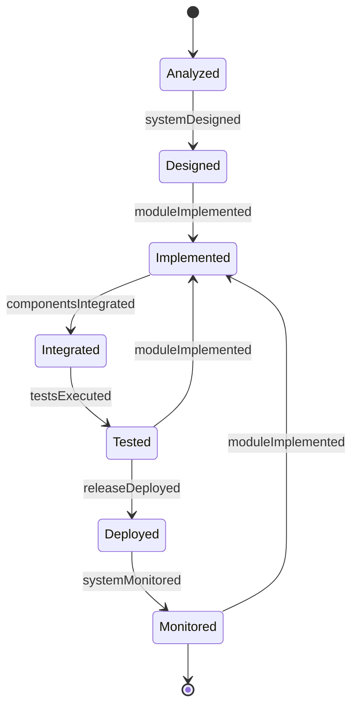
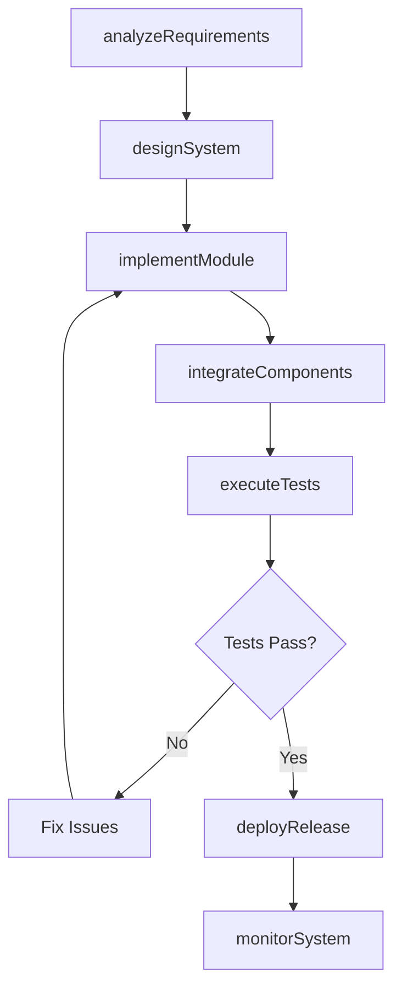
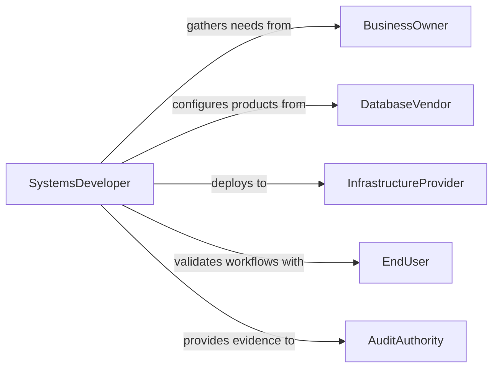

# Develop Computer Information Systems

> Business-as-Code definition for developing computer or information systems. Models the full development lifecycle from system analysis and design through implementation, testing, deployment, and maintenance.

## Overview

Developing computer or information systems involves building enterprise-grade platforms that capture, store, process, and distribute organizational data. This includes database systems, enterprise resource planning platforms, business intelligence tools, and data management infrastructure. The development process spans requirements analysis, system design, iterative coding, integration testing, deployment, and ongoing maintenance to ensure the system evolves with business needs.

## Actors

| Actor | Description |
|-------|-------------|
| BusinessOwner | Defines the information management needs and strategic priorities |
| DatabaseVendor | Provides database engines, licensing, and technical support |
| InfrastructureProvider | Supplies cloud or on-premises hosting, networking, and storage |
| EndUser | Interacts with the information system in daily operations |
| AuditAuthority | Verifies data integrity, access controls, and regulatory compliance |

## Roles

| Role | Description |
|------|-------------|
| SystemsDeveloper | Implements system components, modules, and integration logic |
| DatabaseAdministrator | Designs schemas, manages data storage, and optimizes query performance |
| TestEngineer | Validates system functionality, performance, and data integrity |
| ReleaseManager | Coordinates deployments, versioning, and rollback procedures |

## Entities

| Entity | Description |
|--------|-------------|
| InformationSystem | A complete platform for managing organizational data and processes |
| SystemModule | A functional component handling a specific domain within the system |
| DatabaseSchema | The structural definition of tables, indexes, and relationships |
| IntegrationEndpoint | A connection point for exchanging data with external systems |
| TestSuite | A collection of automated tests validating system behavior |
| ReleasePackage | A versioned bundle of code, configuration, and migration scripts |

## Actions

| Action | Description |
|--------|-------------|
| analyzeRequirements | Gather and document functional and technical system requirements |
| designSystem | Create architecture, data models, and component specifications |
| implementModule | Build a functional system component with business logic |
| integrateComponents | Connect system modules and external data sources |
| executeTests | Run automated test suites to validate system behavior |
| deployRelease | Push a versioned release to staging or production environments |
| monitorSystem | Track system health, performance, and error rates post-deployment |

## Events

| Event | Description |
|-------|-------------|
| requirementsAnalyzed | System requirements have been gathered and documented |
| systemDesigned | Architecture and data models have been finalized |
| moduleImplemented | A system component has been built and unit tested |
| componentsIntegrated | System modules have been connected and verified |
| testsExecuted | Automated test suites have completed with results |
| releaseDeployed | A versioned release has been pushed to an environment |
| systemMonitored | Performance and health metrics have been collected |

## Searches

| Search | Description |
|--------|-------------|
| findSystems | List information systems by department, technology, or status |
| getModules | Retrieve modules for a specific information system |
| getTestResults | Fetch test execution results by suite, module, or date |
| findReleases | Search release packages by version, environment, or deployment date |

## Entity Relationships



## State Diagram



## Workflow



## Actor Relationships



## Usage

### Calling Actions

```typescript
import { developComputerInformationSystems } from '@headlessly/develop-computer-information-systems'

const infoSystems = developComputerInformationSystems()

// Analyze requirements for a new HR information system
const requirements = await infoSystems.analyzeRequirements({
  systemName: 'HR Management Platform',
  departments: ['human-resources', 'payroll', 'recruitment'],
  capabilities: ['employee-records', 'benefits-admin', 'time-tracking', 'reporting'],
  userCount: 2500
})

// Implement the employee records module
const module = await infoSystems.implementModule({
  systemId: requirements.systemId,
  name: 'employee-records',
  entities: ['Employee', 'Department', 'Position', 'EmploymentHistory'],
  operations: ['create', 'update', 'search', 'archive']
})

// Deploy a release to staging
const release = await infoSystems.deployRelease({
  systemId: requirements.systemId,
  version: '1.2.0',
  environment: 'staging',
  migrations: ['add-benefits-tables', 'seed-plan-data'],
  rollbackVersion: '1.1.3'
})
```

### Event-Driven Automation

```typescript
// Run integration tests after a module is implemented
infoSystems.moduleImplemented(async ({ systemId, moduleName }) => {
  await infoSystems.executeTests({
    systemId,
    suite: `integration-${moduleName}`,
    environment: 'ci'
  })
})

// Alert ops team after production deployment
infoSystems.releaseDeployed(async ({ systemId, version, environment }) => {
  if (environment === 'production') {
    await notify({
      to: 'ops-team',
      message: `${systemId} v${version} deployed to production. Monitoring initiated.`
    })
  }
})
```
