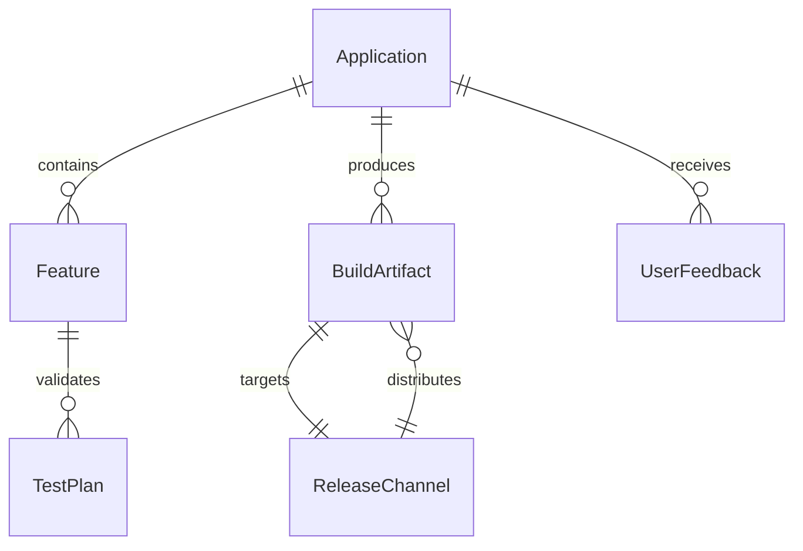
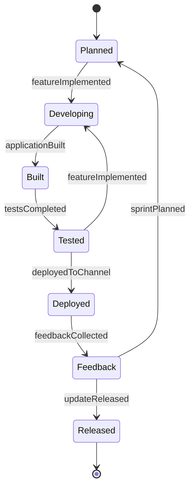
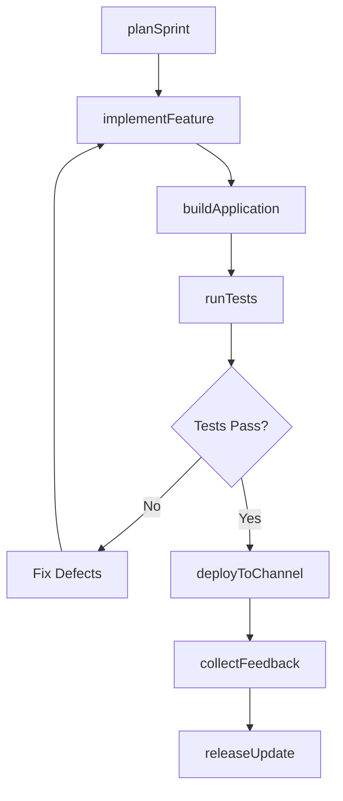
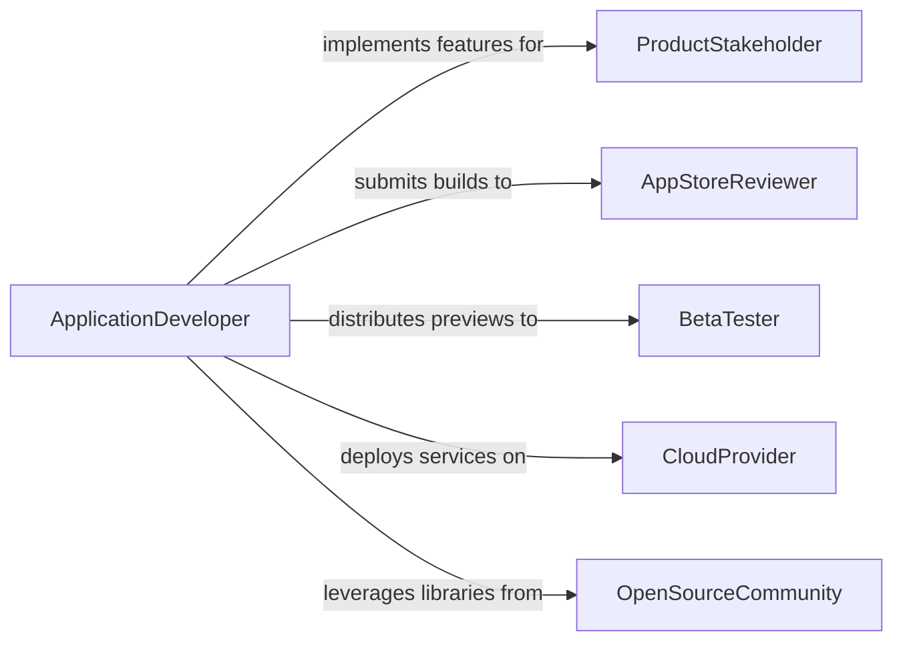

# Develop Computer Online Applications

> Business-as-Code definition for developing computer or online applications. Models the lifecycle of building desktop and cloud-hosted applications from planning through development, testing, and release.

## Overview

Developing computer or online applications involves creating software products that run on desktop platforms, web browsers, or cloud infrastructure. This encompasses native desktop applications, progressive web apps, SaaS platforms, and hybrid solutions. The development process covers sprint planning, feature implementation, continuous integration, quality assurance, and release management across multiple distribution channels and operating environments.

## Actors

| Actor | Description |
|-------|-------------|
| ProductStakeholder | Defines the product vision, feature priorities, and acceptance criteria |
| AppStoreReviewer | Evaluates applications for distribution on platform marketplaces |
| BetaTester | Provides early feedback on pre-release application builds |
| CloudProvider | Supplies infrastructure, managed services, and deployment tooling |
| OpenSourceCommunity | Contributes libraries, frameworks, and code used in the application |

## Roles

| Role | Description |
|------|-------------|
| ApplicationDeveloper | Writes application code, implements features, and fixes defects |
| DevOpsEngineer | Manages build pipelines, infrastructure, and deployment automation |
| QualityAssuranceEngineer | Creates and executes test plans to validate application behavior |
| ProductManager | Prioritizes the backlog and coordinates feature releases |

## Entities

| Entity | Description |
|--------|-------------|
| Application | A software product distributed to users via desktop or web channels |
| Feature | A distinct capability or user-facing functionality within the application |
| BuildArtifact | A compiled, packaged application binary or bundle ready for deployment |
| TestPlan | A structured set of scenarios and expected outcomes for validation |
| ReleaseChannel | A distribution path such as stable, beta, or canary |
| UserFeedback | Structured input from users on application behavior and experience |

## Actions

| Action | Description |
|--------|-------------|
| planSprint | Define the work items and goals for a development iteration |
| implementFeature | Build a new capability according to specifications |
| buildApplication | Compile and package the application into distributable artifacts |
| runTests | Execute automated and manual test plans against the build |
| deployToChannel | Publish a build artifact to a specific release channel |
| collectFeedback | Gather user input on application behavior and satisfaction |
| releaseUpdate | Promote a tested build to the stable release channel |

## Events

| Event | Description |
|-------|-------------|
| sprintPlanned | Development iteration goals and work items have been defined |
| featureImplemented | A new feature has been coded and unit tested |
| applicationBuilt | The application has been compiled and packaged |
| testsCompleted | Automated and manual test plans have been executed |
| deployedToChannel | A build artifact has been published to a release channel |
| feedbackCollected | User input on the application has been gathered and categorized |
| updateReleased | A tested build has been promoted to the stable channel |

## Searches

| Search | Description |
|--------|-------------|
| findApplications | List applications by platform, status, or technology stack |
| getBuilds | Retrieve build artifacts by version, channel, or date |
| getTestResults | Fetch test execution results by plan, build, or severity |
| findFeedback | Search user feedback by application, version, or category |

## Entity Relationships



## State Diagram



## Workflow



## Actor Relationships



## Usage

### Calling Actions

```typescript
import { developComputerOnlineApplications } from '@headlessly/develop-computer-online-applications'

const appDev = developComputerOnlineApplications()

// Plan a development sprint
const sprint = await appDev.planSprint({
  applicationId: 'task-manager-pro',
  sprintNumber: 14,
  goals: ['offline-mode', 'calendar-sync', 'notification-preferences'],
  duration: { weeks: 2 }
})

// Implement a feature
const feature = await appDev.implementFeature({
  applicationId: 'task-manager-pro',
  sprintId: sprint.id,
  name: 'offline-mode',
  description: 'Enable task creation and editing without network connectivity',
  branch: 'feature/offline-mode'
})

// Build and deploy to beta channel
const build = await appDev.buildApplication({
  applicationId: 'task-manager-pro',
  targets: ['web', 'desktop-mac', 'desktop-windows'],
  version: '3.5.0-beta.1'
})

await appDev.deployToChannel({
  buildId: build.id,
  channel: 'beta',
  rolloutPercent: 25
})
```

### Event-Driven Automation

```typescript
// Auto-run tests when a feature is implemented
appDev.featureImplemented(async ({ applicationId, featureName, branch }) => {
  await appDev.runTests({
    applicationId,
    suite: 'regression',
    branch,
    environment: 'ci'
  })
})

// Notify product team on stable release
appDev.updateReleased(async ({ applicationId, version }) => {
  await notify({
    to: 'product-team',
    message: `${applicationId} v${version} is now live on the stable channel`
  })
})
```
