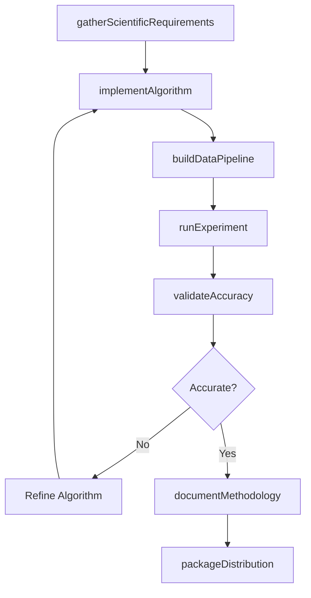
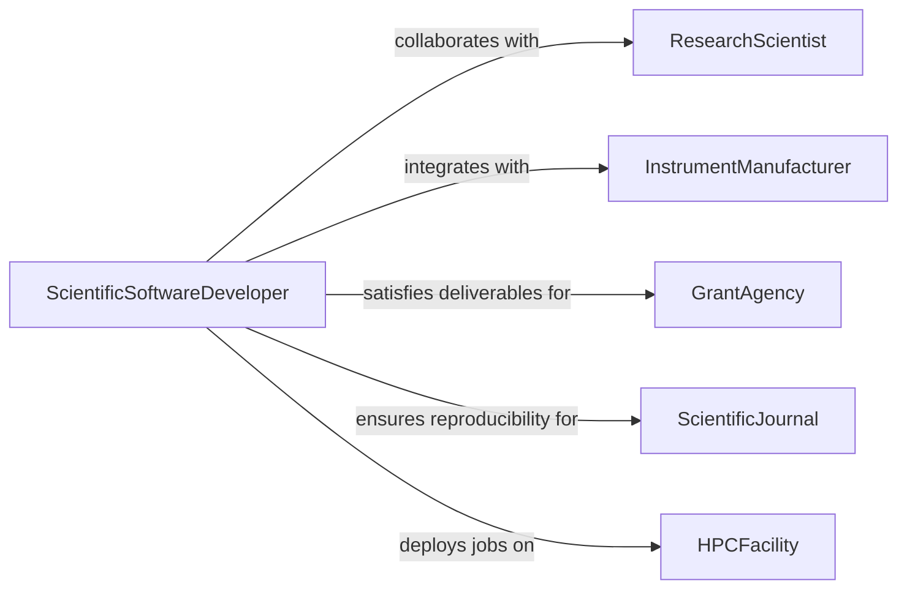

# Develop Software Applications Scientific Technical

> Business-as-Code definition for developing software or applications for scientific or technical use. Models the process of building computational tools for research, engineering analysis, data processing, and laboratory automation.

## Overview

Developing software for scientific or technical use involves creating specialized applications for data analysis, laboratory instrument control, engineering simulation, bioinformatics, and research computation. These applications must handle complex numerical operations, large datasets, and domain-specific file formats while maintaining computational accuracy and reproducibility. Development often requires close collaboration between software engineers and domain scientists to ensure algorithms correctly implement established methodologies.

## Actors

| Actor | Description |
|-------|-------------|
| ResearchScientist | Defines computational requirements and validates scientific accuracy |
| InstrumentManufacturer | Provides hardware interfaces and data format specifications |
| GrantAgency | Funds research projects requiring software development |
| ScientificJournal | Establishes reproducibility and data sharing standards for publications |
| HPCFacility | Provides high-performance computing clusters for large-scale computation |

## Roles

| Role | Description |
|------|-------------|
| ScientificSoftwareDeveloper | Implements algorithms, data pipelines, and analytical tools |
| ComputationalScientist | Validates numerical methods and ensures scientific correctness |
| DataEngineer | Designs data ingestion, transformation, and storage pipelines |
| ResearchEngineer | Bridges research prototypes with production-grade implementations |

## Entities

| Entity | Description |
|--------|-------------|
| ScientificApplication | A software tool designed for research or technical computation |
| Algorithm | A numerical or analytical method implemented in the software |
| Dataset | A structured collection of experimental or observational data |
| Pipeline | An automated sequence of data processing and analysis steps |
| Experiment | A configured run of the application with specific inputs and parameters |
| Publication | A research output referencing the software's methods and results |

## Actions

| Action | Description |
|--------|-------------|
| gatherScientificRequirements | Collect computational needs from researchers and domain experts |
| implementAlgorithm | Code a numerical method or analytical procedure |
| buildDataPipeline | Create automated workflows for data ingestion and transformation |
| runExperiment | Execute the application with a defined parameter set and input data |
| validateAccuracy | Compare software outputs to known results or analytical solutions |
| packageDistribution | Bundle the application for distribution via package managers or containers |
| documentMethodology | Write technical documentation explaining algorithms and usage |

## Events

| Event | Description |
|-------|-------------|
| requirementsGathered | Scientific and technical requirements have been documented |
| algorithmImplemented | A numerical method has been coded and unit tested |
| pipelineBuilt | A data processing pipeline has been assembled and verified |
| experimentCompleted | A configured run has finished and produced results |
| accuracyValidated | Software outputs have been verified against reference data |
| distributionPackaged | The application has been bundled for external distribution |
| methodologyDocumented | Technical documentation has been completed and reviewed |

## Searches

| Search | Description |
|--------|-------------|
| findApplications | List scientific applications by domain, language, or status |
| getExperiments | Retrieve experiment runs by application, date, or parameter set |
| getValidationResults | Fetch accuracy comparison reports for an algorithm |
| findDatasets | Search datasets by format, domain, or experiment association |

## Workflow



## Actor Relationships



## Usage

### Calling Actions

```typescript
import { developSoftwareApplicationsScientificTechnical } from '@headlessly/develop-software-applications-scientific-technical'

const sciDev = developSoftwareApplicationsScientificTechnical()

// Gather requirements for a genomics analysis tool
const requirements = await sciDev.gatherScientificRequirements({
  applicationName: 'GenomeVariantCaller',
  domain: 'bioinformatics',
  capabilities: ['variant-detection', 'quality-filtering', 'annotation'],
  inputFormats: ['BAM', 'CRAM', 'VCF'],
  performanceTarget: { genomes: 100, hours: 4 }
})

// Implement the core variant detection algorithm
const algorithm = await sciDev.implementAlgorithm({
  applicationId: requirements.applicationId,
  name: 'bayesian-variant-caller',
  method: 'bayesian-inference',
  language: 'Rust',
  parallelism: 'multi-threaded'
})

// Run a validation experiment
const experiment = await sciDev.runExperiment({
  applicationId: requirements.applicationId,
  inputDataset: 'giab-hg002-30x',
  parameters: { minQuality: 30, minDepth: 10, ploidy: 2 },
  computeProfile: 'hpc-64core'
})
```

### Event-Driven Automation

```typescript
// Auto-validate accuracy when experiment completes
sciDev.experimentCompleted(async ({ applicationId, experimentId }) => {
  await sciDev.validateAccuracy({
    experimentId,
    referenceDataset: 'giab-truth-set',
    metrics: ['sensitivity', 'specificity', 'f1-score']
  })
})

// Package for distribution when methodology is documented
sciDev.methodologyDocumented(async ({ applicationId, version }) => {
  await sciDev.packageDistribution({
    applicationId,
    version,
    formats: ['docker', 'conda', 'pip'],
    license: 'BSD-3-Clause'
  })
})
```
