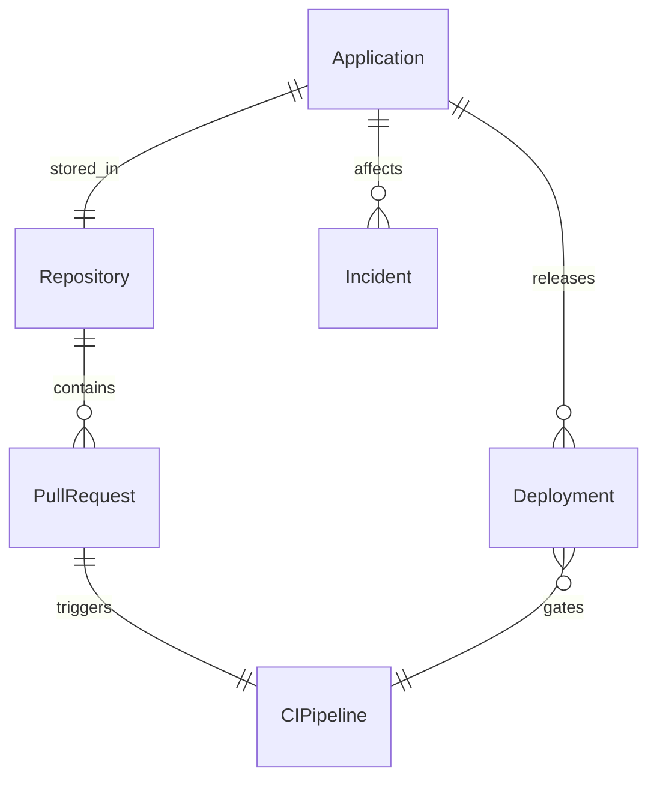
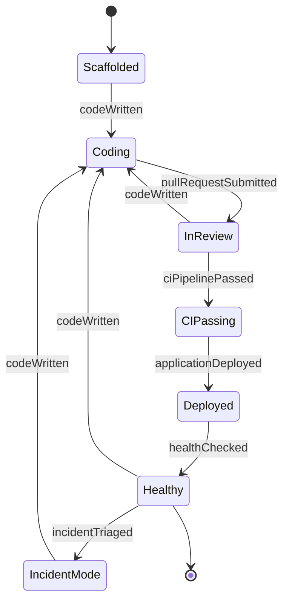
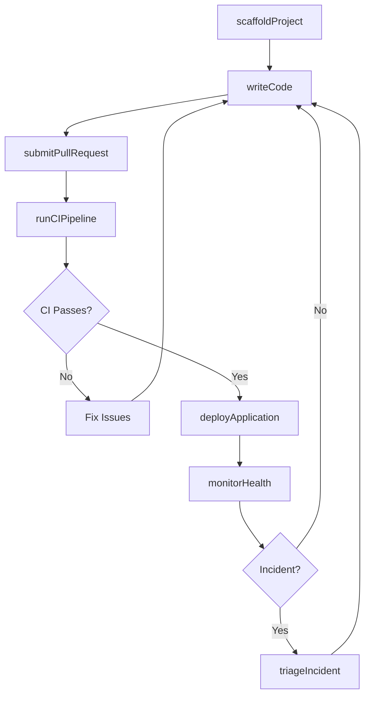
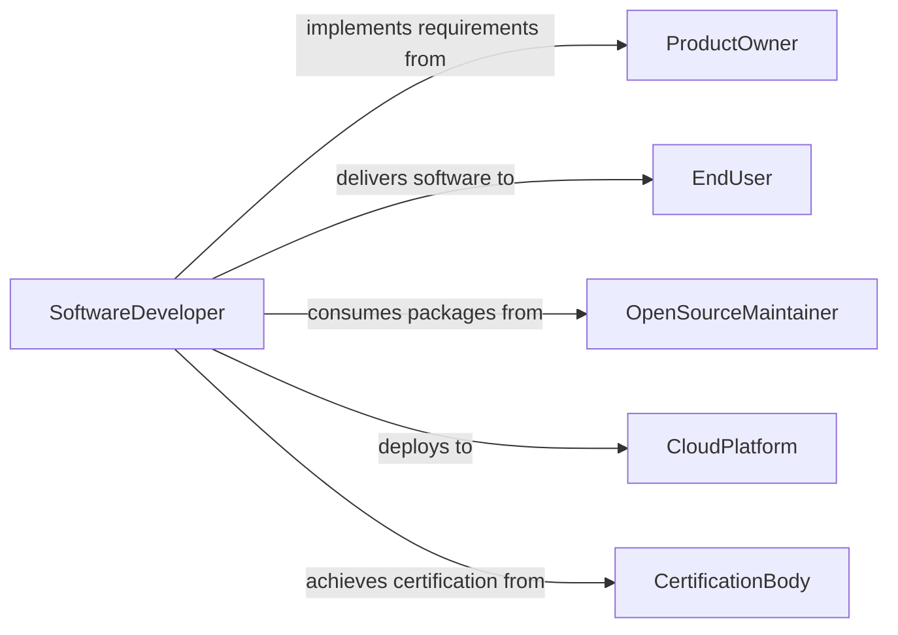

# Develop Software Computer Applications

> Business-as-Code definition for developing software or computer applications. Models the general-purpose software development lifecycle from ideation through coding, testing, deployment, and iteration.

## Overview

Developing software or computer applications encompasses the full lifecycle of creating programs that solve user problems or automate business processes. This includes requirements gathering, architecture design, iterative development, automated testing, continuous integration, deployment, and post-release monitoring. The process applies to applications of all types including command-line tools, desktop programs, mobile apps, microservices, and libraries, following modern software engineering practices.

## Actors

| Actor | Description |
|-------|-------------|
| ProductOwner | Defines feature requirements and acceptance criteria |
| EndUser | Uses the software and provides feedback on functionality and usability |
| OpenSourceMaintainer | Manages shared libraries and frameworks the application depends on |
| CloudPlatform | Provides compute, storage, and managed services for application hosting |
| CertificationBody | Validates software against industry standards or compliance frameworks |

## Roles

| Role | Description |
|------|-------------|
| SoftwareDeveloper | Writes, tests, and maintains application source code |
| TechLead | Makes architectural decisions and reviews code for quality |
| QAEngineer | Designs test strategies and validates application behavior |
| SiteReliabilityEngineer | Ensures application reliability, observability, and incident response |

## Entities

| Entity | Description |
|--------|-------------|
| Application | A software program built to fulfill a set of user or business requirements |
| Repository | A version-controlled codebase containing the application source |
| PullRequest | A code change proposal with associated review and CI checks |
| CIPipeline | An automated workflow for building, testing, and validating code changes |
| Deployment | A versioned release of the application to a target environment |
| Incident | An unplanned event affecting application availability or correctness |

## Actions

| Action | Description |
|--------|-------------|
| scaffoldProject | Initialize a new application with project structure and tooling |
| writeCode | Implement features, bug fixes, or refactoring changes |
| submitPullRequest | Propose code changes for review and automated validation |
| runCIPipeline | Execute build, lint, test, and security scan steps |
| deployApplication | Release a version to staging or production environments |
| monitorHealth | Track application performance, errors, and resource utilization |
| triageIncident | Investigate and resolve production issues affecting users |

## Events

| Event | Description |
|-------|-------------|
| projectScaffolded | A new application project has been initialized |
| codeWritten | Feature or fix code has been committed to a branch |
| pullRequestSubmitted | A code change has been proposed for review |
| ciPipelinePassed | Automated build and test pipeline has completed successfully |
| applicationDeployed | A version has been released to an environment |
| healthChecked | Application performance metrics have been evaluated |
| incidentTriaged | A production issue has been investigated and resolved |

## Searches

| Search | Description |
|--------|-------------|
| findApplications | List applications by language, framework, or deployment status |
| getPullRequests | Retrieve pull requests by repository, author, or status |
| getDeployments | Fetch deployment history by application, environment, or date |
| findIncidents | Search production incidents by severity, application, or resolution status |

## Entity Relationships



## State Diagram



## Workflow



## Actor Relationships



## Usage

### Calling Actions

```typescript
import { developSoftwareComputerApplications } from '@headlessly/develop-software-computer-applications'

const dev = developSoftwareComputerApplications()

// Scaffold a new microservice project
const project = await dev.scaffoldProject({
  name: 'order-processing-service',
  language: 'TypeScript',
  framework: 'Hono',
  runtime: 'Cloudflare Workers',
  features: ['database', 'queue', 'observability']
})

// Submit a pull request for a new feature
const pr = await dev.submitPullRequest({
  repositoryId: project.repositoryId,
  branch: 'feature/bulk-order-import',
  title: 'Add bulk order import via CSV upload',
  description: 'Implements CSV parsing and batch insert for order records',
  reviewers: ['tech-lead', 'qa-engineer']
})

// Deploy to production
const deployment = await dev.deployApplication({
  applicationId: project.applicationId,
  version: '2.1.0',
  environment: 'production',
  strategy: 'blue-green',
  rollbackOnFailure: true
})
```

### Event-Driven Automation

```typescript
// Auto-run CI when a pull request is submitted
dev.pullRequestSubmitted(async ({ repositoryId, branch }) => {
  await dev.runCIPipeline({
    repositoryId,
    branch,
    steps: ['lint', 'typecheck', 'test', 'security-scan', 'build']
  })
})

// Alert on-call when an incident is detected
dev.healthChecked(async ({ applicationId, metrics }) => {
  if (metrics.errorRate > 0.01 || metrics.p99Latency > 2000) {
    await dev.triageIncident({
      applicationId,
      severity: 'high',
      symptoms: `Error rate: ${metrics.errorRate}, P99: ${metrics.p99Latency}ms`
    })
  }
})
```
