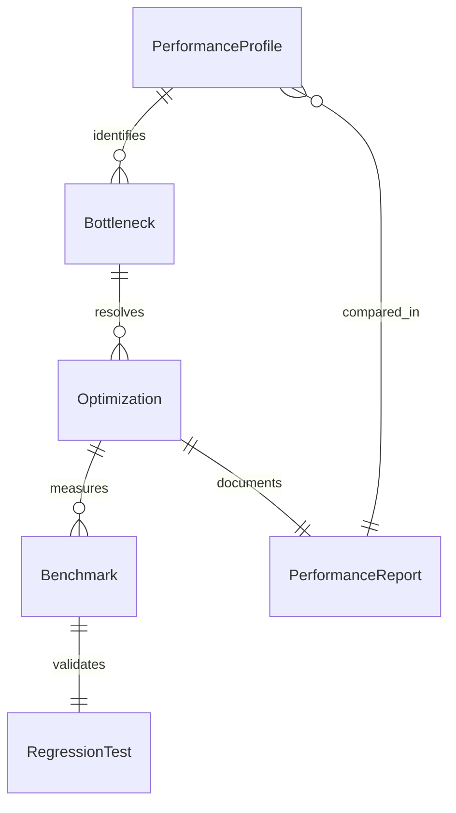
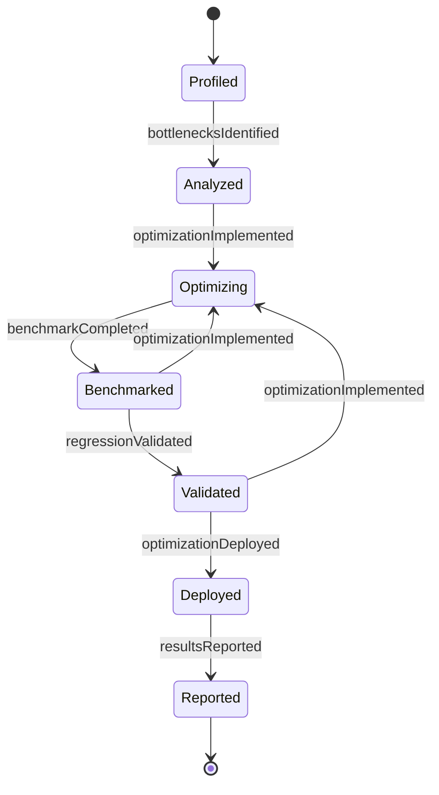
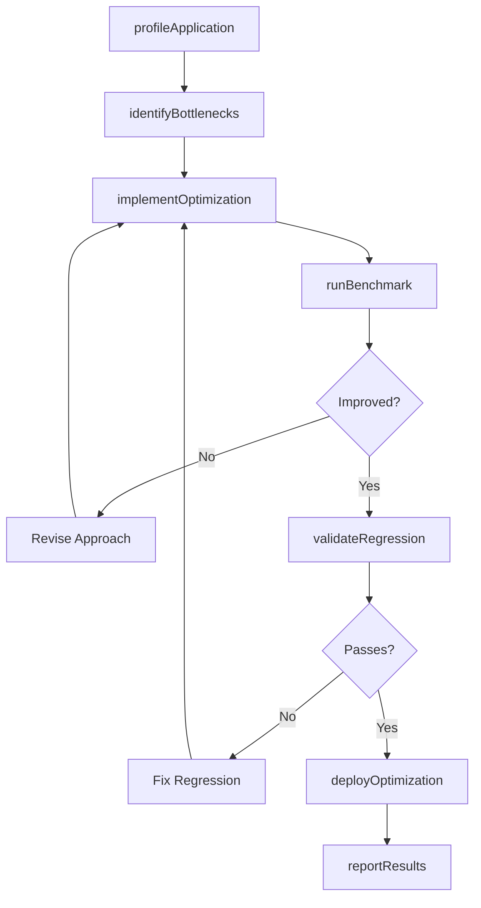
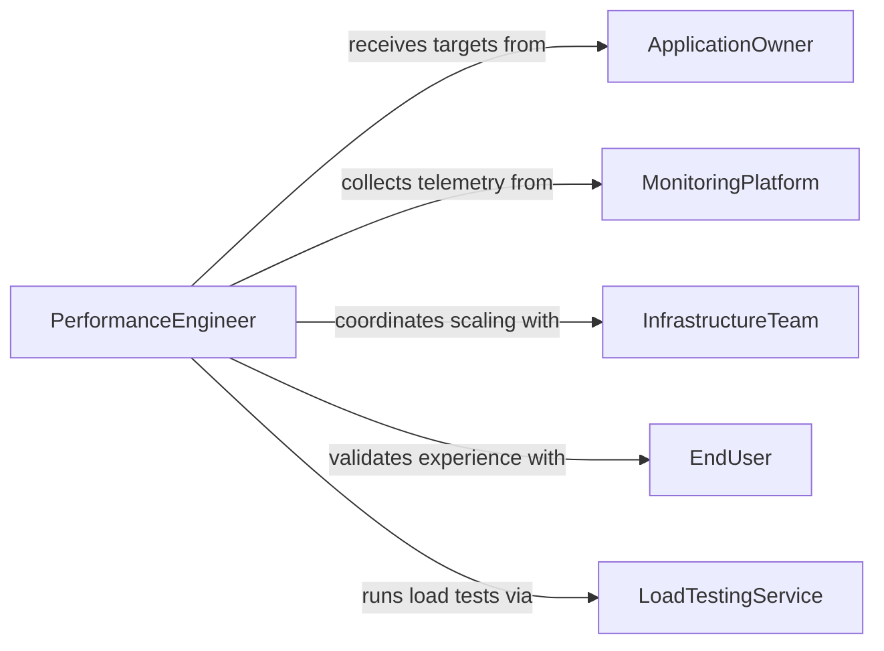

# Modify Software Programs Improve Performance

> Business-as-Code definition for modifying software programs to improve performance. Models the process of profiling, analyzing, and optimizing existing software to achieve faster execution, lower resource consumption, and improved scalability.

## Overview

Modifying software programs to improve performance involves identifying bottlenecks through profiling and benchmarking, then applying targeted optimizations to reduce latency, memory usage, CPU consumption, and I/O overhead. This includes refactoring algorithms, optimizing database queries, improving caching strategies, reducing bundle sizes, and tuning runtime configurations. Performance modifications must be validated through regression testing to ensure functional correctness is maintained while achieving measurable improvements.

## Actors

| Actor | Description |
|-------|-------------|
| ApplicationOwner | Reports performance issues and defines acceptable performance targets |
| MonitoringPlatform | Provides real-time telemetry on application latency, throughput, and errors |
| InfrastructureTeam | Manages compute resources and assists with environment-level tuning |
| EndUser | Experiences the performance characteristics and reports slowdowns |
| LoadTestingService | Generates synthetic traffic to simulate production workloads |

## Roles

| Role | Description |
|------|-------------|
| PerformanceEngineer | Profiles applications, identifies bottlenecks, and implements optimizations |
| DatabaseTuner | Optimizes queries, indexes, and data access patterns |
| BackendDeveloper | Refactors application code to improve algorithmic efficiency |
| BenchmarkAnalyst | Designs and executes performance benchmarks to measure improvements |

## Entities

| Entity | Description |
|--------|-------------|
| PerformanceProfile | A captured snapshot of CPU, memory, and I/O usage during execution |
| Bottleneck | An identified code path or resource constraint limiting performance |
| Optimization | A specific code or configuration change targeting a bottleneck |
| Benchmark | A repeatable test measuring execution speed, throughput, or resource usage |
| RegressionTest | A test ensuring existing functionality is preserved after modifications |
| PerformanceReport | A summary comparing before and after metrics for an optimization cycle |

## Actions

| Action | Description |
|--------|-------------|
| profileApplication | Capture CPU, memory, and I/O usage data for analysis |
| identifyBottlenecks | Analyze profiling data to locate performance-limiting code paths |
| implementOptimization | Apply targeted code or configuration changes to resolve bottlenecks |
| runBenchmark | Execute repeatable performance tests to measure impact |
| validateRegression | Confirm functional behavior is unchanged after optimization |
| deployOptimization | Release performance improvements to production |
| reportResults | Summarize performance gains with before-and-after comparisons |

## Events

| Event | Description |
|-------|-------------|
| applicationProfiled | Performance data has been captured and is ready for analysis |
| bottlenecksIdentified | Performance-limiting code paths have been located |
| optimizationImplemented | A targeted performance improvement has been coded |
| benchmarkCompleted | Performance tests have been executed with measurable results |
| regressionValidated | Functional correctness has been confirmed post-optimization |
| optimizationDeployed | Performance improvements have been released to production |
| resultsReported | Before-and-after performance comparison has been documented |

## Searches

| Search | Description |
|--------|-------------|
| findBottlenecks | List identified bottlenecks by application, severity, or category |
| getBenchmarkHistory | Retrieve benchmark results over time for trend analysis |
| getOptimizations | Fetch applied optimizations by application, type, or status |
| findPerformanceReports | Search performance reports by application, date, or improvement magnitude |

## Entity Relationships



## State Diagram



## Workflow



## Actor Relationships



## Usage

### Calling Actions

```typescript
import { modifySoftwareProgramsImprovePerformance } from '@headlessly/modify-software-programs-improve-performance'

const perf = modifySoftwareProgramsImprovePerformance()

// Profile the application under load
const profile = await perf.profileApplication({
  applicationId: 'checkout-service',
  duration: 300,
  concurrentUsers: 1000,
  metrics: ['cpu', 'memory', 'io', 'latency']
})

// Identify performance bottlenecks
const bottlenecks = await perf.identifyBottlenecks({
  profileId: profile.id,
  thresholds: { cpuPercent: 80, latencyP95: 500, memoryMB: 2048 }
})

// Implement an optimization for the top bottleneck
const optimization = await perf.implementOptimization({
  bottleneckId: bottlenecks.items[0].id,
  type: 'query-optimization',
  description: 'Add composite index on orders(user_id, created_at) and rewrite N+1 query',
  branch: 'perf/optimize-order-lookup'
})

// Run benchmarks to measure improvement
const benchmark = await perf.runBenchmark({
  applicationId: 'checkout-service',
  baseline: profile.id,
  scenarios: ['checkout-flow', 'order-history', 'cart-update'],
  concurrentUsers: 1000
})
```

### Event-Driven Automation

```typescript
// Auto-identify bottlenecks when profiling completes
perf.applicationProfiled(async ({ profileId, applicationId }) => {
  await perf.identifyBottlenecks({
    profileId,
    thresholds: { cpuPercent: 75, latencyP95: 400, memoryMB: 1536 }
  })
})

// Generate performance report after deployment
perf.optimizationDeployed(async ({ applicationId, optimizationId, baselineProfileId }) => {
  await perf.reportResults({
    applicationId,
    optimizationId,
    baselineProfileId,
    recipients: ['engineering-leads', 'application-owner']
  })
})
```
