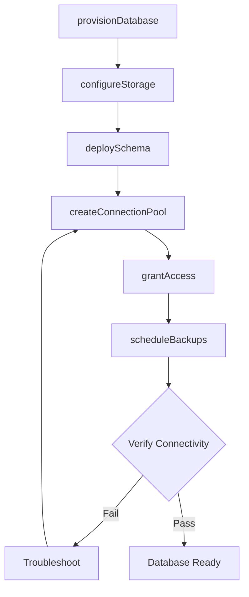
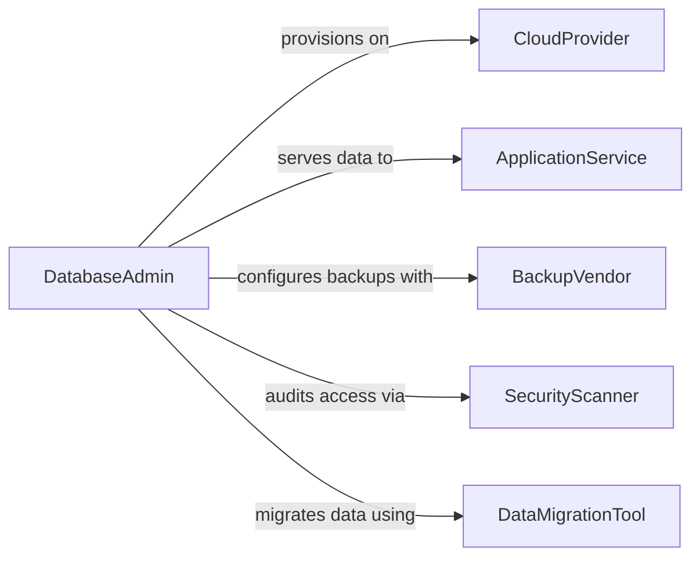

# Create Databases to Store Electronic Data

> Business-as-Code definition for creating database systems that organize, store, and manage electronic data assets across applications and services.

## Overview

Creating databases for electronic data storage involves provisioning database instances, designing table structures, configuring storage engines, and establishing data access layers. This definition models the end-to-end process of standing up new databases, from capacity planning and engine selection through schema deployment and connectivity verification, enabling teams to automate database provisioning as code.

## Actors

| Actor | Description |
|-------|-------------|
| CloudProvider | Infrastructure platform hosting the database instance |
| ApplicationService | Software system that reads and writes data |
| DataMigrationTool | Third-party tool used to transfer data between systems |
| BackupVendor | Service providing backup and disaster recovery |
| SecurityScanner | Tool or service auditing database access configurations |

## Roles

| Role | Description |
|------|-------------|
| DatabaseAdmin | Provisions and manages database instances |
| BackendDeveloper | Integrates applications with the database |
| DevOpsEngineer | Automates infrastructure and deployment pipelines |
| DataArchitect | Designs logical and physical data models |

## Entities

| Entity | Description |
|--------|-------------|
| DatabaseInstance | A running database server or managed service |
| TableDefinition | Structure defining columns, types, and constraints |
| StorageConfiguration | Settings for storage engine, volume size, and IOPS |
| ConnectionPool | Managed set of database connections for applications |
| BackupSchedule | Automated backup frequency and retention settings |
| MigrationScript | Versioned SQL or code that modifies schema |
| AccessCredential | Authentication token or credentials for database access |

## Actions

| Action | Description |
|--------|-------------|
| provisionDatabase | Create a new database instance on the target platform |
| deploySchema | Apply table definitions and constraints to the instance |
| configureStorage | Set storage engine parameters and volume allocation |
| createConnectionPool | Establish connection pooling for application access |
| scheduleBackups | Configure automated backup intervals and retention |
| runMigration | Execute a versioned schema migration script |
| grantAccess | Issue credentials and permissions for database users |

## Events

| Event | Description |
|-------|-------------|
| databaseProvisioned | A new database instance is running and available |
| schemaDeployed | Table structures have been applied to the database |
| storageConfigured | Storage engine settings have been applied |
| connectionPoolCreated | Application connection pooling is active |
| backupScheduled | Automated backups have been configured |
| migrationExecuted | A schema migration has completed successfully |
| accessGranted | Database credentials have been issued to a user |

## Searches

| Search | Description |
|--------|-------------|
| listDatabases | Enumerate database instances by environment or region |
| getSchemaVersion | Retrieve the current schema version for a database |
| findMigrations | List migration scripts by status or date range |
| getBackupHistory | Retrieve backup records for a given database |
| checkConnectionStatus | Verify connectivity and pool utilization |

## Workflow



## Actor Relationships



## Usage

### Calling Actions

```typescript
import { createDatabasesStoreElectronicData } from '@headlessly/create-databases-store-electronic-data'

const databases = createDatabasesStoreElectronicData()

// Provision a new PostgreSQL database
const db = await databases.provisionDatabase({
  engine: 'postgresql',
  version: '16',
  region: 'us-east-1',
  instanceSize: 'db.r6g.large'
})

// Deploy schema
await databases.deploySchema({
  databaseId: db.id,
  tables: [
    { name: 'users', columns: [
      { name: 'id', type: 'UUID', primaryKey: true },
      { name: 'email', type: 'VARCHAR(255)', unique: true },
      { name: 'created_at', type: 'TIMESTAMPTZ' }
    ]}
  ]
})

// Set up connection pooling
await databases.createConnectionPool({
  databaseId: db.id,
  maxConnections: 100,
  idleTimeout: 30000
})
```

### Event-Driven Automation

```typescript
// Auto-schedule backups after provisioning
databases.databaseProvisioned(async ({ databaseId, engine }) => {
  await databases.scheduleBackups({
    databaseId,
    frequency: 'daily',
    retentionDays: 30
  })
})

// Notify team after migration
databases.migrationExecuted(async ({ databaseId, version }) => {
  await notify({
    to: 'engineering',
    message: `Database ${databaseId} migrated to schema version ${version}`
  })
})
```
