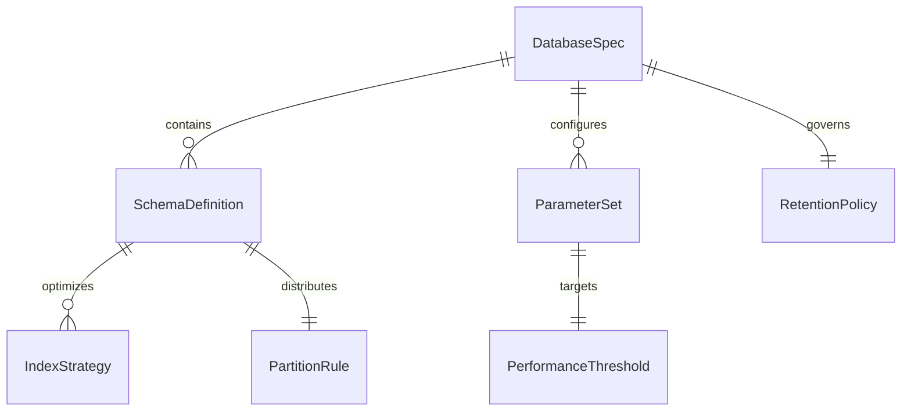
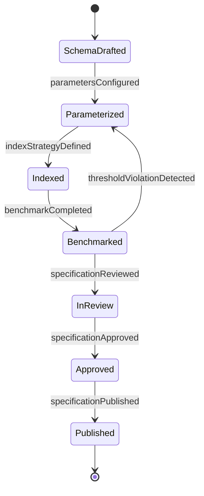
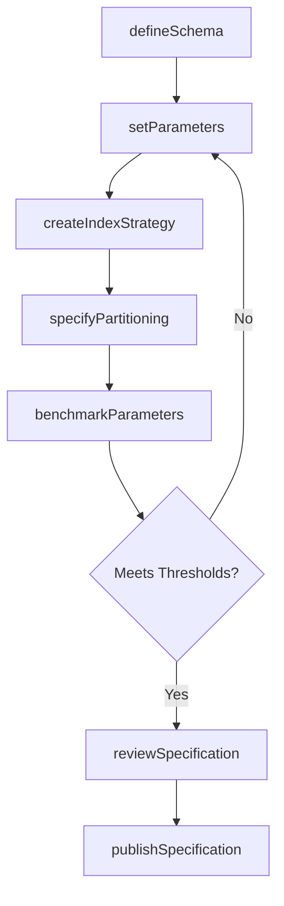
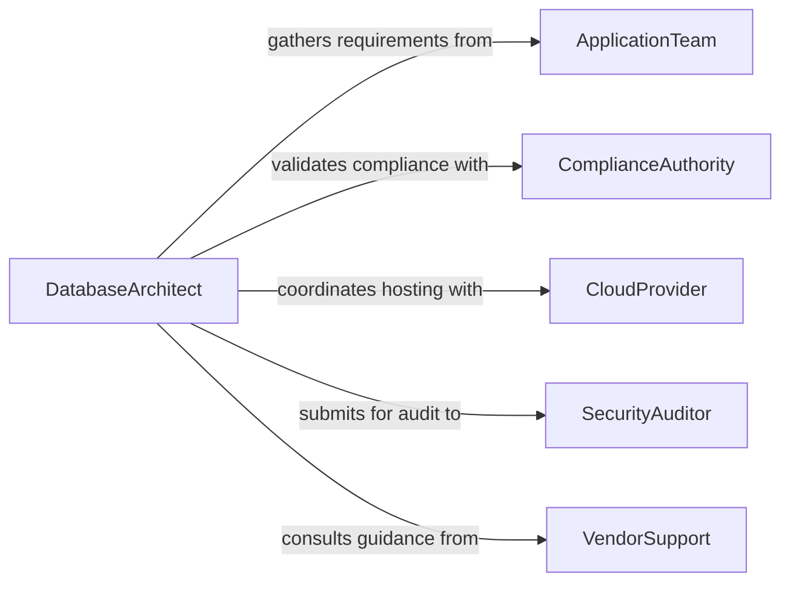

# Develop Database Parameters and Specifications

> Business-as-Code definition for developing database parameters, schemas, and technical specifications that govern data storage, indexing, and retrieval requirements.

## Overview

Database parameter and specification development encompasses the definition of schema structures, data types, indexing strategies, partitioning rules, and performance thresholds for database systems. This definition models the full lifecycle from requirements gathering through specification authoring, review, and publication, enabling teams to codify database design decisions as programmable artifacts.

## Actors

| Actor | Description |
|-------|-------------|
| DataConsumer | Application or service that reads from the database |
| CloudProvider | Infrastructure vendor hosting the database platform |
| ComplianceAuthority | Regulatory body imposing data residency or retention rules |
| ApplicationTeam | Development team integrating with the database |
| SecurityAuditor | External party reviewing data protection standards |
| VendorSupport | Database vendor providing technical guidance |

## Roles

| Role | Description |
|------|-------------|
| DatabaseArchitect | Designs schema structures and parameter specifications |
| DataEngineer | Implements and tests database configurations |
| DBA | Manages production database parameters and tuning |
| TechnicalLead | Approves specification documents before implementation |

## Entities

| Entity | Description |
|--------|-------------|
| DatabaseSpec | A formal specification document for a database system |
| SchemaDefinition | Table and column structure with data types and constraints |
| IndexStrategy | Configuration describing indexes and their properties |
| PartitionRule | Rules governing how data is distributed across partitions |
| PerformanceThreshold | Target metrics for query latency, throughput, and concurrency |
| RetentionPolicy | Rules for data lifecycle and archival periods |
| ParameterSet | A collection of tunable database configuration values |

## Actions

| Action | Description |
|--------|-------------|
| defineSchema | Specify table structures, columns, and relationships |
| setParameters | Configure database engine parameters and limits |
| createIndexStrategy | Define indexing approach for query optimization |
| specifyPartitioning | Establish data partitioning and sharding rules |
| setRetentionPolicy | Define data retention and archival timelines |
| reviewSpecification | Submit specification for peer and architectural review |
| publishSpecification | Finalize and distribute the approved specification |
| benchmarkParameters | Test parameter configurations against performance targets |

## Events

| Event | Description |
|-------|-------------|
| schemaDefinitionCreated | A new schema definition has been authored |
| parametersConfigured | Database parameters have been set or updated |
| indexStrategyDefined | An indexing strategy has been established |
| specificationReviewed | A specification has completed peer review |
| specificationApproved | A specification has been formally approved |
| specificationPublished | A finalized specification has been distributed |
| benchmarkCompleted | Performance benchmarking of parameters has finished |
| thresholdViolationDetected | A parameter configuration fails performance targets |

## Searches

| Search | Description |
|--------|-------------|
| findSpecifications | List specifications by database type, status, or author |
| getParameterSets | Retrieve parameter configurations for a given database |
| getIndexStrategies | Look up indexing strategies by table or workload type |
| findRetentionPolicies | Query retention policies by compliance domain |
| getSchemaDefinitions | Retrieve schema definitions by version or project |

## Entity Relationships



## State Diagram



## Workflow



## Actor Relationships



## Usage

### Calling Actions

```typescript
import { developDatabaseParametersSpecifications } from '@headlessly/develop-database-parameters-specifications'

const dbSpecs = developDatabaseParametersSpecifications()

// Define a new schema
const schema = await dbSpecs.defineSchema({
  name: 'customer_events',
  columns: [
    { name: 'event_id', type: 'UUID', primaryKey: true },
    { name: 'customer_id', type: 'UUID', nullable: false },
    { name: 'event_type', type: 'VARCHAR(64)', nullable: false },
    { name: 'payload', type: 'JSONB' },
    { name: 'created_at', type: 'TIMESTAMPTZ', default: 'NOW()' }
  ]
})

// Set engine parameters
await dbSpecs.setParameters({
  schemaId: schema.id,
  parameters: {
    maxConnections: 200,
    sharedBuffers: '4GB',
    workMem: '256MB',
    maintenanceWorkMem: '1GB'
  }
})

// Benchmark the configuration
const result = await dbSpecs.benchmarkParameters({
  schemaId: schema.id,
  workload: 'oltp-mixed',
  duration: '30m'
})
```

### Event-Driven Automation

```typescript
// Alert when benchmarks fail thresholds
dbSpecs.thresholdViolationDetected(async ({ schemaId, metric, actual, target }) => {
  await notify({
    to: 'database-team',
    message: `Parameter benchmark failed: ${metric} was ${actual}, target was ${target}`
  })
})

// Auto-publish after approval
dbSpecs.specificationApproved(async ({ specId }) => {
  await dbSpecs.publishSpecification({ specId })
})
```
