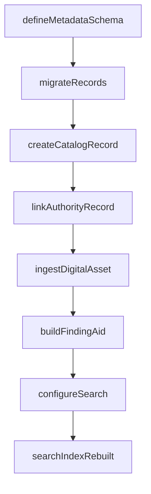
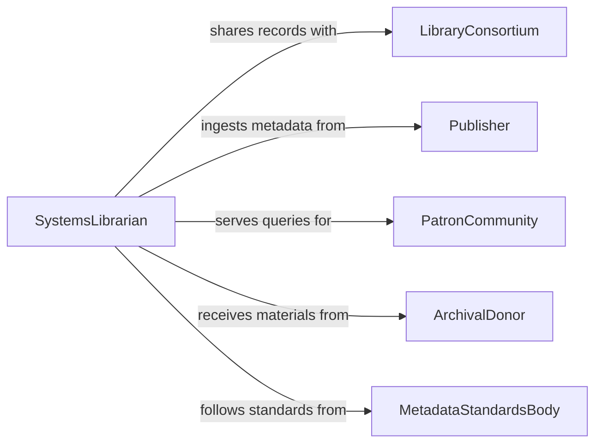

# Develop Library or Archival Databases

> Business-as-Code definition for developing cataloging and archival database systems that organize, preserve, and provide access to library collections and archival records.

## Overview

Library and archival database development covers the design of cataloging systems, metadata schemas based on standards such as MARC and Dublin Core, digital asset management structures, and patron access interfaces. This definition models the creation and maintenance of databases that support collection discovery, preservation workflows, and interlibrary resource sharing.

## Actors

| Actor | Description |
|-------|-------------|
| LibraryConsortium | Network of libraries sharing catalog records |
| Publisher | Organization providing bibliographic metadata |
| PatronCommunity | End users searching and borrowing from the collection |
| ArchivalDonor | Individual or organization donating materials |
| PreservationService | Vendor providing digitization or conservation services |
| MetadataStandardsBody | Organization maintaining cataloging standards |

## Roles

| Role | Description |
|------|-------------|
| CatalogLibrarian | Designs and maintains cataloging schemas |
| DigitalArchivist | Manages digital preservation and access systems |
| SystemsLibrarian | Configures and maintains database infrastructure |
| CollectionManager | Oversees acquisition and organization of materials |

## Entities

| Entity | Description |
|--------|-------------|
| CatalogRecord | Bibliographic entry describing a library item |
| ArchivalCollection | A group of related archival materials |
| MetadataSchema | Standard-based field definitions for catalog records |
| DigitalAsset | Digitized representation of a physical item |
| FindingAid | Descriptive guide to an archival collection |
| AuthorityRecord | Standardized name or subject heading entry |
| CirculationRecord | Tracking record for item loans and returns |
| HoldingsRecord | Information about physical location and availability |

## Actions

| Action | Description |
|--------|-------------|
| defineMetadataSchema | Create field mappings based on cataloging standards |
| createCatalogRecord | Add a new bibliographic entry to the database |
| ingestDigitalAsset | Load a digitized item into the archival system |
| buildFindingAid | Generate a structured guide to an archival collection |
| linkAuthorityRecord | Associate a catalog entry with standardized headings |
| migrateRecords | Transfer records from a legacy system to the new database |
| configureSearch | Set up full-text and faceted search capabilities |

## Events

| Event | Description |
|-------|-------------|
| metadataSchemaCreated | A new metadata schema has been defined |
| catalogRecordAdded | A bibliographic record has been added |
| digitalAssetIngested | A digitized item has been loaded into the system |
| findingAidPublished | An archival finding aid has been made available |
| recordsMigrated | Legacy records have been transferred successfully |
| searchIndexRebuilt | The search index has been updated with new records |
| authorityRecordLinked | A catalog entry has been linked to authority headings |

## Searches

| Search | Description |
|--------|-------------|
| searchCatalog | Full-text and faceted search across catalog records |
| findCollections | Locate archival collections by subject or date range |
| getHoldings | Retrieve availability and location for a catalog item |
| findAuthorityRecords | Search standardized name and subject headings |
| listDigitalAssets | Browse digitized items by collection or format |

## Workflow



## Actor Relationships



## Usage

### Calling Actions

```typescript
import { developLibraryArchivalDatabases } from '@headlessly/develop-library-archival-databases'

const archiveDB = developLibraryArchivalDatabases()

// Define a Dublin Core metadata schema
const schema = await archiveDB.defineMetadataSchema({
  standard: 'dublin-core',
  extensions: ['dcterms', 'local-fields'],
  requiredFields: ['title', 'creator', 'date', 'type']
})

// Create a catalog record
const record = await archiveDB.createCatalogRecord({
  schemaId: schema.id,
  title: 'Correspondence of the Wright Brothers, 1899-1948',
  creator: 'Wright, Orville',
  type: 'archival-collection',
  dateRange: { start: '1899', end: '1948' }
})

// Ingest a digitized item
await archiveDB.ingestDigitalAsset({
  catalogRecordId: record.id,
  format: 'TIFF',
  source: 's3://digitization-output/wright-letters/batch-001'
})
```

### Event-Driven Automation

```typescript
// Rebuild search index after record additions
archiveDB.catalogRecordAdded(async ({ recordId }) => {
  await archiveDB.configureSearch({ rebuild: true })
})

// Notify consortium of new holdings
archiveDB.digitalAssetIngested(async ({ catalogRecordId, format }) => {
  await notify({
    to: 'consortium-sync',
    message: `New digital asset available for record ${catalogRecordId}`
  })
})
```
