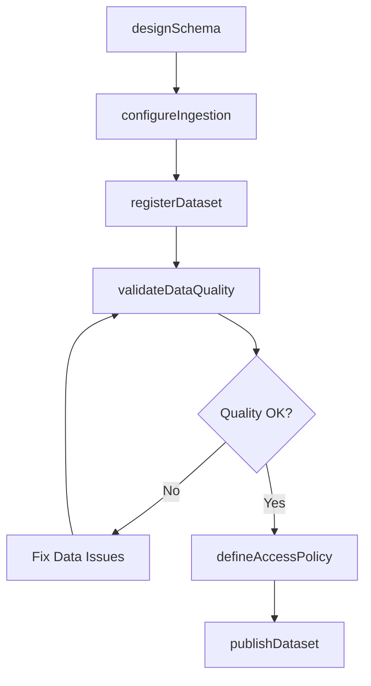
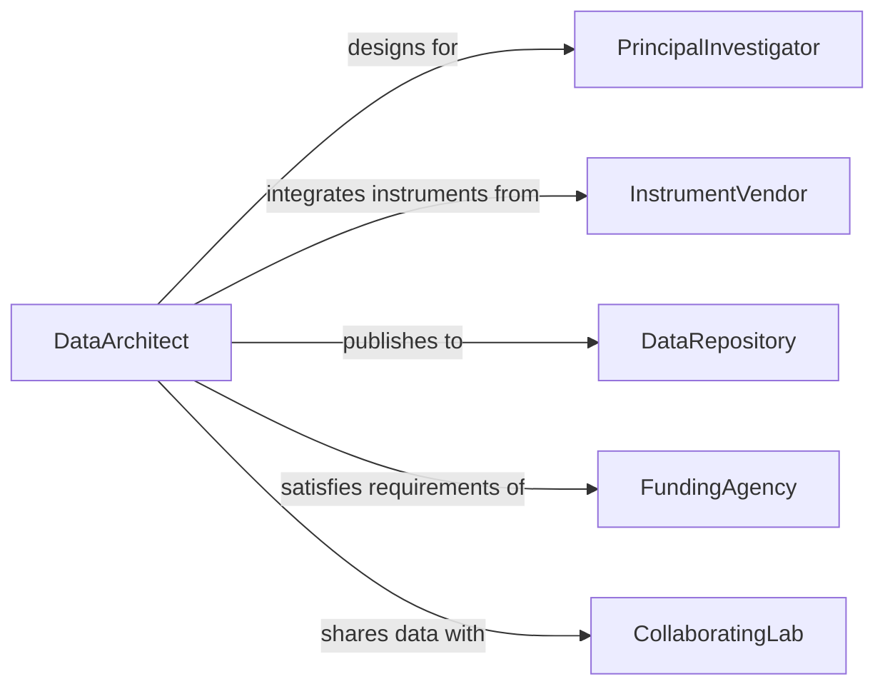

# Develop Technical or Scientific Databases

> Business-as-Code definition for developing specialized databases that store, index, and serve technical research data and scientific datasets.

## Overview

Technical and scientific database development involves designing storage systems optimized for research datasets, experimental results, instrument readings, and computational outputs. This definition covers the full process of requirements analysis, schema design for scientific data types, ingestion pipeline configuration, and query interface provisioning to support reproducible research workflows.

## Actors

| Actor | Description |
|-------|-------------|
| ResearchInstitution | Organization funding or conducting scientific studies |
| InstrumentVendor | Supplier of laboratory or field equipment generating data |
| DataRepository | External archive or registry for published datasets |
| FundingAgency | Government or private body requiring data management plans |
| PeerReviewer | Scientist validating data integrity and methodology |
| CollaboratingLab | Partner laboratory sharing or consuming datasets |

## Roles

| Role | Description |
|------|-------------|
| DataArchitect | Designs schemas for scientific data structures |
| ResearchEngineer | Builds ingestion pipelines and query interfaces |
| PrincipalInvestigator | Defines research data requirements and access policies |
| DataCurator | Maintains metadata quality and dataset provenance |

## Entities

| Entity | Description |
|--------|-------------|
| ScientificDataset | A collection of structured research observations |
| MetadataRecord | Descriptive information about a dataset including provenance |
| DataSchema | Table and field definitions for scientific data types |
| IngestionPipeline | Automated workflow for loading raw data into the database |
| QueryInterface | Endpoint or tool for searching and retrieving datasets |
| AccessPolicy | Rules governing who can read or modify datasets |
| ExperimentRecord | Linked set of datasets from a single experiment |

## Actions

| Action | Description |
|--------|-------------|
| designSchema | Create schema definitions for scientific data types |
| configureIngestion | Set up automated data loading from instruments or files |
| registerDataset | Add a new dataset with metadata to the database |
| defineAccessPolicy | Specify read and write permissions for datasets |
| validateDataQuality | Run integrity checks on ingested scientific data |
| publishDataset | Make a dataset available to external repositories |
| versionSchema | Create a new version of the database schema |

## Events

| Event | Description |
|-------|-------------|
| schemaDesigned | A new scientific data schema has been created |
| datasetRegistered | A new dataset has been added to the database |
| ingestionCompleted | Raw data has been successfully loaded |
| dataQualityValidated | Integrity checks have passed for a dataset |
| accessPolicyUpdated | Permissions for a dataset have been modified |
| datasetPublished | A dataset has been released to an external repository |
| schemaVersioned | A schema has been updated to a new version |

## Searches

| Search | Description |
|--------|-------------|
| findDatasets | Search datasets by experiment, date range, or keywords |
| getMetadata | Retrieve metadata records for a specific dataset |
| listSchemaVersions | List all versions of a database schema |
| findByInstrument | Locate datasets generated by a specific instrument |
| getIngestionStatus | Check the status of active ingestion pipelines |

## Workflow



## Actor Relationships



## Usage

### Calling Actions

```typescript
import { developTechnicalScientificDatabases } from '@headlessly/develop-technical-scientific-databases'

const sciDB = developTechnicalScientificDatabases()

// Design a schema for genomic data
const schema = await sciDB.designSchema({
  name: 'genomic_sequences',
  fields: [
    { name: 'sequence_id', type: 'UUID', primaryKey: true },
    { name: 'organism', type: 'VARCHAR(128)' },
    { name: 'sequence_data', type: 'TEXT' },
    { name: 'quality_score', type: 'FLOAT' },
    { name: 'instrument_id', type: 'VARCHAR(64)' }
  ],
  indexes: ['organism', 'quality_score']
})

// Register a dataset
const dataset = await sciDB.registerDataset({
  schemaId: schema.id,
  name: 'Human Genome Variants Q4 2025',
  source: 'Illumina NovaSeq 6000',
  recordCount: 2500000
})

// Validate data quality
await sciDB.validateDataQuality({ datasetId: dataset.id })
```

### Event-Driven Automation

```typescript
// Auto-publish after quality validation
sciDB.dataQualityValidated(async ({ datasetId }) => {
  await sciDB.publishDataset({
    datasetId,
    repository: 'ncbi-genbank'
  })
})

// Notify on ingestion completion
sciDB.ingestionCompleted(async ({ datasetId, recordCount }) => {
  await notify({
    to: 'research-team',
    message: `Ingestion complete: ${recordCount} records loaded for dataset ${datasetId}`
  })
})
```
