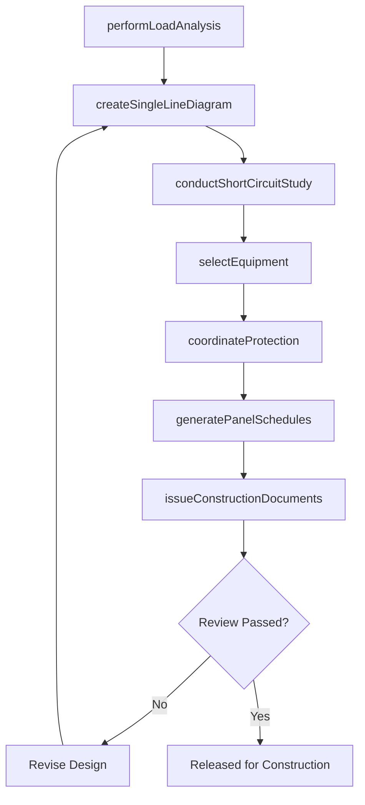
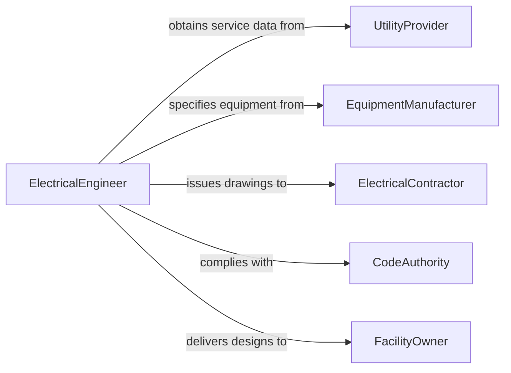

# Design Electrical Equipment Systems

> Business-as-Code definition for designing electrical equipment and systems. Models the power systems design lifecycle from load analysis through single-line diagram creation, protection coordination, and commissioning documentation.

## Overview

Designing electrical equipment and systems involves engineering power distribution networks, switchgear, transformers, generators, protection schemes, and grounding systems for buildings, industrial facilities, and utility infrastructure. This definition provides actions for performing load calculations, creating single-line diagrams, selecting protective devices, coordinating relay settings, and producing construction-ready electrical drawings used by electrical contractors and facility operators.

## Actors

| Actor | Description |
|-------|-------------|
| UtilityProvider | Supplies service entrance specifications and interconnection requirements |
| EquipmentManufacturer | Provides switchgear, transformers, and protective device specifications |
| ElectricalContractor | Installs electrical systems from design drawings and specifications |
| CodeAuthority | Enforces the National Electrical Code and local amendments |
| FacilityOwner | Specifies load requirements, reliability targets, and budget constraints |

## Roles

| Role | Description |
|------|-------------|
| ElectricalEngineer | Designs power distribution systems, protection schemes, and equipment layouts |
| PowerSystemsAnalyst | Performs load flow, short circuit, and coordination studies |
| ElectricalDrafter | Produces single-line diagrams, panel schedules, and wiring drawings |
| CommissioningAgent | Verifies installed systems against design specifications |

## Entities

| Entity | Description |
|--------|-------------|
| SingleLineDiagram | A simplified representation of the electrical distribution system |
| LoadSchedule | A tabulation of connected and demand loads by circuit and panel |
| ProtectionScheme | The arrangement of breakers, fuses, and relays that protect the system |
| EquipmentSpecification | Detailed ratings and requirements for electrical apparatus |
| ShortCircuitStudy | An analysis of fault current magnitudes at various points in the system |
| PanelSchedule | A detailed listing of circuits, breaker sizes, and loads for a distribution panel |

## Actions

| Action | Description |
|--------|-------------|
| performLoadAnalysis | Calculate connected and demand loads for each branch and feeder circuit |
| createSingleLineDiagram | Draft the one-line representation of the power distribution system |
| selectEquipment | Choose transformers, switchgear, and protective devices based on load and fault data |
| conductShortCircuitStudy | Analyze fault current levels to size protective equipment |
| coordinateProtection | Set relay and breaker trip curves to ensure selective fault isolation |
| generatePanelSchedules | Produce detailed circuit listings for distribution panels |
| issueConstructionDocuments | Release the complete electrical drawing and specification package |

## Events

| Event | Description |
|-------|-------------|
| loadAnalysisCompleted | Load calculations have been finalized |
| singleLineDiagramCreated | The one-line diagram has been drafted and reviewed |
| equipmentSelected | Electrical apparatus has been specified and sourced |
| shortCircuitStudyCompleted | Fault current analysis has been performed |
| protectionCoordinated | Protective device settings have been established |
| panelSchedulesGenerated | Circuit-level panel schedules have been produced |
| constructionDocumentsIssued | The design package has been released for construction |

## Searches

| Search | Description |
|--------|-------------|
| findDesigns | List electrical system designs by facility, voltage level, or project status |
| getLoadSchedules | Retrieve load data by panel, feeder, or building section |
| getProtectionSettings | Find relay and breaker settings by circuit or coordination study |
| getEquipmentSpecs | Retrieve equipment specifications by type, rating, or manufacturer |

## Workflow



## Actor Relationships



## Usage

### Calling Actions

```typescript
import { designElectricalEquipmentSystems } from '@headlessly/design-electrical-equipment-systems'

const electrical = designElectricalEquipmentSystems()

// Perform load analysis for a commercial building
const loads = await electrical.performLoadAnalysis({
  projectId: 'office-tower-main-st',
  facilityType: 'commercial',
  serviceVoltage: 480,
  panels: [
    { name: 'MDP', location: 'electrical-room-1', circuits: 42 },
    { name: 'LP-1A', location: 'floor-1', circuits: 30 }
  ]
})

// Create the single-line diagram
const sld = await electrical.createSingleLineDiagram({
  projectId: 'office-tower-main-st',
  loadScheduleId: loads.id,
  utilityService: { voltage: 13200, phases: 3, fault: 10000 }
})

// Conduct short circuit study and coordinate protection
await electrical.conductShortCircuitStudy({ projectId: 'office-tower-main-st', sldId: sld.id })
await electrical.coordinateProtection({ projectId: 'office-tower-main-st', sldId: sld.id })
```

### Event-Driven Automation

```typescript
// Auto-select equipment when short circuit study completes
electrical.shortCircuitStudyCompleted(async ({ projectId, maxFaultCurrent }) => {
  await electrical.selectEquipment({
    projectId,
    interruptingRating: maxFaultCurrent,
    standard: 'UL-489'
  })
})

// Notify contractor when construction documents are issued
electrical.constructionDocumentsIssued(async ({ projectId, drawingCount }) => {
  await notify({
    to: 'electrical-contractor',
    message: `${drawingCount} electrical drawings for ${projectId} have been issued for construction`
  })
})
```
